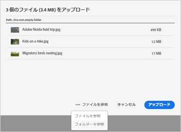
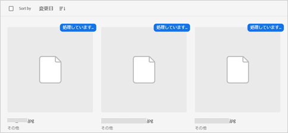
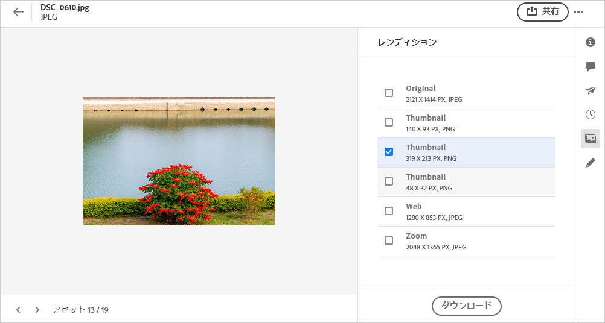
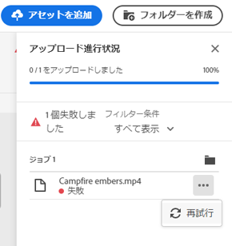
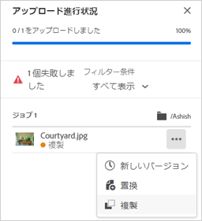
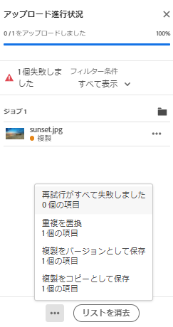
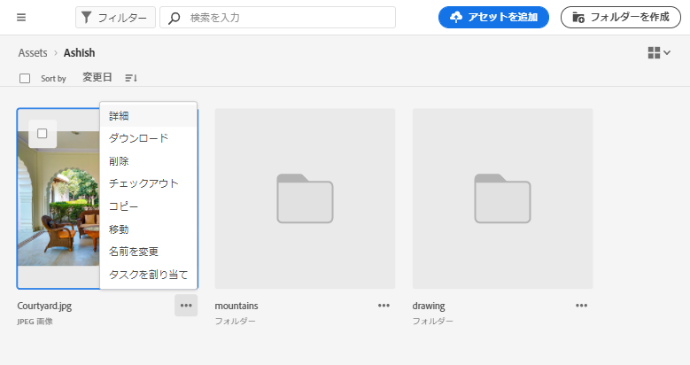

# アセットのアップロード {#add-assets}

操作する新しいアセットを追加するには、ローカルファイルシステムからいくつかのアセットをアップロードします。<!-- TBD: Many of the [common file formats are supported](/help/supported-file-formats.md). -->

次の方法を使用して、1つ以上のアセットまたはアセットを含むフォルダーをアップロードできます。

* ユーザーインターフェイス上でアセットまたはフォルダーをドラッグし、画面の指示に従います。
* ツールバーの「**[!UICONTROL アセットを追加]**」オプションをクリックし、アップロードダイアログにファイルを追加します。

<!-- TBD: Update this GIF
 -->

フォルダーの作成後にアセットをアップロードするには、次の方法のいずれかを使用できます。 空のフォルダーを作成するには、ツールバーの「**[!UICONTROL フォルダーを作成]**」をクリックします。 [!DNL Assets Essentials]は強力な全文検索機能を提供しますが、フォルダーを使用してアセットをより整理することもできます。

ファイルを選択すると、確認ダイアログが表示され、さらにファイルを追加したり、既に選択したファイルを削除したりできます。 選択範囲にファイルを追加するには、「**[!UICONTROL 参照]**」をクリックし、「**[!UICONTROL ファイルを参照]**」または「**[!UICONTROL フォルダーを参照]**」を選択します。 同じフォルダーまたは別のフォルダーから、さらにファイルまたはフォルダーを追加します。

すべてのファイルがキューに入ったら、「**[!UICONTROL アップロード]**」をクリックします。

*図：選択したアセットをアップロードする前に、キューのアセットを追加または削除できます。*

## アップロードの進行状況とステータス{#upload-progress}を表示

多数のアセットまたはネストしたフォルダーを[!DNL Assets Essentials]にアップロードする場合、アセットの重複やネットワークの問題など、様々な理由で一部のアセットのアップロードに失敗する可能性があります。

アップロードの進行状況を追跡するには、ツールバーの「**[!UICONTROL アップロードの進行状況]**」オプションをクリックします。 パネルには、すべてのアセットのアップロードの進行状況が表示されます。

アップロードの進行状況またはステータスに基づいてアセットのサブセットを表示するには、**[!UICONTROL アップロードの進行状況]**&#x200B;サイドバーのフィルターを使用します。 様々なフィルターには、すべてのアセット、完了したアップロード、進行中のアップロード、キューに入れられたアセットのアップロード、一時停止したアップロード、重複したアセット、アップロードに失敗したアセットが表示されます。

*図：アップロードステータスやアップロードの進行状況に基づいて、アップロードしようとしたアセットをフィルタリングします。*

アセットがアップロードされるとすぐに、Assets Essentialsはアセットを処理してサムネールを生成し、メタデータを処理します。 多くのアセットでは、処理に時間がかかります。 サムネールが表示されず、プレースホルダーサムネールに処理メッセージが表示される場合は、数分後にフォルダーを再度確認してください。

## アセットレンディション {#renditions}

Assets Essentialsは、アップロードされたアセットをほぼリアルタイムで処理し、サポートされている多くのファイルタイプに対して、レンディションを生成します。 画像用に作成されたレンディションは、アップロードされた画像のサイズが変更されます。 アセットだけでなく、適切なバージョンを使用するレンディションもダウンロードできます。 アセット](/help/navigate-view.md#preview-assets)をプレビューすると、アセットのすべてのレンディションを表示できます。[

## 失敗したアップロードを管理します{#resolve-upload-fails}

何らかの理由でサポートされているアセットのアップロードが失敗した場合は、[!UICONTROL アップロードの進行状況]ウィンドウの「**[!UICONTROL 再試行]**」をクリックします。

*図：何らかの理由でサポートされているファイルのアップロードに失敗した場合は、再試行します。*

重複したアセットをアップロードしようとしても、アップロードを明示的に確認するまで、アセットはアップロードされません。 最初は、重複したアセットは、アップロードに失敗したとマークされます。 解決するには、バージョンの作成、既存のアセットの削除と置き換え、またはアセットの名前を変更して複製コピーを作成します。 このようなエラーは、一度に1つのアセットずつ解決することも、失敗したすべての重複に対して一括で一度に解決することもできます。

*図：デフォルトでアップロードに失敗する重複アセットの場合は、一度に1つのアセットの問題を解決します。*

*図：デフォルトでアップロードに失敗した重複アセットの場合は、すべてのアセットの問題を一度に解決します。*

>[!TIP]
>
>DAMリポジトリーには、[!DNL Creative Cloud]デスクトップアプリケーション内から直接アセットをアップロードできます。 [[!DNL Assets Essentials] と [!DNL Adobe Asset Link]](/help/integration.md)の統合方法を参照してください。

## アセットまたはフォルダーの削除{#delete-assets}

不要になった個々のアセットやフォルダーを削除できます。 アセットまたはフォルダーを削除するには、次のいずれかの操作を行います。

* アセットまたはフォルダーのサムネールで利用できるオプションを使用します。

   

* アセットまたはフォルダーを選択し、ツールバーの&#x200B;**[!UICONTROL 削除]** をクリックします。
