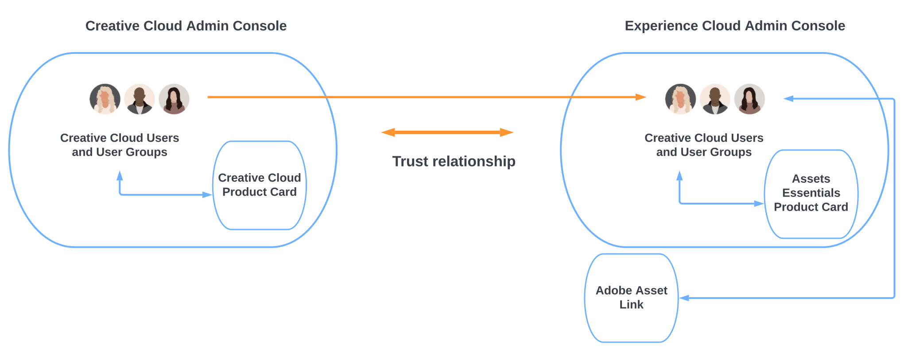

# Assets Essentials for Work Management Solutions とCreative CloudPro {#creative-cloud-enterprise-user-journeys}

## はじめに {#introduction}

Work Management Solutions を使用するCreative CloudPro は、クリエイティブ、コンテンツ、作業管理ツールを統合し、クリエイティブなコンテンツを作成する能力を高め、ビジネス目標を迅速に達成します。 このソリューションには、次のコンポーネントが含まれます。

* Creative CloudPro

* Adobe Workfront

* Experience Manager Assets Essentials

このチュートリアルでは、Assets EssentialsアプリケーションをCreative CloudのデスクトップアプリケーションやAdobe Workfrontアプリケーションと統合できるようにする管理者ジャーニーを紹介します。 Creative Cloudのデスクトップアプリケーションには、Adobe Photoshop、Adobe Illustrator、Adobe InDesign、Adobe XDが含まれます。

## デプロイメントタイプ {#deployment-types}

ソリューションは、Creative CloudとAdobe Experience Cloudの両方のアプリケーションとサービスで構成されているので、会社の 1 つまたは 2 つのAdobeAdmin Consoleにデプロイされる場合があります。

2 つの設定にデプロイする場合は、Admin Consoleの追加手順が必要です。

* Creative Cloudサービスとアプリケーション (Enterprise Pro のCreative Cloudとオプションモジュール ) は、 [Adobe Admin ConsoleのCreative Cloudデプロイメント](https://chl-author-preview.corp.adobe.com/content/help/en/enterprise/admin-guide.html).

* Adobe WorkfrontとAdobe Experience Manager Assets Essentialsは、 [Adobe Admin Console forExperience Cloudソリューション](https://experienceleague.adobe.com/docs/core-services/interface/administration/admin-getting-started.html).

Creative CloudとAssets Essentialsアプリケーションを統合するには、Admin ConsoleでCreative Cloudに使用できるユーザーが、Experience CloudにAdmin Consoleして使用できるようにする必要があります。 ユーザーをExperience CloudAdmin Consoleで使用できるようにするには、ディレクトリを作成して、 [ディレクトリ信頼](https://helpx.adobe.com/enterprise/using/set-up-identity.html#directory-trusting) 2 つの管理コンソール間。

図に示すように、Creative Cloudユーザーは、2 つのコンソール間の信頼関係に基づいて、Experience CloudAdmin Consoleで自動的に使用可能になります。 その後、ユーザーをAssets Essentials製品プロファイルに追加できます。 その結果、Creative CloudユーザーはAssets Essentialsリポジトリとやり取りできるAdobeAsset Link アプリケーションにアクセスできます。 詳しくは、 [Assets EssentialsとCreative Cloudアプリケーションの統合](integrate-assets-essentials-creative-cloud.md).

## Experience Managerドキュメントジャーニー {#documentation-journeys}

ドキュメントジャーニーは、Assets Essentialsを初めて使用する読者が、最初から最後までビジネス上の問題を理解し、解決するのに役立つナレーションを提供し、前のトピックやAssets Essentialsの知識を最小限に抑えながら、様々な複雑なトピックや機能を結び付けます。

ドキュメントジャーニーは、Adobeの最新の調査、Adobeコンサルタントによる実証済みの実装経験、お客様のプロジェクトからのフィードバックに基づく、ベストプラクティスの原則に基づいて設計されています。

## 前提条件

* [Adobe Admin Consoleへのアクセス (Experience Cloudソリューション )](https://experienceleague.adobe.com/docs/core-services/interface/administration/admin-getting-started.html)

* [Adobe Admin Consoleへのアクセス (Creative Cloud向け )](https://helpx.adobe.com/enterprise/admin-guide.html)

## Experience Manager Assets Essentials の管理 {#administer-assets-essentials}

Adobe Experience Manager Assets Essentialsは、Adobe Experience Manager Assets の新しい軽量エディションです。 Assets Essentialsは、シンプルで一貫性のあるユーザーインターフェイスを備え、統合されたアセット管理とコラボレーションを実現します。 これにより、より多くのクリエイティブチームやマーケティングチームがデジタルアセットを保存、検出および配布できるようになります。

Adobe Experience Manager Assets Essentialsは、お客様向けにAdobeによってプロビジョニングされます。 プロビジョニングの一環として、Assets EssentialsがAdobe Admin Consoleの顧客の組織に追加されます。

管理者は、Admin Consoleを使用してAssets Essentials製品に対するユーザーの使用権限を管理します。

* ユーザーグループを追加

* ユーザーグループにユーザーを追加

* Assets Essentials製品プロファイルへのユーザーの追加

Admin Consoleでユーザーの使用権限を管理した後、管理者はAssets Essentialsアプリケーションを使用して次のことをおこなうことができます。

* 組織のニーズに最適なフォルダー構造を作成する

* フォルダー構造に対する権限の管理

* メタデータフォームの設定

[! [ガイドを参照](https://helpx.adobe.com/content/dam/help/en/marketing-cloud/how-to/digital-foundation/_jcr_content/main-pars/image_1250343773/see-the-guide-sm.png)](adminster-aem-assets-essentials.md)

## Creative CloudアプリケーションとExperience Manager Assets Essentials の統合 {#administer-creative-cloud-applications}

[AdobeAsset Link のアプリ内パネル](https://www.adobe.com/jp/creativecloud/business/enterprise/adobe-asset-link.html) クリエイティブプロフェッショナルが [!DNL Assets Essentials] サポート対象内からのリポジトリ [!DNL Adobe Creative Cloud] デスクトップアプリケーション このパネルは、[!DNL Adobe Photoshop]、[!DNL Adobe Illustrator]、[!DNL Adobe InDesign] および [!DNL Adobe XD] で使用できます。これにより、アセットへのアクセスが効率化され、その結果、コンテンツベロシティ（コンテンツ創出速度）が向上します。

このチュートリアルでは、 [!DNL Adobe Photoshop], [!DNL Adobe Illustrator], [!DNL Adobe InDesign]、および [!DNL Adobe XD] Experience Manager Assets Essentials のアプリケーション

ゴール:

* ディレクトリとExperience CloudのCreative CloudAdmin Console

* Assets Essentials製品プロファイルへのCreative Cloudユーザーの追加

* AdobeAsset Link のインストール

* Adobe Asset Link の使用

[! [ガイドを参照](https://helpx.adobe.com/content/dam/help/en/marketing-cloud/how-to/digital-foundation/_jcr_content/main-pars/image_1250343773/see-the-guide-sm.png)](integrate-assets-essentials-creative-cloud.md)

## Adobe WorkfrontとExperience Manager Assets Essentials の統合 {#administer-adobe-workfront}

[[!DNL Adobe Workfront]](https://www.workfront.com/) は作業管理アプリケーションで、作業のライフサイクル全体を一元的に管理するのに役立ちます。次の間のネイティブ統合： [!DNL Adobe Workfront] および [!DNL Assets Essentials] 組織は、業務とアセット管理を本質的に結び付けることで、コンテンツの速度と市場投入までの時間を改善できます。 ユーザーは、自分の作業を管理するという観点で、同じソリューション内の必要なドキュメントや画像にアクセスできます。

このチュートリアルでは、Adobe Workfrontの管理とExperience Manager Assets Essentials との統合について説明します。

ゴール:

* Workfront製品プロファイルへのユーザーの追加

* Assets Essentials製品プロファイルへのユーザーの追加

* Experience Manager Assets Essentials 統合の設定

[! [ガイドを参照](https://helpx.adobe.com/content/dam/help/en/marketing-cloud/how-to/digital-foundation/_jcr_content/main-pars/image_1250343773/see-the-guide-sm.png)](integrate-assets-essentials-workfront.md)

