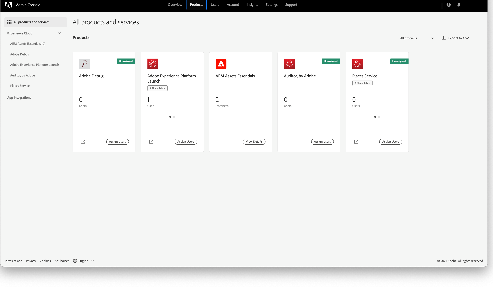

# [!DNL Assets Essentials] の管理とユーザーの追加 {#administer}

[!DNL Adobe Experience Manager Assets Essentials] は、アドビのお客様向けにアドビによってプロビジョニングされます。プロビジョニングの一環として、[!DNL Adobe Admin Console] でお客様の組織に [!DNL Assets Essentials] が追加されます。管理者は [!DNL Admin Console] を使用して [!DNL Assets Essentials] ソリューションのユーザー権利を管理し、[!DNL Assets Essentials] で権限とメタデータフォームを設定するアプリケーション管理者を割り当てます。

## Assets Essentials の自動デプロイメント {#automatic-deployment-assets-essentials}

Assets Essentials ソリューションがプロビジョニングされると、管理者にアドビから電子メールが届きます。この電子メールには、歓迎メッセージと使用を開始するためのリンクが含まれています。さらに、アドビは、Assets Essentials を自動的にデプロイするプロセスを開始します。デプロイメントプロセスが完了するまでに 1 時間ほどかかります。

電子メールに記載されたリンクから、[Admin Console](https://adminconsole.adobe.com) にアクセスしてログインします。複数の組織アカウントに管理者としてアクセスできる場合は、該当する組織を選択するか、上部のバーにある切り替えボタンを使用して組織を切り替えます。自動デプロイメントプロセスが完了すると、[!DNL AEM Assets Essentials] の製品カードが [!DNL Admin Console] に表示されます。

Assets Essentials ソリューションのデプロイメントが成功したら、管理者は次のタスクを実行する必要があります。

* ソリューションの[ユーザーグループ、フォルダー構造の設定、権限の割り当て](manage-permissions.md)を行います。[ベストプラクティス](permission-management-best-practices.md)に従って、簡単で効果的な権限の設定を行います。
* 組織のメンバーの [!DNL Assets Essentials] に対する[ユーザーアクセスの管理](#add-users-to-essentials)
* （オプション）[サービスステータスとログの確認](#view-logs)

>[!NOTE]
>
>Assets Essentials が 2022年1月6日（PT）より前にプロビジョニングされている場合は、組織メンバーのユーザーアクセスを管理する前に、[Cloud Manager でのデプロイメント手順](#deploy-essentials)を実行してください。

## ユーザー管理 {#add-users-to-essentials}

管理者は、[!DNL Assets Essentials] にアクセスできるユーザーを管理します。管理者は、[!DNL Adobe Admin Console] を使用してユーザーアクセスを追加または削除します。[!DNL Assets Essentials] では、次の 2 種類のユーザーアクセスが利用可能です。

* **[!DNL Assets Essentials]管理者**&#x200B;アプリケーションに管理者アクセス権を持っています。このグループのアプリケーション管理者は、すべてのエンドユーザー機能に加えて、アプリケーションリポジトリ全体の任意のフォルダーおよびグループ／ユーザーに対する権限を管理できます。
* **[!DNL Assets Essentials] ユーザー**：完全なユーザーインターフェイスにアクセスできます。デジタルアセットのアップロード、整理、タグ付け、検索が可能です。
* **[!DNL Assets Essentials] Consumer ユーザー**：[!DNL Adobe Journey Optimizer] 電子メールテンプレートエディターの埋め込みアセット選択エクスペリエンスにアクセスできます。詳しくは、[ [!DNL Journey Optimizer] での  [!DNL Assets Essentials]  使用](https://experienceleague.adobe.com/docs/journey-optimizer/using/create-messages/assets-essentials.html?lang=ja)を参照してください。

[!DNL Admin Console] では、これら 3 つのアクセスタイプは 3 つの[!UICONTROL 製品プロファイル]で表されます。組織のメンバーを 2 つのプロファイルのいずれかに追加またはいずれかから削除するには、次の手順に従います。

1. 組織の [!DNL Admin Console] にアクセスし、上部のバーで「**[!UICONTROL 製品]**」をクリックし、「**[!UICONTROL AEM Assets Essentials]**」をクリックして、[!DNL Assets Essentials] 環境をクリックします。[!DNL Assets Essentials] には、管理者、通常ユーザー、消費者ユーザー用のアクセスを表す 3 つの製品プロファイルがあります。

   
   <!-- Need to update screenshot to include 3 profiles -->

   *図：3 種類のユーザーの追加に使用できる 3 つのプロファイル*

1. ユーザーをグループに追加するには、該当するグループをクリックし、「**[!UICONTROL ユーザーを追加]**」を選択し、ユーザーの詳細を入力して、「**[!UICONTROL 保存]**」をクリックします。ユーザーを追加すると、使用を開始するための招待メールがそのユーザーに届きます。招待メールは、[!DNL Admin Console] の製品プロファイル設定で無効にすることができます。

   ![ユーザーの追加：[!DNL Assets Essentials]](assets/adminconsole-add-user.png)

   *図：[!DNL Admin Console] から [!DNL Assets Essentials] へのユーザーの追加*

1. ユーザーをグループから削除するには、該当するグループをクリックし、既存のユーザーを選択して、「**[!UICONTROL ユーザーを削除]**」を選択します。

>[!TIP]
>
>[!DNL Admin Console] では、CSV ファイルを使用してユーザーを一括で管理できます。詳しくは、[[!DNL Admin Console]  のドキュメント](https://helpx.adobe.com/jp/enterprise/using/accounts.html)を参照してください。

## サービスステータスとアクセスログの確認 {#view-logs}

プロビジョニング後、管理者は [!DNL Assets Essentials] を 1 回だけデプロイします。初期デプロイ後、サービスのメンテナンスと更新はアドビによって行われます。管理者は、[!DNL Cloud Manager] ユーザーインターフェイスを使用して、サービスステータスを確認したり、最近のアクセスログをダウンロードしたりできます。

1. ユーザーから問題が報告された場合は、**[!UICONTROL プログラムの概要]**&#x200B;インターフェイスで [!DNL Assets Essentials] のサービスステータスを確認します。ソリューションの通常動作時のステータスは「`Running`」です。その他のステータスが [!DNL Cloud Manager] に表示された場合は、[!DNL Admin Console] のサポートセクションでサポートチケットを作成します。

   ![[!DNL Assets Essentials] のステータス：[!DNL Cloud Manager]](assets/cloudmanager-manage-access-essentials.png)

   *図：[!DNL Cloud Manager] での [!DNL Assets Essentials] の通常ステータスは「`Running`」です。*

1. 最近のアクセスログをダウンロードするには、 アイコンをクリックし、「**[!UICONTROL ログをダウンロード]**」を選択して、画面の指示に従います。ログを使用して HTTPS アクセスリクエストを監査できます。

   

   *図：アクセスログをダウンロードするためのオプション*

## [!DNL Assets Essentials] のデプロイ {#deploy-essentials}

>[!NOTE]
>
>Assets Essentials が 2022年1月6日（PT）より前にプロビジョニングされている場合にのみ、以下の手順を実行します。

プロビジョニング後に [!DNL Admin Console] で [!DNL Assets Essentials] の使用権限が組織に追加されます。このソリューションをユーザーが使用できるようにするには、組織の管理者がソリューションをデプロイする必要があります。管理者は、[!DNL Cloud Manager] ユーザーインターフェイスを使用して 1 回限りのデプロイメントを行います。初期デプロイ後、サービスのメンテナンスと更新はアドビによって行われます。ソリューションがプロビジョニングされると、アドビから電子メールが管理者に届きます。この電子メールには、歓迎メッセージと使用を開始するためのリンクが含まれています。デプロイするには、次の手順に従います。

1. 電子メールに記載されたリンクから、[Admin Console](https://adminconsole.adobe.com) にアクセスしてログインします。複数の組織アカウントに管理者としてアクセスできる場合は、該当する組織を選択するか、上部のバーにある切り替えボタンを使用して組織を切り替えます。[!DNL Assets Essentials] の製品カードが [!DNL Admin Console] に表示されます。

   ![[!DNL Assets Essentials] カード：[!DNL Admin Console]](assets/essentials-in-admin-console.png)

   *図：[!DNL Admin Console] の [!DNL Assets Essentials] カード*

   >[!NOTE]
   >
   >**[!UICONTROL AEM Assets Essentials - Cloud Manager]** カードではなく **[!UICONTROL AEM Assets Essentials]** カードが製品セクションに表示される場合、Assets Essentials のデプロイメントは既に完了しています。残りの手順はスキップできます。

1. [!DNL Admin Console] で `AEM Assets Essentials - Cloud Manager` 製品プロファイルに自分自身を管理者として追加します。自分自身ではなく、組織の別のメンバーを追加することもできますし、複数の管理者を追加することもできます。

1. 「[!UICONTROL 製品プロファイルを選択]」で  アイコンをクリックしたあと、**[!UICONTROL 製品プロファイル]**&#x200B;として「[!UICONTROL デプロイメントマネージャー - Assets Essentials]」を選択します。この手順で追加されたユーザーが、[!DNL Cloud Manager] へのアクセス情報を記載した電子メールをアドビから受け取り、デプロイメントを行うことができます。

   ![管理者の追加と製品プロファイルの選択：[!DNL Admin Console]](assets/adminconsole-user1.png)

   *図：[!DNL Admin Console] での管理者の追加と製品プロファイルの選択*

1. [!DNL Cloud Manager] にアクセスするには、[!DNL Cloud Manager] へのアクセス情報が記載された電子メール内のリンクをクリックします。または、ブラウザーで [https://experience.adobe.com/#/cloud-manager/](https://experience.adobe.com/#/cloud-manager/) にアクセスします。

1. Cloud Manager のユーザーインターフェイスで、右上隅の「**[!UICONTROL プログラムの追加]**」をクリックします。

1. 任意の名前を指定して、オプションで画像（[!DNL Cloud Manager] 内のプログラムを表す）をアップロードし、「**[!UICONTROL 作成]**」をクリックします。[!DNL Cloud Manager] でのプログラムのセットアップに数分かかります。

1. プログラムの準備が整ったら、タイルの上にポインターを置き、 アイコンをクリックします。

1. [!DNL Assets Essentials] サービスを組織に追加するには、「**[!UICONTROL 環境を追加]**」をクリックし、名前とデプロイメント領域を選択して、「**[!UICONTROL 保存]**」をクリックします。デプロイメント領域を後で変更することはできません。[!DNL Assets Essentials] のデプロイメント領域を、[!DNL Assets Essentials] の使用対象となる他のソリューションのデプロイメント領域と一致させるようにしてください。両者を一致させることにより、デジタルアセットへのネットワークアクセスを可能な限り速くし、待ち時間を可能な限り短くすることができます。

   ![環境の追加：[!DNL Cloud Manager]](assets/cloudmanager-add-environment-for-essentials.png)

   *図：[!DNL Assets Essentials] の使用を開始するための環境を [!DNL Cloud Manager] で追加*

1. 数分後、環境が正常に作成されたら、[!DNL Admin Console] にアクセスし、組織のユーザーを [!DNL Assets Essentials] ソリューションに追加できます。 アイコンをクリックし、「**[!UICONTROL アクセスを管理]**」オプションを選択します。

   ![環境の準備：[!DNL Cloud Manager]](assets/cloudmanager-manage-access-essentials.png)

   *図：使用する準備ができた [!DNL Cloud Manager] 内の環境*

>[!MORELIKETHIS]
>
>* [[!DNL Admin Console]  のヘルプ](https://helpx.adobe.com/jp/enterprise/using/admin-console.html)
>* [[!DNL Cloud Manager]  のヘルプ](https://experienceleague.adobe.com/docs/experience-manager-cloud-manager/using/introduction-to-cloud-manager.html?lang=ja)
>* [Adobe Journey Optimizer のドキュメント](https://experienceleague.adobe.com/docs/journey-optimizer/using/ajo-home.html?lang=ja)
>* [リリースノート](release-notes.md)
>* [ [!DNL Assets Essentials]](get-started.md) の基本

