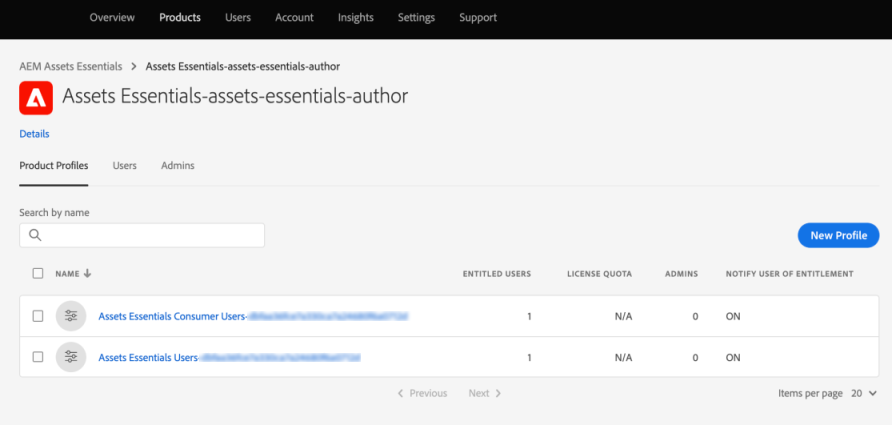

# [!DNL Assets Essentials]をデプロイし、ユーザーを追加します {#administer}

[!DNL Adobe Experience Manager Assets Essentials] は、お客様向けにAdobeでプロビジョニングされます。プロビジョニングの一環として、[!DNL Assets Essentials]が顧客の組織(Adobe組織)に追加されます。 顧客は、導入ツールとして[!DNL Experience Manager Cloud Manager]にアクセスし、ユーザー管理ツールとして[!DNL Admin Console]にアクセスすることもできます。

管理者は、次のタスクを実行します。

* [ [!DNL Assets Essentials]](#deploy-essentials) 組織にデプロイします。
* [に対する組織メン](#add-users-to-essentials) バーのユーザーアクセスを管理 [!DNL Assets Essentials]します。
* 必要に応じて、[サービスのステータスとログ](#view-logs)を表示します。

## デプロイ [!DNL Assets Essentials] {#deploy-essentials}

プロビジョニング後、[!DNL Assets Essentials]の権限がAdobe組織に追加され、組織の管理者がデプロイします。 組織の管理者は、[!DNL Cloud Manager]ユーザーインターフェイスを使用して1回限りのデプロイメントをおこないます。 最初のデプロイメント後、Adobeはサービスのメンテナンスと更新をおこないます。 をデプロイするには、次の手順に従います。

1. 管理者がAdobeから電子メールを受け取る。 この電子メールには、使い始めるためのお知らせメッセージとリンクが含まれています。

1. 電子メール内のリンクから、[Admin Console](https://adminconsole.adobe.com)にアクセスしてログインします。 複数の組織アカウントに対する管理者アクセス権を持っている場合は、適切な組織を選択するか、上部のバーにある切り替えボタンを使用して組織に切り替えます。 [!DNL Assets Essentials]の製品カードは[!DNL Admin Console]に表示されます。

   ![[!DNL Assets Essentials] カード  [!DNL Admin Console]](assets/essentials-in-admin-console.png)

1. [!DNL Cloud Manager]の`AEM Assets Essentials - Cloud Manager`製品に管理者として追加します。 自分ではなく、組織の別のメンバーを追加することも、複数の管理者を追加することもできます。

1. をクリックして[!UICONTROL 製品プロファイル]を選択し、**[!UICONTROL 製品プロファイル]**&#x200B;として[!UICONTROL デプロイメントマネージャー — Assets Essentials]を選択します。 この手順で追加されたユーザーは、[!DNL Cloud Manager]へのアクセス権を持つAdobeから電子メールを受け取り、デプロイを実行できます。

   ![管理者の追加と、  [!DNL Admin Console]](assets/adminconsole-user1.png)

1. [!DNL Cloud Manager]にアクセスするには、電子メール内の[!DNL Cloud Manager]へのアクセス権を持つリンクをクリックします。 または、ブラウザーで`https://experience.adobe.com/#/cloud-manager/`にアクセスします。

1. Cloud Managerのユーザーインターフェイスで、右上隅の「**[!UICONTROL プログラムを追加]**」をクリックします。

1. 任意の名前を指定し、オプションで画像をアップロードし（[!DNL Cloud Manager]内のプログラムを表す）、「**[!UICONTROL 作成]**」をクリックします。 [!DNL Cloud Manager] プログラムの設定には数分かかります。

1. プログラムの準備が整ったら、タイルの上にポインターを置き、をクリックします。

1. [!DNL Assets Essentials]サービスを組織に追加するには、「**[!UICONTROL 環境を追加]**」をクリックし、名前とデプロイメント領域を選択して、「**[!UICONTROL 保存]**」をクリックします。 後で配置領域を変更することはできません。 [!DNL Assets Essentials]のデプロイメント領域と、[!DNL Assets Essentials]を使用する他のソリューションのデプロイメント領域を一致させてください。 一致は、デジタルアセットへの最速のネットワークアクセスと、可能な限り短い待ち時間を確保するためです。

   ![での環境の追加  [!DNL Cloud Manager]](assets/cloudmanager-add-environment-for-essentials.png)

1. 環境が正常に作成されたら、[!DNL Admin Console]にアクセスし、組織のユーザーを[!DNL Assets Essentials]ソリューションに追加できます。 をクリックし、「**[!UICONTROL アクセスを管理]**」オプションを選択します。

   ![での環境の準備  [!DNL Cloud Manager]](assets/cloudmanager-manage-access-essentials.png)

## ユーザー管理 {#add-users-to-essentials}

管理者は、[!DNL Assets Essentials]にアクセスできるユーザーを管理します。 管理者は、[!DNL Adobe Admin Console]を使用してユーザーアクセスを追加または削除します。 [!DNL Assets Essentials] には、次の2種類のユーザーアクセスが可能です。

* **[!DNL Assets Essentials]** ユーザーは完全なユーザーインターフェイスにアクセスできます。これらのユーザーは、デジタルアセットをアップロード、整理、タグ付け、検索できます。
* **[!DNL Assets Essentials]消費者ユーザー**:電子メールテンプレートエディターの埋め込みアセット選択エクスペ [!DNL Adobe Journey Optimizer] リエンスにアクセスできます。詳しくは、[ [!DNL Journey Optimizer]](https://experienceleague.adobe.com/docs/journey-optimizer/using/create-messages/assets-essentials.html)で [!DNL Assets Essentials] を使用を参照してください。

[!DNL Admin Console]では、これら2つのアクセスタイプは2つの[!UICONTROL 製品プロファイル]で表されます。 組織のメンバーを2つのプロファイルのいずれかに追加または削除するには、次の手順に従います。

1. 組織の[!DNL Admin Console]にアクセスし、上部のバーの「**[!UICONTROL 製品]**」をクリックし、「**[!UICONTROL AEM Assets Essentials]**」をクリックして、「[!DNL Assets Essentials]環境」をクリックします。 [!DNL Assets Essentials] には、通常のユーザーと消費者のユーザーのアクセスを表す2つの製品プロファイルがあります。

   

1. ユーザーをグループに追加するには、グループをクリックし、「**[!UICONTROL ユーザーを追加]**」を選択し、ユーザーの詳細を入力して、「**[!UICONTROL 保存]**」をクリックします。 ユーザーを追加すると、開始を求める電子メールがユーザーに送信されます。 [!DNL Admin Console]の製品プロファイル設定で、Eメールの招待状を無効にできます。

   ![ユーザーの追加先  [!DNL Assets Essentials]](assets/adminconsole-add-user.png)

1. グループからユーザーを削除するには、グループをクリックし、既存のユーザーを選択して、「**[!UICONTROL ユーザーを削除]**」を選択します。

>[!TIP]
>
>[!DNL Admin Console]では、CSVファイルを使用してユーザーを一括で管理できます。 詳しくは、[[!DNL Admin Console] ドキュメント](https://helpx.adobe.com/enterprise/using/accounts.html)を参照してください。

## サービスステータスとアクセスログの表示 {#view-logs}

プロビジョニング後、管理者は[!DNL Assets Essentials]を1回だけデプロイします。 最初のデプロイメント後、Adobeはサービスのメンテナンスと更新をおこないます。 管理者は、[!DNL Cloud Manager]ユーザーインターフェイスを使用して、サービスのステータスを確認し、最近のアクセスログをダウンロードできます。

1. ユーザーが問題を報告したら、**[!UICONTROL プログラムの概要]**&#x200B;インターフェイスで[!DNL Assets Essentials]のサービスステータスを確認します。 ソリューションの通常の動作時のステータスは`Running`です。 [!DNL Cloud Manager]にその他のステータスが表示された場合は、[!DNL Admin Console]サポートセクションでサポートチケットを作成します。

   ![でのステータスを実行し [!DNL Assets Essentials] ています  [!DNL Cloud Manager]](assets/cloudmanager-manage-access-essentials.png)

1. 最近のアクセスログをダウンロードするには、をクリックし、**[!UICONTROL ログをダウンロード]**&#x200B;を選択して、画面の指示に従います。 ログを使用してHTTPSアクセス要求を監査できます。

   

>[!MORELIKETHIS]
>
>* [[!DNL Admin Console] help](https://helpx.adobe.com/enterprise/using/admin-console.html)
>* [[!DNL Cloud Manager] help](https://experienceleague.adobe.com/docs/experience-manager-cloud-manager/using/introduction-to-cloud-manager.html?lang=ja)
>* [Adobe Journey Optimizerドキュメント](https://experienceleague.adobe.com/docs/journey-optimizer/using/ajo-home.html)
>* [リリースノート](release-notes.md)
* [ [!DNL Assets Essentials]の使用を開始する](get-started.md)

