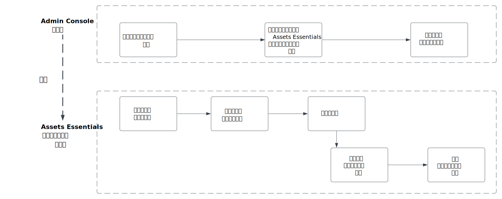
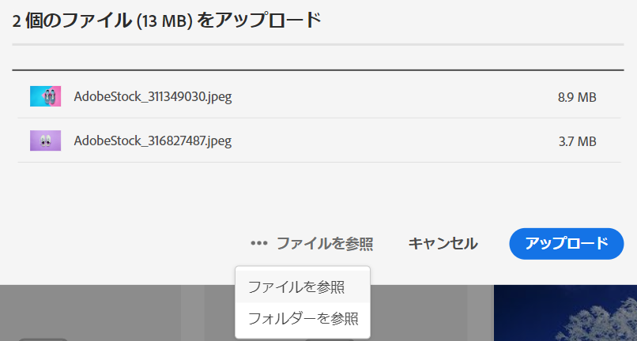
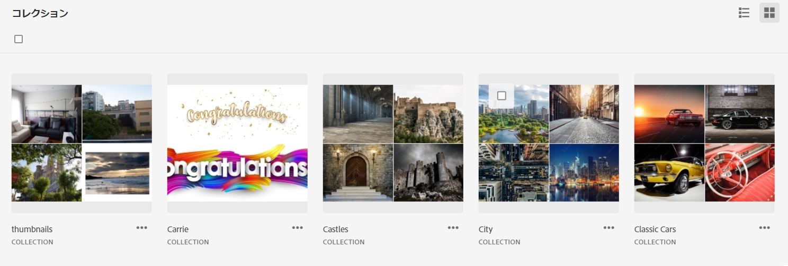

# [!DNL Assets Essentials] の管理とユーザーの追加 {#administer}

[!DNL Adobe Experience Manager Assets Essentials] は、アドビのお客様向けにアドビによってプロビジョニングされます。プロビジョニングの一環として、[!DNL Adobe Admin Console] でお客様の組織に [!DNL Assets Essentials] が追加されます。管理者は [!DNL Admin Console] を使用して [!DNL Assets Essentials] ソリューションに対するユーザーの使用権限を管理し、[!DNL Assets Essentials] に権限とメタデータフォームをセットアップするアプリケーション管理者を割り当てます。

次のデータフロー図は、Assets Essentials の設定と管理を行うために管理者が実行する必要があるタスクのシーケンスを示しています。

## Admin Console へのアクセス {#access-admin-console}

Assets Essentials ソリューションがプロビジョニングされると、管理者にアドビからメールが届きます。このメールには、歓迎メッセージと使用を開始するためのリンクが含まれています。さらに、アドビは、Assets Essentials を自動的にデプロイするプロセスを開始します。デプロイメントプロセスが完了するまでに 1 時間ほどかかります。

メールに記載されたリンクから、[Admin Console](https://adminconsole.adobe.com) にアクセスしてログインします。複数の組織アカウントに管理者としてアクセスできる場合は、該当する組織を選択するか、[組織セレクター](https://helpx.adobe.com/jp/enterprise/using/admin-console.html)を使用してその組織に切り替えます。自動デプロイメントプロセスが完了すると、[!DNL AEM Assets Essentials] の製品カードが [!DNL Admin Console] に表示されます。

Admin Console を使用して、次のユーザーの使用権限タスクを実行します。

* [Assets Essentials アプリケーション管理者の作成](#create-assets-essentials-administrator)

* [ユーザーグループの追加](#add-user-groups)

* [製品プロファイルへのユーザーグループの追加](#add-users-to-product-profiles)

### Assets Essentials アプリケーション管理者の作成 {#create-assets-essentials-administrator}

Admin Console 管理者は、Assets Essentials 管理者製品プロファイルをユーザーグループではなくユーザーに追加する必要があります。その後、Assets Essentials アプリケーション管理者は、フォルダー構造の作成、アセットのアップロード、権限の設定、メタデータフォームの設定、公開コレクションの作成などのタスクを管理できます。Assets Essentials アプリケーション管理者プロファイルをユーザーに割り当てる方法について詳しくは、[ユーザーグループへの製品プロファイルの追加](#add-product-profiles-to-user-groups)を参照してください。

### ユーザーグループの追加 {#add-user-groups}

ユーザーグループを作成し、そのユーザーグループにユーザーを割り当てます。これらのユーザーグループは、Assets Essentials アプリケーションで、フォルダーに対する権限を設定するために使用できます。

ユーザーグループの管理方法については、[ユーザーグループの管理](https://helpx.adobe.com/jp/enterprise/using/user-groups.html)の `Create user groups` および `Edit user groups` を参照してください。 

>[!NOTE]
>
>Admin Console が、Azure や Google コネクタ、ユーザー同期ツール、User Management Rest API など、ユーザー／グループの割り当てを管理する外部システムを活用するように設定されている場合、グループとユーザーの割り当ては自動的に設定されます。詳しくは、[Adobe Admin Consoleユーザー](https://helpx.adobe.com/jp/enterprise/using/users.html)を参照してください。

ユーザーグループへのユーザーの追加を管理する方法については、[ユーザーグループの管理](https://helpx.adobe.com/jp/enterprise/using/user-groups.html#add-users-to-groups)の `Add users to groups` を参照してください。

### ユーザーグループへの製品プロファイルの追加 {#add-product-profiles-to-user-groups}

Assets Essentials アプリケーションにアクセスできるように、ユーザーグループに製品プロファイルを追加します。

ユーザーグループに製品プロファイルを追加するには：

1. 組織の [Admin Console](https://adminconsole.adobe.com) にアクセスし、上部のバーで「**[!UICONTROL 製品]**」をクリックしたあと、「**[!UICONTROL AEM Assets Essentials]**」をクリックし、次に [!DNL Assets Essentials] のインスタンスをクリックします。インスタンスの名前は、以下のスクリーンショットに示す名前とは異なる可能性があります。
   >[!NOTE]
   >
   >[!DNL Cloud Manager] インスタンスは、サービスステータスの確認やサービスログへのアクセスなど、特別な管理にのみ使用するもので、製品へのユーザーの追加には使用できません。

   

   [!DNL Assets Essentials] には、管理者、通常のユーザーおよび消費者ユーザー用のアクセスを表す 3 つの製品プロファイルがあります。

   * **[!DNL Assets Essentials] 管理者**：アプリケーションに管理者アクセス権を持っています。このグループのアプリケーション管理者は、すべてのエンドユーザー機能に加えて、アプリケーションリポジトリ全体の任意のフォルダーおよびグループ／ユーザーに対する権限を管理できます。

   * **[!DNL Assets Essentials] ユーザー**：完全なユーザーインターフェイスにアクセスできます。デジタルアセットのアップロード、整理、タグ付け、検索が可能です。

   * **[!DNL Assets Essentials]Consumer ユーザー**：[!DNL Adobe Journey Optimizer] メールテンプレートエディターの埋め込みアセット選択エクスペリエンスにアクセスできます。詳しくは、[ [!DNL Journey Optimizer] での  [!DNL Assets Essentials]  使用](https://experienceleague.adobe.com/docs/journey-optimizer/using/create-messages/assets-essentials.html?lang=ja)を参照してください。

   

1. 製品にユーザーグループを追加するには、3 つの Assets Essentials 製品プロファイルのいずれか 1 つをクリックし、「**[!UICONTROL ユーザーを追加]**」を選択して、ユーザーグループの詳細を入力し、「**[!UICONTROL 保存]**」をクリックします。

   

   ユーザーを追加すると、使用を開始するための招待メールがそのユーザーに届きます。招待メールは、[!DNL Admin Console] の製品プロファイル設定で無効にすることができます。

   >[!NOTE]
   >
   >ユーザーが Assets Essentials アプリケーションで管理タスクを実行するには、Admin Console で管理者の Assets Essentials 製品プロファイルにユーザーを追加する必要があります。これらのタスクには、[フォルダー構造の作成](#create-folder-structure)、[フォルダーの権限の管理](#manage-permissions-for-folders)、[メタデータフォームの設定](#metadata-forms)などがあります。　　

## Assets Essentials アプリケーションへのアクセス {#access-assets-essentials-application}

Admin Console でユーザーの使用権限を実行した後、Assets Essentials アプリケーションにアクセスして、次のタスクを実行できます。

* [フォルダー構造の作成](#create-folder-structure)

* [アセットのアップロード](#upload-assets)

* [フォルダーの権限の管理](#manage-permissions-for-folders)

* [メタデータフォームの設定](#metadata-forms)

* [公開コレクションを作成](#create-public-collections)

### フォルダー構造を作成 {#create-folder-structure}

次の方法を使用して、Assets Essentials リポジトリにフォルダー構造を作成できます。

* ツールバーにある「**[!UICONTROL フォルダーを作成]**」オプションをクリックし、空のフォルダーを作成します。

* ツールバーにある「**[!UICONTROL アセットを追加]**」オプションをクリックし、[ローカルマシンで使用可能なフォルダー構造をアップロード](add-delete.md)します。

組織のビジネス目標に適したフォルダー構造を作成します。既存のフォルダー構造を Assets Essentials リポジトリにアップロードする場合は、構造を確認する必要があります。詳しくは、[効果的な権限管理のフォルダー構造のベストプラクティス](permission-management-best-practices.md##folder-structure-assets-essentials)を参照してください。

組織で使用できるフォルダー構造タイプには様々なものがあります。一般的なフォルダー構造の例を以下に示します。

>[!NOTE]
>
>これらのタスクを管理する（特に権限の管理）には、ユーザーにアプリケーション管理権限が必要です。[管理者の Assets Essentials 製品プロファイル](#add-users-to-product-profiles)に、この権限を追加する必要があります。

### アセットのアップロード {#upload-assets}

操作対象となる新しいアセットを追加するには、ローカルファイルシステムからアセットをアップロードします。ユーザーインターフェイス上でアセットまたはフォルダーをドラッグし、画面に表示される指示に従うか、ツールバーの「**[!UICONTROL アセットを追加]**」オプションをクリックして、いくつかのファイルをアップロードダイアログに追加します。 [!DNL Assets Essentials] は強力なフルテキスト検索機能を提供しますが、フォルダーを使用してアセットを適切に整理することもできます。詳しくは、[アセットのアップロード](add-delete.md)を参照してください。

### フォルダーの権限の管理 {#manage-permissions-for-folders}

Assets Essentials では、管理者は、リポジトリで使用可能なフォルダーのアクセスレベルを管理できます。管理者は、ユーザーグループを作成し、それらのグループに権限を割り当てて、アクセスレベルを管理できます。また、権限管理の権限をフォルダーレベルでユーザーグループにデリゲートすることもできます。

>[!VIDEO](https://video.tv.adobe.com/v/341104)

詳しくは、[フォルダーの権限の管理](manage-permissions.md)を参照してください。

### メタデータフォームの設定（オプション） {#metadata-forms}

Assets Essentials には、多数の標準メタデータフィールドがデフォルトで用意されています。組織には、追加のメタデータニーズがあり、ビジネス固有のメタデータを追加するために、さらに多くのメタデータフィールドが必要です。メタデータフォームを使用すると、ビジネスごとにアセットの[!UICONTROL 詳細]ページにカスタムメタデータフィールドを追加できます。ビジネス固有のメタデータにより、アセットのガバナンスと検出が向上します。フォームは、ゼロから作成することも、既存のフォームを再利用することもできます。

各種アセット（様々な MIME タイプ）のメタデータフォームを設定できます。ファイルの MIME タイプと同じフォーム名を使用します。Essentials は、アップロードされたアセットの MIME タイプをフォームの名前と自動的に照合し、フォームフィールドに基づいて、アップロードされたアセットのメタデータを更新します。

例えば、`PDF` または `pdf` という名前のメタデータフォームが存在する場合、アップロードされた PDF ドキュメントには、そのフォームで定義されたメタデータフィールドが含まれています。

詳しくは、[メタデータフォーム](metadata.md#metadata-forms)を参照してください。

>[!VIDEO](https://video.tv.adobe.com/v/341275)

メタデータフォームについて詳しくは、[Assets Essentials のメタデータフォーム](metadata.md#metadata-forms)を参照してください。

### 公開コレクションの作成（オプション） {#create-public-collections}

コレクションとは、Experience Manager Assets Essentials 内の一連のアセットのことです。コレクションを使用して、ユーザー間でアセットを共有します。

フォルダーとは異なり、1 つのコレクションに異なる複数の場所のアセットを含めることができます。1 人のユーザーと複数のコレクションを共有できます。各コレクションには、アセットへの参照が含まれます。アセットの参照整合性はコレクション間で維持されます。詳しくは、[コレクションの管理](manage-collections.md)を参照してください。

## 次の手順 {#next-steps}

<!-- THIS URL IS A 404 ERROR; NO REDIRECT WAS PUT IN PLACE * [Watch a video to deploy Assets Essentials](https://experienceleague.adobe.com/docs/experience-manager-learn/assets-essentials/provisioning.html?lang=en) -->

* Assets Essentials ユーザーインターフェイスの「[!UICONTROL フィードバック]」オプションを使用して製品に関するフィードバックを提供する

* 右側のサイドバーにある「[!UICONTROL このページを編集]」（）または「[!UICONTROL 問題を記録] 」（）を使用してドキュメントに関するフィードバックを提供する

* [カスタマーケア](https://experienceleague.adobe.com/?support-solution=General&amp;lang=ja#support)に問い合わせる

>[!MORELIKETHIS]
>
>* [[!DNL Admin Console]  のヘルプ](https://helpx.adobe.com/jp/enterprise/using/admin-console.html)
>* [[!DNL Cloud Manager]  のヘルプ](https://experienceleague.adobe.com/docs/experience-manager-cloud-manager/using/introduction-to-cloud-manager.html?lang=ja)
>* [Adobe Journey Optimizer のドキュメント](https://experienceleague.adobe.com/docs/journey-optimizer/using/ajo-home.html?lang=ja)
>* [リリースノート](release-notes.md)
>* [ [!DNL Assets Essentials]](get-started.md) の基本

