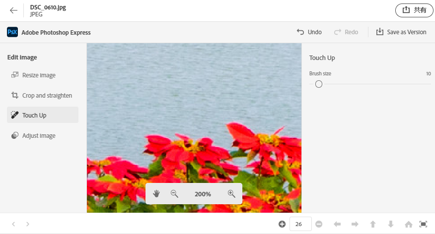
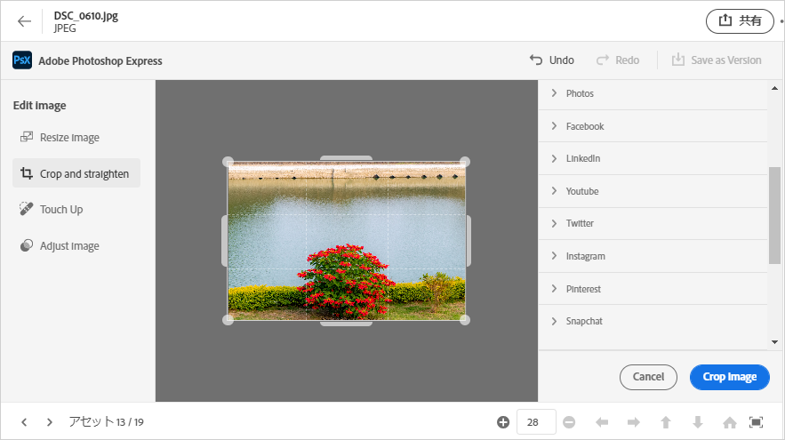
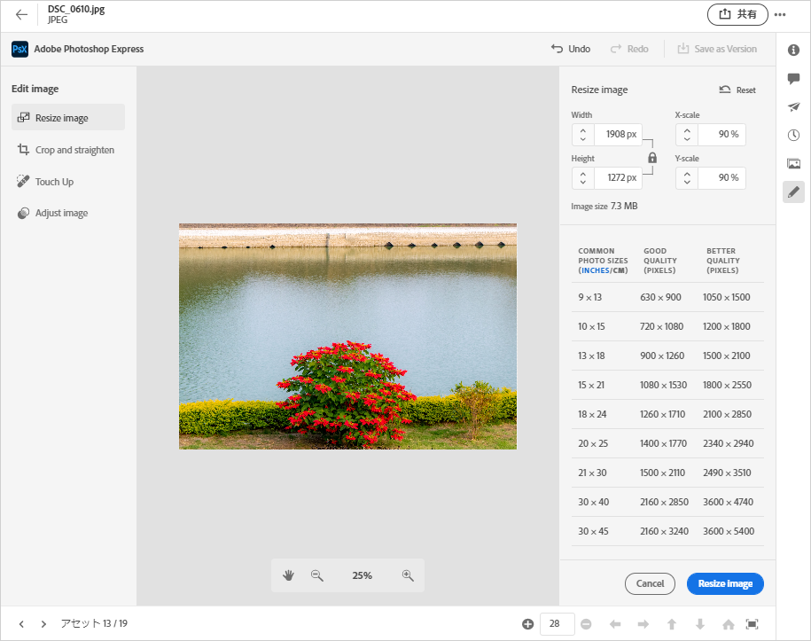
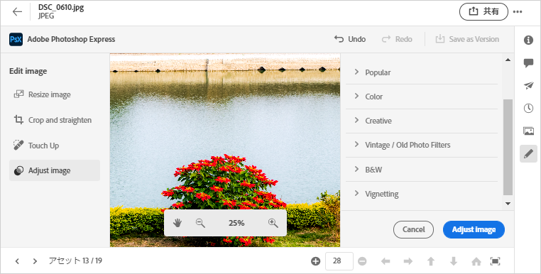

# [!DNL Assets Essentials] {#edit-images}で画像を編集

[!DNL Assets Essentials] は、を利用した、ユーザーにわかりやすい編集オプションを提供しま [!DNL Adobe Photoshop Express]す。使用可能な編集操作は、スポット修復、切り抜きと直線化、画像のサイズ変更、画像の調整です。

画像を編集した後、新しい画像を新しいバージョンとして保存できます。 バージョン管理を使用すると、必要に応じて後で元のアセットに戻すことができます。 画像を編集するには、[プレビュー](/help/navigate-view.md#preview-assets)を開き、右側のパネルの「**[!UICONTROL 画像を編集]** 」をクリックします。

*図：画像を編集するオプションは、を使用しま [!DNL Adobe Photoshop Express]す。*

## Spot Heal画像{#spot-heal-images}

画像上に小さな点や小さなオブジェクトがある場合は、Adobe Photoshopのスポット修復機能を使用して、その点を編集および削除できます。

ブラシは、修正された領域をサンプリングし、修復されたピクセルを画像の残りの部分にシームレスにブレンドします。 修正する位置よりもわずかに大きいブラシサイズを使用します。

<!-- TBD: See if we should give backlinks to PS docs for these concepts.
For more information about how Spot Healing works in Photoshop, see [retouching and repairing photos](https://helpx.adobe.com/photoshop/using/retouching-repairing-images.html). -->

## 画像の切り抜きと直線化{#crop-straighten-images}

切り抜きと直線化オプションを使用すると、基本的な切り抜き、画像の回転、水平方向または垂直方向の反転をおこない、人気のあるソーシャルメディアWebサイトに適したサイズに切り抜くことができます。

編集内容を保存するには、「**[!UICONTROL 画像を切り抜く]**」をクリックします。 編集後、新しい画像をバージョンとして保存できます。

多くのデフォルトオプションを使用すると、様々なソーシャルメディアのプロファイルや投稿に合わせて画像を最適な比率に切り抜くことができます。

## 画像のサイズ変更{#resize-image}

特定のサイズに画像をサイズ変更するのが一般的な使用例です。 [!DNL Assets Essentials] 特定の写真サイズに対して事前に計算された新しい解像度を提供することで、共通の写真サイズに合わせて画像のサイズをすばやく変更できます。一般的な写真サイズをセンチまたはインチ単位で表示して、サイズを確認できます。 デフォルトでは、サイズ変更メソッドは縦横比を保持します。 縦横比を手動で上書きするには、をクリックします。

サイズを入力し、「**[!UICONTROL 画像のサイズ変更]**」をクリックして画像のサイズを変更します。 変更をバージョンとして保存する前に、「[!UICONTROL 元に戻す]」をクリックして保存前に行ったすべての変更を元に戻すか、「[!UICONTROL 元に戻す]」をクリックして編集プロセスの特定の手順を変更します。

## 画像を調整{#adjust-image}

[!DNL Assets Essentials] 数回のクリックで色、トーン、コントラストなどを調整できます。編集ウィンドウで「**[!UICONTROL 画像を調整]**」をクリックします。 右側のサイドバーでは、次のオプションを使用できます。

* **人気**: [!UICONTROL 高コントラスト&amp;ディテール]、 [!UICONTROL 彩度を下げたコントラスト]、 [!UICONTROL 古い写真]、 [!UICONTROL B&amp;Wソフト]、および [!UICONTROL B&amp;Wセピアトーン]。
* **カラー**: [!UICONTROL ナチュラル]、 [!UICONTROL 明るい]、 [!UICONTROL 高いコントラスト]、 [!UICONTROL 高いコントラストと詳細]、 [!UICONTROL 鮮明]、 [!UICONTROL マット]。
* **クリエイティブ**: [!UICONTROL 彩度を下げるコントラスト]、 [!UICONTROL クールライト]、 [!UICONTROL ターコイズ&amp;レッド]、 [!UICONTROL ソフトミスト]、 [!UICONTROL ヴィンテージインスタント]、 [!UICONTROL 暖かいコントラスト]、 [!UICONTROL フラット&amp;グリーン]、 [!UICONTROL 赤いリフトマット]、 [!UICONTROL 暖かい影]、 [!UICONTROL 古い写真]。
* **B&amp;W**: [!UICONTROL B&amp;W横置き]、 [!UICONTROL B&amp;W高コントラスト]、 [!UICONTROL B&amp;Wパンチ]、 [!UICONTROL B&amp;W低コントラスト]、 [!UICONTROL B&amp;Wフラット]、 [!UICONTROL B&amp;Wソフト]、 [!UICONTROL B&amp;W赤外]、 [!UICONTROL B&amp;Wセレントーン]、 [!UICONTROL B&amp;W Sepia Tone]および [!UICONTROL B&amp;W Split Tone]です。
* **ビネット**: [!UICONTROL 「なし」]、「 [!UICONTROL 明るい]」、「 [!UICONTROL 中]」、「 [!UICONTROL 重い]」。

<!--
TBD: Insert a video of the available social media options.
-->

>[!MORELIKETHIS]
>
>* [アセットのバージョン履歴の表示](/help/navigate-view.md)

