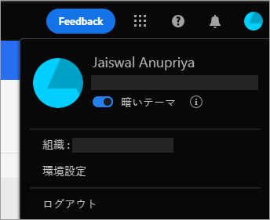

# [!DNL Experience Manager Assets Essentials] の基本 {#assets-essentials-get-started}

<!-- TBD: Make links for these steps. -->

[!DNL Assets Essentials] を使用したデジタルアセットの管理に必要なのは、次の 3 つの簡単な手順だけです。

* **手順 1**：アセットを[アップロード](/help/add-delete.md)し[表示](/help/navigate-view.md)する。
* **手順 2**：アセットを[検索](/help/search.md)し[ダウンロード](/help/manage-organize.md#download)する。
* **手順3**: [アセットを管](/help/manage-organize.md) 理および整理します。

[!DNL Assets Essentials] を使用するには、[https://experience.adobe.com/#/assets](https://experience.adobe.com/#/assets) でログインします。ログイン時に、「`Company or School Account`」を選択します。 アクセス権を受け取るには、組織の管理者に問い合わせてください。

さらに、[ユーザーインターフェイスについて](/help/navigate-view.md)、[ユースケース一覧](#use-cases)、<!-- TBD: [supported file types](/help/supported-file-formats.md), -->[既知の問題](/help/release-notes.md#known-issues)も参考になります。

## [!DNL Assets Essentials] へのアクセス権の取得  {#get-access}

アドビは、ソリューションをプロビジョニングし、組織が指名した人物を管理者として追加します。管理者は、[[!DNL Admin Console]](https://helpx.adobe.com/jp/enterprise/admin-guide.html/enterprise/using/welcome.ug.html) を使用して、組織の様々なユーザーにアクセス権を付与できます。アクセスに関するリクエストについては、組織の管理者に問い合わせてください。

## [!DNL Assets Essentials] の設定 {#configuration}

環境設定を開くには、ユーザーインターフェイスの右上隅にあるアバターをクリックします。ソリューションの環境設定で、明るいテーマと暗いテーマを切り替えることができます。

複数の異なる組織に属している場合は、組織を変更し、様々な組織のアカウントにアクセスすることもできます。

[!UICONTROL Experience Cloud の環境設定]を変更するには、「[!UICONTROL 環境設定]」をクリックします。

<!-- TBD: What can admins configure? What more can users configure? Any doc that describes Exp Cloud preferences? 
Metadata forms is out of the scope of 6/17 GA. When the functionality is added, link to it from here. It is about configuring metadata UI. -->

<!-- TBD: This section contains beta-specific video that will be updated post-GA.

## Login experience {#login-experience}

When logging in, after providing the credentials, you can be prompted to select an account. In this case, select `Company or School Account` to proceed.

-->

## [!DNL Assets Essentials] のユースケース {#use-cases}

[!DNL Assets Essentials] を使用すると、次のような様々なデジタルアセット管理（DAM）タスクを実行できます。

| ユーザータスク | 機能とハウツー情報 |
|-----|------|
| アセットの参照と表示 | <ul> <li>[リポジトリの参照](/help/navigate-view.md#view-assets-and-details) </li> <li> [アセットのプレビュー](/help/navigate-view.md#preview-assets) <li> [アセットのレンディションの表示](/help/add-delete.md#renditions) </li> <li>[アセットのバージョンの表示](/help/manage-organize.md#view-versions)</li></ul> |
| 新しいアセットの追加 | <ul> <li>[新しいアセットやフォルダーのアップロード](/help/add-delete.md#add-assets)</li> <li>[アップロードの進行状況の監視とアップロードの管理](/help/add-delete.md#upload-progress)</li> <li>[重複の解決](/help/add-delete.md#resolve-upload-fails)</li> </ul> |
| アセットまたは関連情報の更新 | <ul> <li>[画像の編集](/help/edit-images.md)</li> <li>[バージョンの作成](/help/manage-organize.md#create-versions)と[バージョンの表示](/help/manage-organize.md#view-versions)</li> <li>[画像の編集](/help/edit-images.md)</li> </ul> |
| アセットの編集 | <ul> <li>[Adobe Photoshop Express を使用したブラウザー内編集](/help/edit-images.md)</li> <li>[ソーシャルメディアプロファイルの切り抜き](/help/edit-images.md#crop-straighten-images)</li> <li>[バージョンの表示と管理](/help/manage-organize.md#view-versions)</li> <li>[使用方法 [!DNL Adobe Asset Link]](/help/integration.md#integrations)</ul></ul> |
| リポジトリ内のアセットの検索 | <ul> <li>[特定のフォルダー内での検索](/help/search.md#refine-search-results)</li> <li>[保存済みの検索](/help/search.md#saved-search)</li> <li>[最近表示されたアセットの検索](/help/search.md)</li> <li>[フルテキスト検索](/help/search.md) |
| アセットのダウンロード | <ul> <li> [アセットのプレビュー](/help/navigate-view.md#preview-assets) </li> <li> [アセットのダウンロード](/help/manage-organize.md#download) <li> [レンディションのダウンロード](/help/add-delete.md#renditions) </li></ul> |
| メタデータ操作 | <ul> <li>[詳細なメタデータの表示](/help/metadata.md) </li> <li> [メタデータの更新](/help/metadata.md#update-metadata)</li> <li> [新しいメタデータフォームの作成](/help/metadata.md#metadata-forms) </li> </ul> |
| 他の ソリューションとの統合 | <ul> <li>[アセットセレクターの使用： [!DNL Adobe Journey Optimizer]](/help/integration.md)</li> <li>[[!DNL Adobe Asset Link] （ [!DNL Creative Cloud]](/help/integration.md) 用）</li> <li>[との統合 [!DNL Adobe Workfront]](/help/integration.md)</li> </ul> |

<!--TBD: Merge the below rows in the table when the use cases are documented/available.

| How do I delete assets? | <ul> <li>[Delete assets](/help/manage-organize.md)</li> <li>Recover deleted assets</li> <li>Permanently delete assets</li> </ul> |
| How do I share assets or find shared assets? | <ul> <li>Shared by me</li> <li>Shared with me</li> <li>Share for comments and review</li> <li>Unshare assets</li> </ul> |
| How do I collaborate with others and get my assets reviewed | <ul> <li>Share for review</li> <li>Provide comments. Resolve and filter comments</li> <li>Annotations on images</li> <li>Assign tasks to specific users and prioritize</li> </ul> |

-->

##  製品に関するフィードバックの提供 {#provide-feedback}

アドビは、ソリューションに関するフィードバックを歓迎します。作業中のアプリケーションを切り替えずにフィードバックを提供するには、ユーザーインターフェイスで「[!UICONTROL フィードバック]」オプションを使用します。また、スクリーンショットやイシューのビデオ録画などのファイルを添付することもできます。

ドキュメントに関するフィードバックを提供するには、[!UICONTROL Edit this page] または[!UICONTROL Log an issue] を右側のサイドバーから作成をクリックします。 次のいずれかを実行できます。

* コンテンツを更新し、GitHubプル要求を送信します。
* GitHubでイシューまたはチケットを作成します。 イシューを作成する際に、自動的に入力された記事名を保持します。

>[!MORELIKETHIS]
>
>* [ユーザーインターフェイスについて](/help/navigate-view.md)
>* [リリースノートと既知の問題](/help/release-notes.md)

<!-- TBD: 
>* [Supported file types](/help/supported-file-formats.md).
-->
