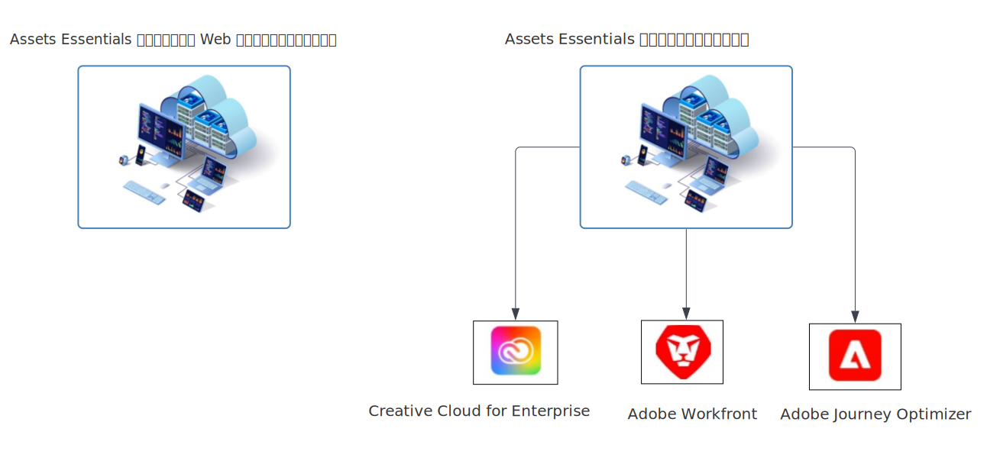

# [!DNL Adobe Experience Manager Assets Essentials] の概要 {#assets-essentials}

<!-- TBD: Update this banner to remove Beta label. 

-->

Adobeは、デジタルアセットを最大限に活用するための堅牢なデジタルアセット管理 (DAM) ソリューションを提供します。 Adobe Experience Manager Assets Essentialsは、デジタルアセットを保存、管理、検出、使用する、Adobeの軽量アセット管理ソリューションです。

## Assets Essentialsとは {#assets-essemtials-overview}

Experience Manager Assets Essentials は、Adobe Experience Manager AssetsCloud Serviceの軽量エディションです。 Assets Essentialsは、シンプルで最新のユーザーインターフェイスを使用して、統合されたアセット管理とコラボレーションを提供します。 使いやすいソリューションを使用すれば、よりクリエイティブなマーケティングチームがデジタルアセットを保存、検出、配布できます。

Assets Essentialsでは、次のことが可能です。

* アセットを一元的に管理、整理、管理します。

* チーム間でコンテンツ開発に関するコラボレーション

* 最終承認済みアセットへのアクセス、検索。

* ダウンストリーム配信用のアセットの共有とダウンロード。

## Assets Essentialsへのアクセス方法 {#access-options}

Assets Essentialsは、エンドユーザーおよび管理者向けのスタンドアロン Web ユーザーインターフェイスを備えており、これらのユーザーはすべてのソリューションの機能にアクセスできます。 また、他のAdobeソリューションのユーザーは、埋め込みエクスペリエンス (Enterprise、Adobe Journey Optimizer、Adobe Workfrontの各アプリケーションのCreative Cloudで利用可能 ) を通じて、Assets Essentialsのアセットにアクセスし、操作することもできます。

## なぜAssets Essentials? {#assets-essentials-features}

Assets Essentialsには主なメリットがあり、次のことができます。

* **すぐに使い始める** を追加する必要はありません。

* より多くのチームに対するアセットへのアクセスを拡張し、との一貫した顧客体験を提供する **シンプルなアセット管理**.

* ネイティブとコンテンツのライフサイクルを統合 **他のAdobeソリューションへの統合**.

* 以下を実現するには、 **クラウドベースのプラットフォーム**&#x200B;安全で、いつでもどこでも拡張可能

* 基本的な DAM 機能と **成長する** Enterprise DAM にコピーします。

**すぐに使い始める**

Assets Essentialsソリューションは、Adobeによってお客様に提供され、プロビジョニングプロセスの完了後に利用できます。 管理者はAdobe Admin Consoleで製品にアクセスでき、システム設定とユーザーのオンボーディングを直ちに開始できます。

Assets Essentialsの詳細 [管理とユーザーのオンボーディング](deploy-administer.md).

**アセット管理の簡素化**

Assets Essentialsのシンプルなユーザーインターフェイスにより、デジタルアセットの管理、検出、配布が容易になります。 クリエイティブ、マーケティング、事業部門のチームなど、様々な機能を持つ幅広いユーザーは、アセットに関して共同作業を行い、必要に応じて適切な承認済みアセットにアクセスできます。

詳しくは、 [Assets Essentialsを使用した、アセット管理のニーズの概要](get-started.md).

**他のアプリケーションとのAdobe**

Assets Essentialsは、サポートされるAdobeソリューションと統合され、これらのアプリケーションのインターフェイス内から組み込みのエクスペリエンスを提供します。 これにより、ユーザーはアプリケーション内で直接必要なアセットに簡単にアクセスできます。 すべてのユーザーが、使い慣れたツールやアプリケーションで、一元管理された同じアセットを使用できます。

組み込みのAssets Essentialsエクスペリエンスは、エンタープライズ、Adobe Journey Optimizer、Adobe Workfrontの各アプリケーションのCreative Cloudに使用できます。

詳しくは、[他のアドビソリューションとの統合](integration.md)を参照してください。

**クラウドベースのプラットフォーム**

Assets Essentialsでは、Adobeクラウドインフラストラクチャに基づいて、デジタルアセットの作成、管理、配布に関するビジネスニーズに焦点を当てることができます。 さらに、Adobeは、頻繁な更新を通じてユーザーにシームレスに提供される製品イノベーションを利用して、ソリューションの可用性、安全性、拡張性、常に最新の状態に保ちます。

**お客様と共に成長する機能**

Assets Essentialsをすぐに使い始めて、様々なチームの主要なデジタルアセット管理機能を活用します。

ビジネスニーズが拡大し、カスタマイズ、拡張機能と統合、自動化、Dynamic Media、Brand Portalなどの高度なデジタルアセット管理要件に対するサポートが必要になった場合、Adobeでもオファーが提供されます [Adobe Experience Manager Assetsas a Cloud Service](https://experienceleague.adobe.com/docs/experience-manager-cloud-service/content/assets/home.html?lang=en).

## 次の手順 {#next-steps}

* 次を使用して製品に関するフィードバックを提供： [!UICONTROL フィードバック] Assets Essentialsユーザーインターフェイスで使用できるオプション

* 次を使用してドキュメントのフィードバックを提供： [!UICONTROL このページを編集]  または [!UICONTROL 問題のログ]  右側のサイドバーで利用可能

* 連絡先 [カスタマーケア](https://experienceleague.adobe.com/?support-solution=General&amp;lang=ja#support)

>[!MORELIKETHIS]
>
>* [[!DNL Assets Essentials] チュートリアルページ](https://experienceleague.adobe.com/docs/experience-manager-learn/assets-essentials/overview.html?lang=en)

