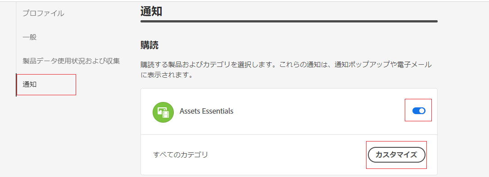
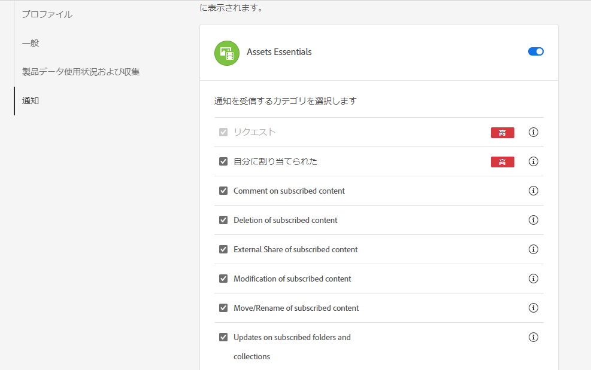
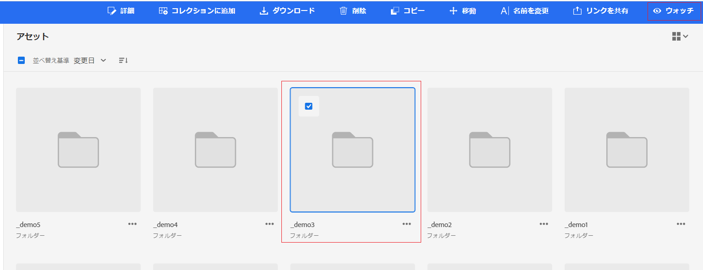

# 通知の管理 {#manage-notifications}

Assets Essentials通知を使用すると、リポジトリー内の使用可能なアセットやフォルダーに対して実行された操作を監視できます。 通知を送信するコンテンツを選択し、購読する必要があります。 また、通知を送信するカテゴリを設定することもできます。

## 通知カテゴリを購読 {#subscribe-to-notification-categories}

カテゴリのリストから選択して購読すると、通知を受け取ることができます。 Assets Essentialsは、使用可能なオプションから選択したカテゴリに対してのみ通知を送信します。

<table>
    <tbody>
     <tr>
      <th><strong>通知カテゴリ</strong></th>
      <th><strong>説明</strong></th>
     </tr>
     <tr>
      <td>リクエスト</td>
      <td>タスクをユーザーに割り当てると、そのユーザーによってタスクに対して実行されたアクションがある場合に通知を受け取ります。</td>
     </tr>
     <tr>
      <td>自分に割り当て済み</td>
      <td>別のユーザーから割り当てられたタスクがある場合に通知を受け取ります。</td>
     </tr>
     <tr>
      <td>購読済みコンテンツに対するコメント</td>
      <td>ユーザーが購読済みアセットにコメントすると、通知が届きます。</td>
     </tr>
     <tr>
      <td>購読済みコンテンツの削除</td>
      <td>ユーザーが購読済みのアセットまたはフォルダーを削除すると、通知を受け取ります。</td>
     </tr>
     <tr>
      <td>購読済みコンテンツの外部共有</td>
      <td>購読したアセットまたはフォルダーの公開リンクをユーザーが生成すると、通知を受け取ります。</td>
     </tr>
     <tr>
      <td>購読済みコンテンツの変更</td>
      <td>ユーザーが購読済みアセットの新しいバージョンを作成すると、通知を受け取ります。</td>
     </tr>
     <tr>
      <td>購読済みコンテンツの移動/名前変更</td>
      <td>購読しているアセットまたはフォルダーの名前をユーザーが移動または変更すると、通知を受け取ります。</td>
     </tr>
     <tr>
      <td>購読済みフォルダーおよびコレクションの更新</td>
      <td>ユーザーが購読フォルダーにアセットを追加または削除すると、通知を受け取ります。</td>
     </tr>    
    </tbody>
   </table>

通知カテゴリを購読するには：

1. クリック  をクリックします。

1. クリック  表示する [!UICONTROL Experience Cloud設定] ページ。

1. 次をクリック： **[!UICONTROL 通知]** オプションが左側のウィンドウに表示されます。

1. 内 **[!UICONTROL 通知]** セクションで、 [!UICONTROL Assets Essentials] 」セクションに移動し、切り替えオプションがオンの状態に切り替えられていることを確認します。

   

1. クリック **[!UICONTROL カスタマイズ]** 通知カテゴリを表示します。
   

1. 通知の対象となる通知カテゴリを選択します。

## フォルダーやアセットの監視と監視解除 {#watch-unwatch-assets}

後 [通知カテゴリの購読](#subscribe-to-notification-categories)に設定されている場合、通知の受信を開始するにはコンテンツを購読する必要があります。

>[!NOTE]
>
>の場合 **[!UICONTROL リクエスト]** および **[!UICONTROL 自分に割り当て済み]** 通知カテゴリを使用する場合、通知カテゴリを購読した後でコンテンツを購読する必要はありません。 自分が作成したリクエストとタスクが割り当てられた時点で、通知が自動的に送信されます。

コンテンツを購読するには、購読する必要があるフォルダーまたはアセットを選択し、「 」をクリックします **[!UICONTROL 所要時間]**.

Assets Essentialsに成功メッセージが表示されます。 次をクリックできます。 **[!UICONTROL 通知設定に移動]** 成功メッセージで、 [通知カテゴリの購読](#subscribe-to-notification-categories).

Assets Essentialsは購読済みカテゴリの通知を送信するようになりました。 複数のアセットまたはフォルダーを選択して、「 **[!UICONTROL 所要時間]** 時間を節約できます。 ただし、一部が既に購読登録されている複数のエンティティを選択した場合、 **[!UICONTROL 所要時間]** オプションが表示されません。

同様に、購読解除するには、購読したアセットまたはフォルダーを選択し、「 」をクリックします **[!UICONTROL 監視解除]**.

## 通知を表示 {#view-notifications}

通知は、Assets Essentialsユーザーインターフェイスのメニューバーの右側に表示されます。

通知をクリックすると、Assets Essentialsによって、通知内で参照されている適切なアセットまたはフォルダーに移動します。

