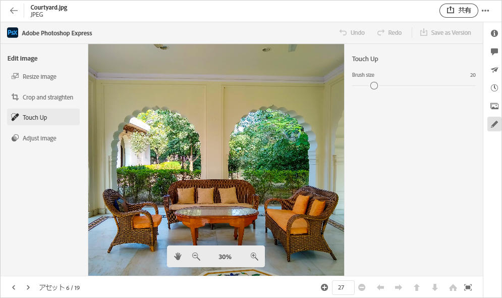
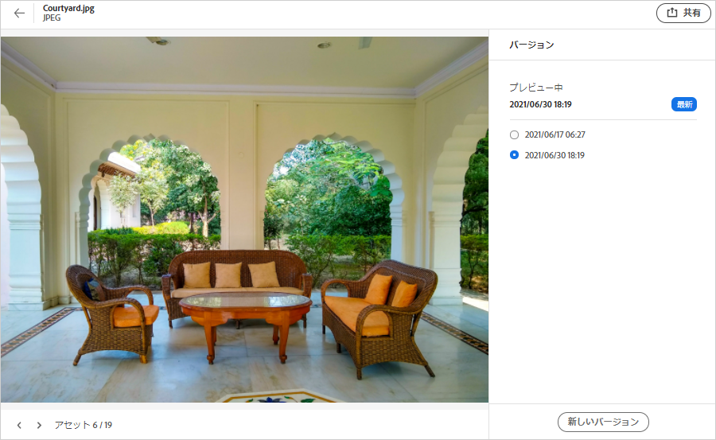
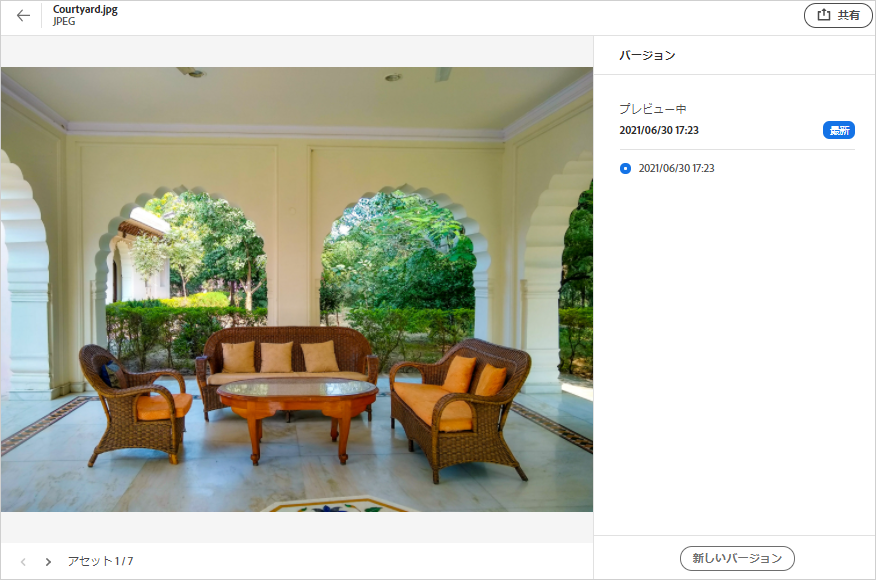

# アセットの管理 {#manage-assets}

[!DNL Assets Essentials] の操作しやすいインターフェイスを使用して、様々なデジタルアセット管理（DAM）タスクを簡単に実行できます。アセットを追加した後は、アセットの検索、ダウンロード、移動、コピー、名前変更、削除、更新および編集を行うことができます。

[!DNL Assets Essentials] を使用すると、次のアセット管理タスクを実行できます。アセットを選択すると、上部のツールバーに次のオプションが表示されます。

*図：選択した画像に対してツールバーで使用できるオプション*

*  選択を解除します。
*  アセットをプレビューし、詳細なメタデータを表示します。プレビュー時に、バージョンを表示して画像を編集できます。
*  選択したアセットをローカルファイルシステムにダウンロードします。
*  選択したアセットまたはフォルダーを削除します。
* アセットのチェックアウト<!--  -->
*  選択したファイルまたはフォルダーをコピーします。
*  選択したアセットまたはフォルダーをリポジトリー階層内の別の場所に移動します。
*  選択したアセットまたはフォルダーの名前を変更します。一意の名前を使用しないと、名前を変更しても警告が表示されて失敗します。その場合は、新しい名前でもう一度やり直すことができます。
* 他のユーザーにタスクを割り当てて、アセットで共同作業する。<!--  -->

アセットのサムネールにも同じオプションが表示されます。

[!DNL Assets Essentials] では、選択したアセットのタイプに応じた関連オプションのみツールバーに表示されます。

*図：選択したフォルダーに対してツールバーで使用できるオプション*

*図：選択した PDF ファイルに対してツールバーで使用できるオプション*

## アセットのダウンロードと配布 {#download}

1 つ以上のアセットまたはフォルダー、またはその両方を選択し、選択したものをローカルファイルシステムにダウンロードできます。アセットを編集して再度アップロードするか、[!DNL Assets Essentials] の外部にアセットを配布することができます。また、アセットの](/help/add-delete.md#renditions)レンディションをダウンロード[することもできます。

## アセットのバージョン管理 {#versions-of-assets}

<!-- 
TBD: query for engineering: How many versions are maintained. What happens when we reach that limit? Are old versions automatically removed? -->

[!DNL Assets Essentials] では、更新または編集されたアセットが再度アップロードされたとき、そのアセットのバージョンを管理します。バージョン履歴や過去のバージョンを表示したり、必要に応じて過去のバージョンのアセットを最新のバージョンとして復元したりできます（後者の場合は、以前のバージョンに戻すことになります）。アセットのバージョンは、次のシナリオで作成されます。

* 既存のアセットと同じファイル名を持つ新しいアセットを、既存のアセットと同じフォルダーにアップロードする。[!DNL Assets Essentials] では、前のアセットを上書きするか、新しいアセットをバージョンとして保存するかを確認するプロンプトを表示します。[重複したアセットのアップロード](/help/add-delete.md#resolve-upload-fails)を参照してください。

   

   *図：既存のアセットと同じ名前のアセットをアップロードする場合、そのアセットのバージョンを作成可能*

* 画像を編集し、「**[!UICONTROL バージョンとして保存]**」をクリックする。[画像の編集](/help/edit-images.md)を参照してください。

   

   *図：編集した画像をバージョンとして保存*

* 既存のアセットのバージョンを開く。「**[!UICONTROL 新しいバージョン]**」をクリックし、アセットの新しいバージョンをリポジトリーにアップロードします。

   

### アセットのバージョンの表示 {#view-versions}

アセットの複製コピーや変更済みコピーをアップロードする際に、そのコピーのバージョンを作成できます。バージョン管理を使用すると、過去のアセットをレビューしたり、必要に応じて以前のバージョンに戻したりすることができます。

バージョンを表示するには、アセットのプレビューを開き、右側のサイドバーで&#x200B;**[!UICONTROL バージョン]**&#x200B;アイコン（）をクリックします。特定のバージョンをプレビューするには、目的のバージョンを選択します。そのバージョンに戻すには、「**[!UICONTROL 最新にする]**」をクリックします。

バージョンタイムラインからバージョンを作成することもできます。最新バージョンを選択し、「**[!UICONTROL 新しいバージョン]**」をクリックして、アセットの新しいコピーをローカルファイルシステムからアップロードします。

*図：アセットのバージョンを表示、以前のバージョンに戻す、別の新しいバージョンをアップロード*
