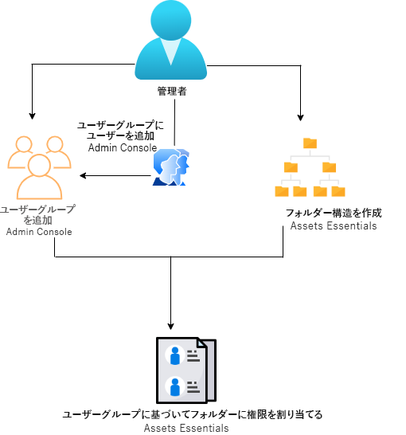
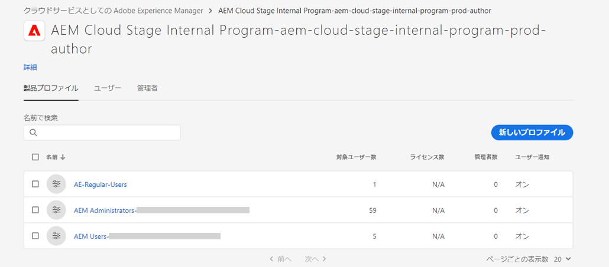
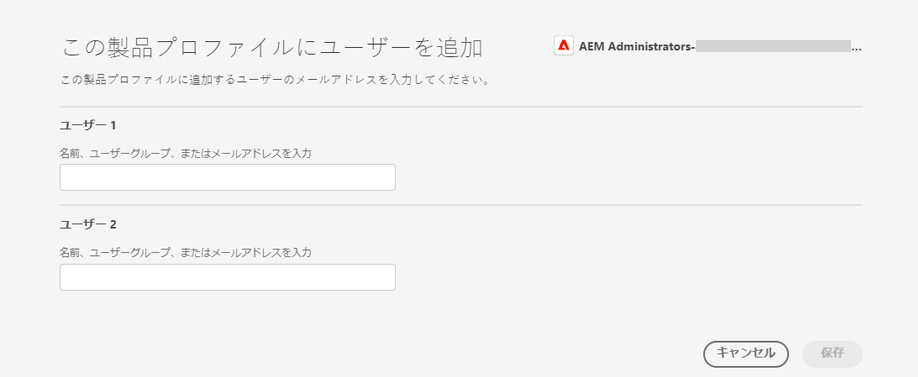
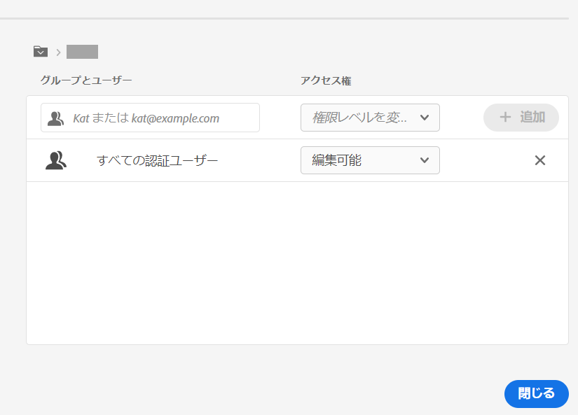
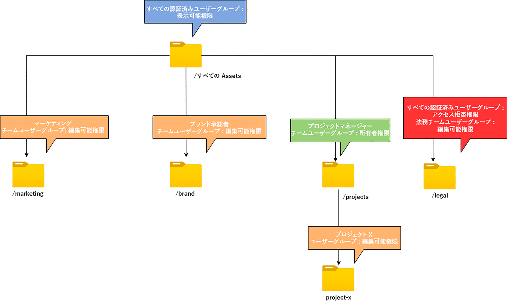

# フォルダーの権限の管理 {#manage-permissions}

>[!CONTEXTUALHELP]
>id="assets_permissions_folders"
>title="権限の管理"
>abstract="[!DNL Assets Essentials] では、管理者は、リポジトリで使用可能なフォルダーのアクセスレベルを管理できます。管理者は、ユーザーグループを作成し、それらのグループに権限を割り当てて、アクセスレベルを管理できます。また、フォルダーレベルでユーザーグループに権限管理の権限をデリゲートすることもできます。"

Assets Essentials では、管理者は、リポジトリで使用可能なフォルダーのアクセスレベルを管理できます。管理者は、ユーザーグループを作成し、それらのグループに権限を割り当てて、アクセスレベルを管理できます。また、フォルダーレベルでユーザーグループに権限管理の権限をデリゲートすることもできます。

次のデータフロー図は、Assets Essentials リポジトリで使用可能なフォルダーに対する権限を設定および管理するために実行する一連のタスクを示しています。

## フォルダーの権限を管理する前に {#before-managing-permissions}

Assets Essentials リポジトリでフォルダーに対する権限の管理を開始する前に、論理フォルダー構造を作成できる管理者の追加、ユーザーグループの作成、様々なユーザーグループのフォルダー権限の管理など、特定のタスクを実行する必要があります。

### 管理者を追加 {#add-admin-users}

Assets Essentials アプリケーションの管理者を追加して、他のユーザーグループのフォルダー権限を管理できるようにします。

管理者を追加するには：

1. 組織の [Admin Console](https://adminconsole.adobe.com) にアクセスし、上部のバーで「**[!UICONTROL 製品]**」をクリックしてから、**[!UICONTROL AEM Assets Essentials]**／[!DNL Assets Essentials] 環境の順の順にクリックします。[!DNL Assets Essentials] には、管理者、通常のユーザーおよび消費者ユーザー用のアクセスを表す 3 つの製品プロファイルがあります。

   

1. ユーザーをグループに追加するには、Assets Essentials 管理者グループをクリックし、「**[!UICONTROL ユーザーを追加]**」を選択し、ユーザーの詳細を入力して、「**[!UICONTROL 保存]**」をクリックします。

   

   ユーザーを追加すると、使用を開始するための招待メールがそのユーザーに届きます。招待メールは、[!DNL Admin Console] の製品プロファイル設定で無効にすることができます。

1. ユーザーをグループから削除するには、該当するグループをクリックし、既存のユーザーを選択して、「**[!UICONTROL ユーザーを削除]**」を選択します。

### ユーザーグループを追加 {#add-user-groups}

ユーザーグループを作成し、それらのグループに権限を割り当てて、Assets Essentials リポジトリのフォルダーアクセスレベルを管理します。その後、ユーザーをユーザーグループに割り当てることができます。

ユーザーをユーザーグループ（1）に追加し、[ユーザーを Assets Essentials 製品プロファイル（2）に](#add-admin-users)追加することはできます。ただし、ユーザーグループを Assets Essentials 製品プロファイル（3）に直接追加することはできません。

ユーザーグループの管理方法については、[ユーザーグループの管理](https://helpx.adobe.com/jp/enterprise/using/user-groups.html)の `Create user groups` および `Edit user groups` を参照してください。 

>[!NOTE]
>
>Admin Console が、Azure や Google コネクタ、ユーザー同期ツール、User Management Rest API など、ユーザー／グループの割り当てを管理する外部システムを活用するように設定されている場合、グループとユーザーの割り当ては自動的に設定されます。詳しくは、[Adobe Admin Consoleユーザー](https://helpx.adobe.com/jp/enterprise/using/users.html)を参照してください。

### グループにユーザーを追加 {#add-users-to-uesr-groups}

ユーザーグループを作成した後、ユーザーグループへのユーザーの追加を開始できます。

ユーザーグループへのユーザーの追加を管理する方法については、[ユーザーグループの管理](https://helpx.adobe.com/jp/enterprise/using/user-groups.html#add-users-to-groups)の `Add users to groups` を参照してください。

### フォルダー構造を作成 {#create-folder-structure}

次の方法を使用して、Assets Essentials リポジトリにフォルダー構造を作成できます。

* ツールバーにある「**[!UICONTROL フォルダーを作成]**」オプションをクリックし、空のフォルダーを作成します。

* ツールバーにある「**[!UICONTROL アセットを追加]**」オプションをクリックし、[ローカルマシンで使用可能なフォルダー構造をアップロード](add-delete.md)します。

組織のビジネス目標に適したフォルダー構造を作成します。既存のフォルダー構造を Assets Essentials リポジトリにアップロードする場合は、構造を確認する必要があります。詳しくは、[効果的な権限管理のベストプラクティス](permission-management-best-practices.md)を参照してください。

## フォルダーに対する権限の管理 {#manage-permissions-on-folders}

次の権限をユーザーグループまたはユーザーに割り当てることができます。ユーザーに権限を割り当てることはお勧めしません。

| 権限名 | 説明 |
|-----|------|
| 表示可能 | <ul><li>フォルダーを表示および移動するための読み取りアクセス </li><li>アセットのプレビュー</li><li>アセットのダウンロード</li><li>アセットのコピー</li><li>アセットへのリンクの共有</li><ul> |
| 編集可能 | <ul><li>表示可能権限に使用できるすべての権限 </li><li>フォルダーの作成</li><li>フォルダーの削除</li><li>フォルダー名の変更</li><li>アセットの作成</li><li>アセットの更新</li><li>アセットの削除</li><li>アセットの移動</li><li>アセット名の変更</li><ul> |
| 所有者 | <ul><li>編集可能権限に使用できるすべての権限</li><li>フォルダーとそのサブフォルダーに対する権限の管理</li>この権限がある管理者は、フォルダーとそのサブフォルダーに対する管理者権限を他のユーザーに委任できます。<ul> |
| アクセスを拒否 | フォルダーとそのサブフォルダーに対する表示可能、編集可能および所有者の権限を削除します。 |

**デフォルトの権限**

Assets Essentials アプリケーションにログオンできるすべての認証済みユーザーには、最初に Assets Essentials リポジトリへの `Can Edit` 権限があります。管理者は、[Assets Essentials リポジトリ全体の権限の編集](#edit-permissions-entire-repository)を行って、デフォルトの権限の変更を調整できます。

**ユーザーグループにフォルダー権限を割り当てるシーケンス**

ユーザーグループにフォルダー権限を割り当てるためのルールを作成します。フォルダーに権限を割り当てるために使用するシーケンスは重要であり、ユーザーグループおよび最終的にはユーザーが使用できるアクセス権を決定します。

例えば、フォルダーの `Can View` 権限をスーパーグループに割り当ててから、そのサブグループに `Can Edit` 権限を割り当てると、サブグループのメンバーだけがフォルダーの編集権限を持つことができます。スーパーグループのユーザーには、フォルダーに対する表示アクセス権があります。

組織のマーケティング部門にのみ `Marketing` フォルダーへの編集権限を付与し、他の部門に表示権限を付与する必要がある場合は、スーパーグループ `All Authenticated Users` に `Can View` 権限、サブグループ `Marketing` に `Can Edit` 権限を割り当てます。

**権限の継承**

Assets Essentials は権限の継承を使用し、子フォルダー内の親フォルダーに設定されている権限を継承できます。例えば、親フォルダーが `All Authenticated Users` グループの `Can View` 権限、子フォルダーに `Marketing` ユーザーグループの `Can Edit` 権限を持っている場合、すべての認証済みユーザーに子フォルダーの表示権限、`Marketing` ユーザーグループが子フォルダーの編集権限を与えることができます。`Marketing` ユーザーグループには、子フォルダー（Marketing）よりさらに下のレベルのフォルダーに対する編集権限があります。

>[!NOTE]
>
> 上位フォルダーのグループに `Deny Access` 権限を設定してから、そのグループまたはそのメンバーのアクセス権（`Can view`、`Can edit` または `Owner`）を復元することはサポートしていません。`Deny Access` の使用は慎重に行ってください。

### ユーザーグループに権限を追加 {#add-permissions}

フォルダーに対するグループ権限を割り当てるには：

1. フォルダーを選択し、「**[!UICONTROL 権限の管理]**」をクリックします。

1. **[!UICONTROL 権限の管理]**&#x200B;ダイアログで、「**[!UICONTROL グループとユーザー]**」フィールドにグループまたはユーザーの名前を指定します。

1. **[!UICONTROL アクセス権]**&#x200B;ドロップダウンリストから「[アクセスのレベル](#manage-permissions-folders)」を選択します。

1. 「**[!UICONTROL 追加]**」をクリックして、ユーザーまたはユーザーグループの権限をすぐに変更します。

1. 手順 1～3 を繰り返して、**[!UICONTROL 権限の管理]**&#x200B;ダイアログにルールを追加します。

   

   >[!NOTE]
   >
   > フォルダーに権限を割り当てるために使用する順序は重要です。この順序は、ユーザーグループおよび最終的にはグループに追加されるユーザーが使用できるアクセス権を決定します。

   複数のフォルダーに対する権限を管理している場合は、左側のパネルから他のフォルダーを選択し、そのフォルダーに対する権限の管理を開始することもできます。 

1. 「**[!UICONTROL 閉じる]**」をクリックします。

>[!CAUTION]
>
> 個々のユーザーではなく、ユーザーグループの権限を管理することをお勧めします。`Deny access` 権限の設定は、ユーザーグループに対してのみサポートしており、個々のユーザーに対してはサポートしていません。

### ユーザーグループに割り当てられた権限の編集 {#edit-permissions}

フォルダー上のユーザーグループに割り当てられている権限を編集するには：

1. フォルダーを選択し、「**[!UICONTROL 権限の管理]**」をクリックします。

1. **[!UICONTROL 権限の管理]**&#x200B;ダイアログで、**[!UICONTROL アクセス権]**&#x200B;ドロップダウンリストから「[アクセスのレベル](#manage-permissions-folders)」を編集します。

1. 必要に応じて、既存の権限ルールに[ユーザーグループまたはユーザーを追加](#add-permissions)します。

1. 「 X 」をクリックして、ユーザーグループに割り当てられている権限を削除します。

### Assets Essentials リポジトリ全体の権限を編集 {#edit-permissions-entire-repository}

アプリケーション管理者は、Assets Essentials リポジトリ全体の権限をデフォルトの `Can Edit` から他のアクセスレベルに編集できます。

Assets Essentials リポジトリ全体の権限を編集するには：

1. 任意のフォルダーを選択し、「**[!UICONTROL 権限の管理]**」をクリックします。

1. **[!UICONTROL 権限の管理]**&#x200B;ダイアログで、左側のパネルの「**[!UICONTROL すべてのアセット]**」をクリックします。

1. [権限を編集](#edit-permissions)し、ダイアログを閉じます。

>[!NOTE]
>
>管理者は、Assets Essentials リポジトリ全体の `Deny Access` 権限レベルを選択して、ユーザーに少なくともアプリケーションへの読み取りアクセス権があることを確認することはできません。同様に、管理者が[!UICONTROL 権限の管理]ダイアログで `Can Edit` 権限を明示的に削除した場合でも、`All Authenticated Users` には少なくともリポジトリへの読み取り権限があります。

## 有効な権限管理の例 {#example-permission-management}

**ユースケース**

* すべての認証ユーザーグループには、リポジトリに対する表示アクセス権があります。
* チーム固有のユーザーグループには、独自の関数固有のフォルダーに対する編集権限があります。
* 法務チーム以外の認証済みユーザーは法務フォルダーを閲覧できません。

次のユーザーグループを Admin Console に作成します。

* マーケティングチーム

* ブランド承認者チーム

* プロジェクトマネージャーチーム

* プロジェクト X チーム

* 法務チーム

次の図に、各ユーザーグループに割り当てられるフォルダー階層と権限を示します。

フォルダー階層内のすべてのユーザーグループのアクセスレベルは次のとおりです。

* /All Assets：管理者がルートレベルで権限をデフォルトの `Can Edit` から `Can View` に変更します。すべてのユーザーがフォルダーやアセットを表示できますが、編集することはできません。

* /marketing：すべてのユーザーが、権限の継承に基づいてフォルダーとそのサブフォルダーを表示できますが、マーケティングチームのユーザーグループには、フォルダーに対する編集権限があります。 

* /brand：すべてのユーザーが、権限の継承に基づいてフォルダーとそのサブフォルダーを表示できますが、ブランド承認者チームのユーザーグループには、フォルダーに対する編集権限があります。

* /projects：すべてのユーザーが、権限の継承に基づいてフォルダーとそのサブフォルダーを表示できます。プロジェクトマネージャーチームのユーザーグループには、次の権限があります。

   * 編集権限

   * 所有者権限：フォルダーとそのサブフォルダーに対する権限を管理します。

* /projects/project-x：すべてのユーザーが、フォルダーとそのサブフォルダーを表示できます。プロジェクトマネージャーチームのユーザーグループには編集権限があり、フォルダーとそのサブフォルダーに対する権限を管理できます（所有者権限）。プロジェクト X チームのユーザーグループには、編集権限があります。

* /legal：`All Authenticated Users` グループの `Deny Access` 権限に基づいて、どのユーザーもフォルダーにアクセスできません。法務チームのユーザーグループには、編集権限があります。

## 次の手順 {#next-steps}

* [ビデオを視聴して Assets Essentials での権限の管理を学ぶ](https://experienceleague.adobe.com/docs/experience-manager-learn/assets-essentials/configuring/permissions-management.html?lang=ja)

* Assets Essentials ユーザーインターフェイスの「[!UICONTROL フィードバック]」オプションを使用して製品に関するフィードバックを提供する

* 右側のサイドバーにある「[!UICONTROL このページを編集]」（）または「[!UICONTROL 問題を記録] 」（）を使用してドキュメントに関するフィードバックを提供する

* [カスタマーケア](https://experienceleague.adobe.com/?support-solution=General&amp;lang=ja#support)に問い合わせる
