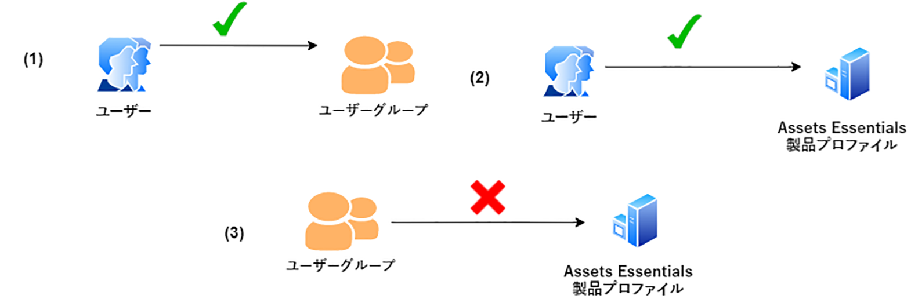

# フォルダーの権限の管理

Assets Essentialsでは、管理者は、リポジトリで使用可能なフォルダーのアクセスレベルを管理できます。 管理者は、ユーザーグループを作成し、それらのグループに権限を割り当てて、アクセスレベルを管理できます。 また、フォルダーレベルでユーザーグループに権限管理権限を委任することもできます。

次のデータフロー図は、Assets Essentialsリポジトリで使用可能なフォルダーに対する権限を設定および管理するために実行する一連のタスクを示しています。

## フォルダーの権限を管理する前に {#before-managing-permissions}

Assets Essentialsリポジトリ内のフォルダーに対する権限の管理を開始する前に、論理フォルダー構造を作成できる管理者の追加、ユーザーグループの作成、様々なユーザーグループのフォルダー権限の管理など、特定のタスクを実行する必要があります。

### 管理者の追加 {#add-admin-users}

Assets Essentialsアプリケーションの管理者を追加して、他のユーザーグループのフォルダー権限を管理できるようにします。

管理者を追加するには：

1. アクセス [Admin Console](https://adminconsole.adobe.com) 組織の場合は、 **[!UICONTROL 製品]** 上部のバーで、 **[!UICONTROL AEM Assets Essentials]**&#x200B;をクリックし、 [!DNL Assets Essentials] 環境。 [!DNL Assets Essentials] には、管理者、通常、消費者の各ユーザーのアクセスを表す 3 つの製品プロファイルがあります。

   

1. ユーザーをグループに追加するには、「 Assets Essentials Administrators 」グループをクリックし、 **[!UICONTROL ユーザーを追加]**、ユーザーの詳細を入力し、 **[!UICONTROL 保存]**.

   

   ユーザーを追加すると、使用を開始するための招待メールがそのユーザーに届きます。招待メールは、[!DNL Admin Console] の製品プロファイル設定で無効にすることができます。

1. ユーザーをグループから削除するには、該当するグループをクリックし、既存のユーザーを選択して、「**[!UICONTROL ユーザーを削除]**」を選択します。

### ユーザーグループの追加 {#add-user-groups}

ユーザーグループを作成し、それらのグループに権限を割り当てて、Assets Essentialsリポジトリのフォルダーアクセスレベルを管理します。 その後、ユーザーをユーザーグループに割り当てることができます。

ユーザーグループ (1) および [Assets Essentials製品プロファイルのユーザー (2)](#add-admin-users). ただし、ユーザーグループをAssets Essentials製品プロファイル (3) に直接追加することはできません。

ユーザーグループの管理方法について詳しくは、 `Create user groups` および `Edit user groups` 次の場所で利用可能： [ユーザーグループの管理](https://helpx.adobe.com/enterprise/using/user-groups.html).

>[!NOTE]
>
>Admin Consoleが、Azure やGoogleコネクタ、ユーザー同期ツール、User Management Rest API など、ユーザー/グループの割り当てを管理する外部システムを利用するように設定されている場合、グループとユーザーの割り当ては自動的に設定されます。 詳しくは、 [Adobe Admin Consoleユーザー](https://helpx.adobe.com/enterprise/using/users.html).

### グループにユーザーを追加 {#add-users-to-uesr-groups}

ユーザーグループを作成した後、ユーザーグループへのユーザーの追加を開始できます。

ユーザーグループへのユーザーの追加を管理する方法について詳しくは、 `Add users to groups` 次の場所で利用可能： [ユーザーグループの管理](https://helpx.adobe.com/in/enterprise/using/user-groups.html#add-users-to-groups).

### フォルダー構造を作成 {#create-folder-structure}

次の方法を使用して、Assets Essentialsリポジトリにフォルダー構造を作成できます。

* 次をクリック： **[!UICONTROL フォルダーを作成]** オプションがツールバーに表示され、空のフォルダーを作成できます。

* クリック **[!UICONTROL アセットを追加]** ツールバーのオプション [ローカルマシンで使用可能なフォルダー構造をアップロードします](add-delete.md).

組織のビジネス目標に適したフォルダ構造を作成します。 既存のフォルダー構造をAssets Essentialsリポジトリにアップロードする場合は、構造を確認する必要があります。 詳しくは、 [効果的な権限管理のベストプラクティス](permission-management-best-practices.md).

## フォルダーに対する権限の管理 {#manage-permissions-on-folders}

次の権限をユーザーグループまたはユーザーに割り当てることができます。 Adobeは、ユーザーに権限を割り当てることはお勧めしません。

| 権限名 | 説明 |
|-----|------|
| 表示可能 | <ul><li>フォルダーを表示および移動するための読み取りアクセス </li><li>アセットのプレビュー</li><li>アセットのダウンロード</li><li>アセットのコピー</li><li>アセットへのリンクの共有</li><ul> |
| 編集可能 | <ul><li>「表示可能」権限で使用可能なすべての権限 </li><li>フォルダーの作成</li><li>フォルダーを削除</li><li>フォルダー名を変更</li><li>アセットの作成</li><li>アセットを更新</li><li>アセットを削除</li><li>アセットの移動</li><li>アセット名を変更</li><ul> |
| 所有者 | <ul><li>Can Edit 権限に使用できるすべての権限</li><li>フォルダーとそのサブフォルダーに対する権限の管理</li>この権限を持つ管理者は、フォルダーとそのサブフォルダーに対する管理者権限を他のユーザーに委任できます。<ul> |
| アクセスを拒否 | フォルダおよびそのサブフォルダの表示、編集、所有者権限を削除します。 |

**デフォルトの権限**

Assets Essentialsアプリケーションにログオンできる、認証済みのすべてのユーザーが、 `Can Edit` 最初はAssets Essentialsリポジトリに対する権限です。 管理者は、デフォルトの権限の変更を次の方法で調整できます： [Assets Essentialsリポジトリ全体の権限の編集](#edit-permissions-entire-repository).

**ユーザーグループにフォルダー権限を割り当てるシーケンス**

ユーザーグループにフォルダー権限を割り当てるためのルールを作成します。 フォルダーに権限を割り当てる際に使用する順序が重要で、ユーザーグループと最終的にユーザーが使用できるアクセス権を決定します。

例えば、 `Can View` フォルダーの権限をスーパーグループに割り当て、 `Can Edit` サブグループに対する権限。サブグループのメンバーのみがフォルダーに対する編集権限を持ちます。 スーパーグループのユーザーは、フォルダーに対する表示アクセス権を持ちます。

の編集権限を `Marketing` 組織のマーケティング部門のみにフォルダを追加し、他のユーザーに対する権限を表示し、割り当てます。 `Can View` スーパーグループに対する権限 `All Authenticated Users` および `Can Edit` サブグループに対する権限 `Marketing`.

**権限の継承**

Assets Essentialsは権限の継承を使用し、子フォルダー内の親フォルダーに設定されている権限を継承できます。 例えば、親フォルダーに `Can View` 権限 `All Authenticated Users` グループと子フォルダーに `Can Edit` 権限 `Marketing` ユーザーグループに属している場合は、認証済みのすべてのユーザーが子フォルダーと `Marketing` 子フォルダーの編集権限を持つユーザーグループ。 この `Marketing` ユーザーグループには、子フォルダー (Marketing) の下のフォルダーのさらなるレベルに対する編集権限があります。

>[!NOTE]
>
> の設定 `Deny Access` 上位フォルダーのグループに対する権限を設定し、アクセスを復元する (`Can view`, `Can edit` または `Owner`) がサポートされていません。 用途 `Deny Access` 慎重に

### ユーザーグループに権限を追加 {#add-permissions}

フォルダーに対するグループ権限を割り当てるには、次の手順に従います。

1. フォルダーを選択し、 **[!UICONTROL 権限の管理]**.

1. の **[!UICONTROL 権限の管理]** ダイアログで、グループまたはユーザーの名前を **[!UICONTROL グループとユーザー]** フィールドに入力します。

1. を選択します。 [アクセスレベル](#manage-permissions-folders) から **[!UICONTROL アクセス]** ドロップダウンリスト。

1. クリック **[!UICONTROL 追加]** をクリックして、ユーザーまたはユーザーグループの権限をすぐに変更します。

1. 手順 1～3 を繰り返して、 **[!UICONTROL 権限の管理]** ダイアログ。

   

   >[!NOTE]
   >
   > フォルダーに権限を割り当てる際に使用する順序は重要で、ユーザーグループに対して使用できるアクセス権と、最終的にグループに追加されるユーザーを決定します。

   複数のフォルダーに対する権限を管理する場合は、左側のウィンドウから他のフォルダーを選択し、そのフォルダーに対する権限の管理を開始することもできます。

1. 「**[!UICONTROL 閉じる]**」をクリックします。

>[!CAUTION]
>
> 個々のユーザーではなく、ユーザーグループの権限を管理することをお勧めします。 の設定 `Deny access` 権限はユーザーグループに対してのみサポートされ、個々のユーザーに対してはサポートされません。

### ユーザーグループに割り当てられた権限の編集 {#edit-permissions}

フォルダー上のユーザーグループに割り当てられている権限を編集するには、次の手順に従います。

1. フォルダーを選択し、 **[!UICONTROL 権限の管理]**.

1. の **[!UICONTROL 権限の管理]** ダイアログ、編集 [アクセスレベル](#manage-permissions-folders) から **[!UICONTROL アクセス]** ドロップダウンリスト。

1. [さらにユーザーグループまたはユーザーを追加する](#add-permissions) を既存の権限ルールに追加する必要があります。

1. 「 X 」をクリックして、ユーザーグループに割り当てられている権限を削除します。

### Assets Essentialsリポジトリ全体の権限を編集 {#edit-permissions-entire-repository}

アプリケーション管理者は、デフォルトのからAssets Essentialsリポジトリ全体の権限を編集できます `Can Edit` を他のアクセスレベルに追加します。

Assets Essentialsリポジトリ全体の権限を編集するには：

1. 任意のフォルダーを選択し、 **[!UICONTROL 権限の管理]**.

1. の **[!UICONTROL 権限の管理]** ダイアログ、クリック **[!UICONTROL すべてのアセット]** をクリックします。

1. [権限の編集](#edit-permissions) ダイアログを閉じます。

>[!NOTE]
>
>管理者が `Deny Access` Assets Essentialsリポジトリ全体の権限レベルを設定します。 同様に、 `All Authenticated Users` 管理者が明示的にリポジトリを削除した場合でも、少なくともリポジトリに対する読み取り権限を持つ `Can Edit` の権限 [!UICONTROL 権限の管理] ダイアログ。

## 有効な権限管理の例 {#example-permission-management}

**ユースケース**

* All Authenticated Users グループはリポジトリに対する表示アクセス権を持ちます。
* チーム固有のユーザーグループは、独自の機能固有のフォルダに対する編集権限を持ちます。
* Legal フォルダーは、Legal チーム以外の認証済みユーザーには表示できません。

次のユーザーグループをAdmin Consoleに作成します。

* マーケティングチーム

* ブランド承認者チーム

* プロジェクトマネージャチーム

* プロジェクト X チーム

* 法務チーム

次の図に、各ユーザーグループに割り当てられるフォルダー階層と権限を示します。

フォルダー階層内のすべてのユーザーグループのアクセスレベルは次のとおりです。

* /すべてのアセット：管理者がデフォルトのルートレベルで権限を変更します `Can Edit` から `Can View`. すべてのユーザーがフォルダーやアセットを表示できますが、編集することはできません。

* /marketing:すべてのユーザーが、権限の継承に基づいてフォルダとサブフォルダを表示できますが、マーケティングチームのユーザーグループは、フォルダに対する編集権限を持っています。

* /brand:すべてのユーザーは、権限の継承に基づいてフォルダとサブフォルダを表示できますが、Brand Approvers チームのユーザーグループは、フォルダに対する編集権限を持っています。

* /projects:すべてのユーザーが、権限の継承に基づいて、フォルダーとそのサブフォルダーを表示できます。 プロジェクトマネージャチームのユーザーグループは次の項目を持ちます。

   * 権限を編集

   * 所有者権限：フォルダーおよびそのサブフォルダーに対する権限を管理します。

* /projects/project-x:すべてのユーザーがフォルダとそのサブフォルダを表示できます。 プロジェクトマネージャチームのユーザーグループは編集権限を持ち、フォルダとそのサブフォルダに対する権限を管理できます（所有者権限）。 プロジェクト X チームのユーザーグループに編集権限があります。

* /legal:フォルダーにアクセスできるユーザーが、 `Deny Access` 権限 `All Authenticated Users` グループ化します。 法務チームのユーザーグループには編集権限があります。
