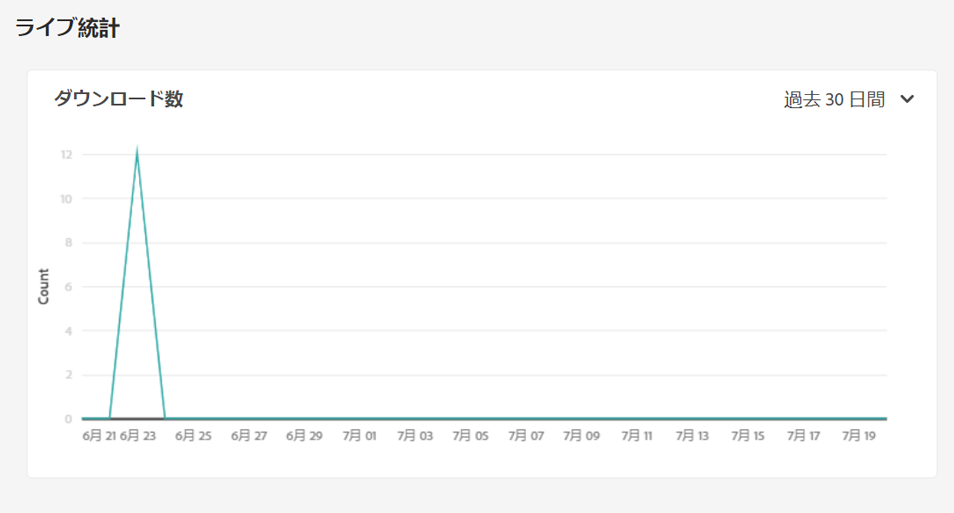
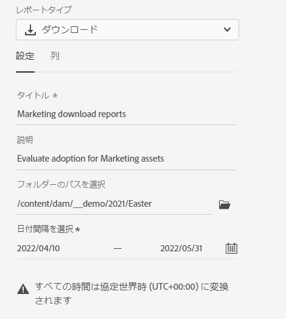
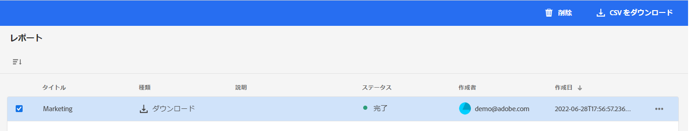

# レポートの管理 {#manage-reports}

アセットレポートを使用すると、管理者はAdobe Experience Manager Assets Essentials環境のアクティビティを視覚的に確認できます。 このデータは、ユーザーがコンテンツや製品とどのようにやり取りするかに関する有用な情報を提供します。

## レポートへのアクセス {#access-reports}

に割り当てられているすべてのユーザー [Assets Essentials Administrators 製品プロファイル](deploy-administer.md) では、「ライブ統計」ダッシュボードにアクセスし、Assets Essentialsでユーザー定義のレポートを作成できます。

## ライブ統計の表示 {#view-live-statistics}

Assets Essentialsを使用すると、Assets Essentials環境のリアルタイムデータを「ライブ統計」ダッシュボードで表示できます。 過去 30 日間または過去 12 ヶ月間のリアルタイムイベント指標を表示できます。

**[!UICONTROL 設定]**／**[!UICONTROL ライブ統計]**&#x200B;に移動して、自動生成されたダウンロードデータを表示します。

## レポートの作成 {#create-report}

レポートを作成するには：

1. **[!UICONTROL 設定]**／**[!UICONTROL レポート]**&#x200B;に移動して、「**[!UICONTROL レポートを作成]**」をクリックします。

1. 「[!UICONTROL 設定]」タブで、レポートのタイトルと説明（オプション）を指定します。

1. 「**[!UICONTROL フォルダーパスを選択]**」フィールドを使用して、レポートを実行するアセットを含むフォルダーパスを選択します。

1. レポートの日付間隔を選択します。

1. 「[!UICONTROL 列]」タブで、レポートに表示する列名を選択します。

1. 「**[!UICONTROL 作成]**」をクリックします。

   

次の表に、レポートに追加できるすべての列の使用方法を示します。

<table>
    <tbody>
     <tr>
      <th><strong>列名</strong></th>
      <th><strong>説明</strong></th>
     </tr>
     <tr>
      <td>タイトル</td>
      <td>アセットのタイトル。</td>
     </tr>
     <tr>
      <td>パス</td>
      <td>Assets Essentials でアセットを使用できるフォルダーパス。</td>
     </tr>
     <tr>
      <td>タイプ</td>
      <td>アセットの MIME タイプ。</td>
     </tr>
     <tr>
      <td>サイズ</td>
      <td>アセットのサイズ。</td>
     </tr>
     <tr>
      <td>ダウンロードしたユーザー</td>
      <td>アセットをダウンロードしたユーザーの電子メール ID。</td>
     </tr>
     <tr>
      <td>ダウンロード日</td>
      <td>アセットのダウンロードアクションが実行された日付。</td>
     </tr>
     <tr>
      <td>作成者</td>
      <td>アセットの作成者。</td>
     </tr>
     <tr>
      <td>作成日時</td>
      <td>アセットが Assets Essentials にアップロードされた日付。</td>
     </tr>
     <tr>
      <td>変更日</td>
      <td>アセットの最終変更日付。</td>
     </tr>
     <tr>
      <td>期限切れ</td>
      <td>アセットの有効期限切れステータス。</td>
     </tr>
     <tr>
      <td>ユーザー名によりダウンロード</td>
      <td>アセットをダウンロードしたユーザーの名前。</td>
     </tr>           
    </tbody>
   </table>

## 既存のレポートを表示 {#view-report-list}

後 [レポートの作成](#create-report)を使用すると、既存のレポートのリストを表示し、それらを CSV 形式でダウンロードまたは削除するように選択できます。

レポートのリストを表示するには、**[!UICONTROL 設定]**／**[!UICONTROL レポート]**&#x200B;に移動します。

各レポートには、レポートのタイトル、レポートのタイプ、レポートの作成時に指定した説明、レポートのステータス、レポートの作成者の電子メール ID、レポートの作成日が表示されます。

レポートの `Completed ` ステータスは、レポートのダウンロード準備ができたことを表します。

## CSV レポートのダウンロード {#download-csv-report}

レポートを CSV 形式でダウンロードするには：

1. **[!UICONTROL 設定]**／**[!UICONTROL レポート]**&#x200B;に移動します。

1. レポートを選択し、「**[!UICONTROL CSV をダウンロード]**」をクリックします。

選択したレポートが CSV 形式でダウンロードされます。CSV レポートに表示される列は、[レポートの作成](#create-report)時に選択する列に依存します。

## レポートの削除 {#delete-report}

レポートを削除するには：

1. **[!UICONTROL 設定]**／**[!UICONTROL レポート]**&#x200B;に移動します。

1. レポートを選択し、「**[!UICONTROL 削除]**」をクリックします。
