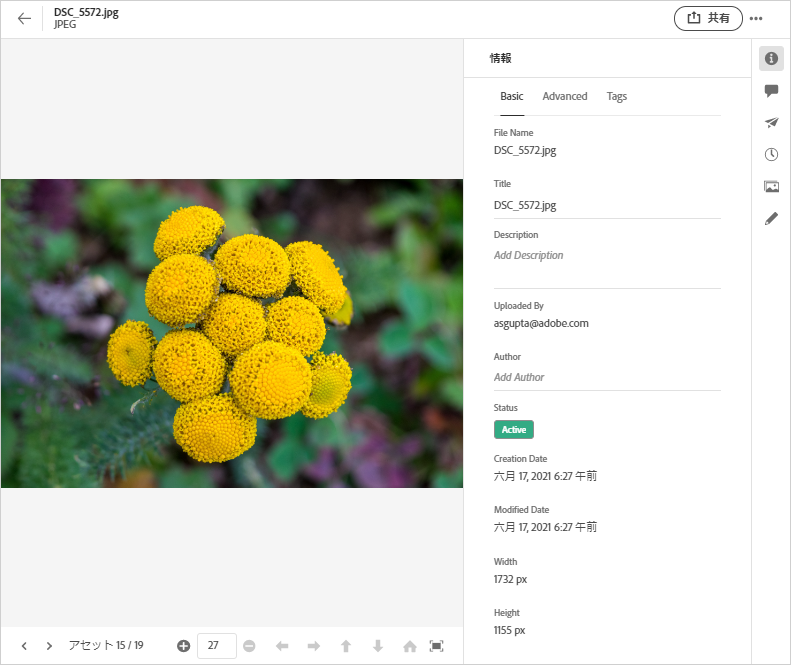
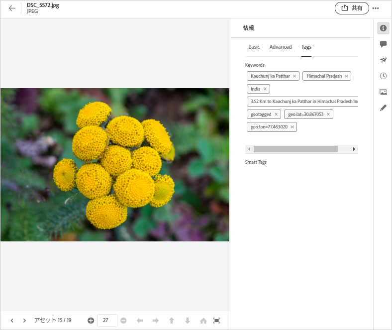

# [!DNL Assets Essentials] のメタデータ  {#metadata}

メタデータとは、データに関するデータまたは説明を意味します。 例えば、アセットとしての画像には、クリックされたカメラに関する情報や、著作権情報を含めることができます。 この情報は、画像のメタデータです。 メタデータは、効率的なアセット管理を行うために重要です。メタデータは、1つのアセットで使用可能なすべてのデータのコレクションですが、必ずしもそのアセットに含まれているとは限りません。

メタデータは、アセットをさらに分類するのに役立ち、デジタル情報の量が増えるにつれ役立ちます。 ファイル名、サムネール、メモリのみに基づいて、数百のファイルを管理できます。 ただし、このアプローチは拡張性に欠けます。関係者の数と管理対象アセットの数が増えると、この数が少なくなります。

メタデータを追加すると、以下の理由からデジタルアセットの価値が大きくなります。

* アクセスが容易になる - システムやユーザーが簡単に見つけることができます。
* 管理しやすくなる - 一連の同じプロパティを持つアセットを容易に検索し、これらのアセットに変更を適用できます。
* 完全 - アセットは、より多くの情報とコンテキスト、より多くのメタデータを保持します。

そのため、Assetsではデジタルアセットのメタデータの作成、管理およびやり取りをおこなう適切な方法を提供します。

## メタデータの表示 {#view-metadata}

アセットのメタデータを表示するには、アセットを参照するかアセットを検索し、アセットを選択して、ツールバーの「**[!UICONTROL 詳細]**」をクリックします。

*図：アセットとそのメタデータを表示するには、ツールバー&#x200B;****の「詳細」をクリックするか、アセットをダブルクリックします。*

タイトル、説明、アップロード日などの基本的なメタデータは、「[!UICONTROL 基本]」タブで使用できます。 「[!UICONTROL 詳細]」タブには、カメラモデル、レンズ詳細、ジオタグなど、より高度なメタデータが含まれます。 「[!UICONTROL タグ]」タブには、画像の内容に基づいて自動適用されるタグが含まれます。

## メタデータを更新 {#update-metadata}

いくつかのメタデータフィールドを手動で更新できます。 フィールドには、[!UICONTROL タイトル]、[!UICONTROL 説明]、[!UICONTROL 作成者]、[!UICONTROL キーワード]が含まれます。

## タグ {#tags}

[!DNL Assets Essentials] は、 [Adobe](https://www.adobe.com/jp/sensei.html) Senseitoが提供する人工知能を使用して、アップロードしたすべてのアセットに関連するタグを自動的に適用します。スマートタグと呼ばれるこれらのタグは、関連性の高いアセットをすばやく見つけることで、プロジェクトのコンテンツ速度を向上させます。 スマートタグは、画像に含まれないメタデータの例です。

スマートタグは、ほぼリアルタイムで適用され、画像の内容に基づいて生成されます。 アセットをアップロードすると、ユーザーインターフェイスにアセットのサムネールに[!UICONTROL 処理]がしばらく表示されます。 処理が完了したら、メタデータ[とスマートタグを](#view-metadata)表示できます。

*図：アセットのスマートタグを表示するには、ツールバーの「詳&#x200B;****細」をクリックするか、アセットをダブルクリックします。*

スマートタグには、信頼性スコアも割合で含まれます。 適用されたタグに関連付けられている信頼性を示します。 自動的に適用されたスマートタグをモデレートできます。

## タグの追加または更新 {#manually-tag}

[!DNL Adobe Sensei]スマートサービスを使用して自動的に追加されるスマートタグに加えて、アセットにタグを追加できます。 プレビュー用にアセットを開き、「[!UICONTROL タグ]」をクリックし、「[!UICONTROL キーワード]」フィールドに目的のキーワードを入力します。 タグを追加するには、Returnキーを押します。 [!DNL Assets Essentials] にはほぼリアルタイムでキーワードのインデックスが作成され、チームは新しいキーワードを使用して更新されたアセットをすぐに検索できます。

[!UICONTROL 「スマートタグ]」セクションからタグを削除することもできます。このセクションは、[!DNL Assets Essentials]によってアップロードされたすべてのアセットに自動的に追加されます。

<!-- TBD: Queries for PM and engg.

Can we edit the existing metadata in any form?

How to moderate smart tags?

Allow or deny list for smart tags?

What about Tags displayed just above Smart Tags in the UI?

Is there a detailed metadata tab. Where do the other details of an asset go?

How can one search based strictly on the metadata. Similar to AEM Assets GQL queries.
-->

<!-- TBD: Link to related articles if any.

>[!MORELIKETHIS]
>
>* [Search assets](search.md).
-->
