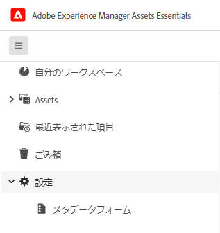
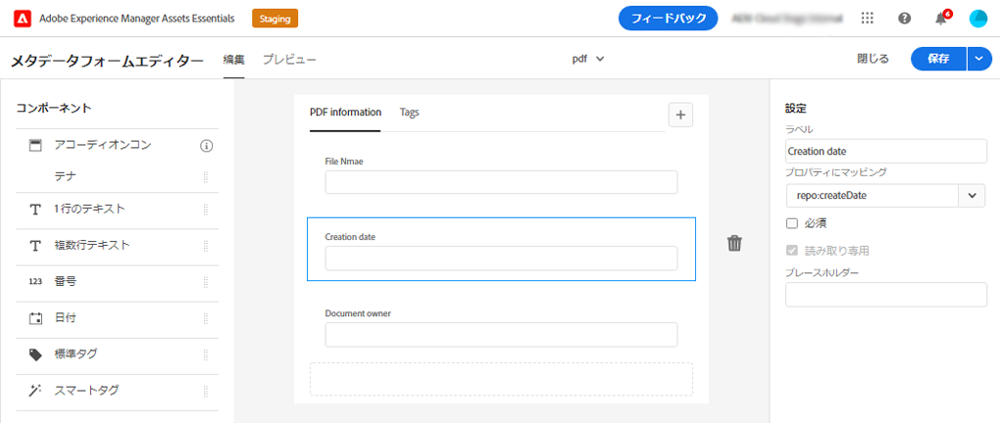

# [!DNL Assets Essentials] でのメタデータ {#metadata}

メタデータとは、データに関するデータまたは説明のことです。例えば、アセットとしての画像には、撮影されたカメラに関する情報や著作権情報などを含めることができます。こうした情報が画像のメタデータです。メタデータは、効率的なアセット管理を行うために重要です。メタデータは、対象のアセットに使用できるすべてのデータのコレクションですが、必ずしもそのアセットに含まれているとは限りません。

メタデータは、アセットをより細かく分類するのに役立ち、デジタル情報量が多くなるにつれてさらに有用になります。数百個のファイルをファイル名、サムネールおよびメモリだけに基づいて管理することは可能です。ただし、このアプローチは拡張性に欠けます。関係者の数や管理するアセットの数が増えると、十分な管理ができなくなります。

メタデータを追加すると、以下の理由からデジタルアセットの価値が大きくなります。

* アクセスが容易になる - システムやユーザーが簡単に見つけることができます。
* 管理しやすくなる - 一連の同じプロパティを持つアセットを容易に検索し、これらのアセットに変更を適用できます。
* 完全 - アセットは、より多くの情報とコンテキスト、より多くのメタデータを保持します。

このような理由から、Assets ではデジタルアセットのメタデータの作成、管理および交換を行う適切な手段を提供します。

## メタデータの表示 {#view-metadata}

アセットのメタデータを表示するには、目的のアセットを参照するか検索し、アセットを選択して、ツールバーの「**[!UICONTROL 詳細]**」をクリックします。

*図：アセットとそのメタデータを表示するには、ツールバーの「**[!UICONTROL 詳細]**」をクリックするか、アセットをダブルクリック*

タイトル、説明、アップロード日などの基本的なメタデータは、「[!UICONTROL 基本]」タブに表示されます。「[!UICONTROL 詳細]」タブには、カメラのモデル、レンズの詳細、ジオタグなど、より詳細なメタデータが表示されます。「[!UICONTROL タグ]」タブには、画像の内容に基づいて自動的に適用されたタグが表示されます。

## メタデータを更新 {#update-metadata}

いくつかのメタデータフィールドは、手動で更新できます。そのようなフィールドとしては、[!UICONTROL タイトル]、[!UICONTROL 説明]、[!UICONTROL 作成者]、[!UICONTROL キーワード]があります。

## タグ {#tags}

[!DNL Assets Essentials] では、[Adobe Sensei](https://www.adobe.com/jp/sensei.html) の人工知能機能を使用して、アップロードされたすべてのアセットに適切なタグを自動的に適用します。スマートタグと呼ばれるこれらのタグは、関連性の高いアセットをすばやく見つけるうえで役に立つので、プロジェクトのコンテンツベロシティ（コンテンツ創出の速度）が向上します。スマートタグは、画像に含まれないメタデータの例です。

スマートタグは、ほぼリアルタイムで適用され、画像の内容に基づいて生成されます。アセットをアップロードすると、ユーザーインターフェイスでアセットのサムネールに[!UICONTROL 処理中]としばらく表示されます。処理が完了したら、スマートタグと[メタデータを表示](#view-metadata)できます。

*図：アセットのスマートタグを表示するには、ツールバーの「**[!UICONTROL 詳細]**」をクリックするか、アセットをダブルクリック*

スマートタグには、信頼性スコア（パーセント）も含まれます。これは、適用されたタグに伴う信頼性を示します。自動的に適用されたスマートタグをモデレートできます。

## タグの追加または更新 {#manually-tag}

[!DNL Adobe Sensei] スマートサービスを使用して自動的に追加されるスマートタグに加えて、アセットにさらにタグを追加できます。アセットをプレビュー用に開き、「[!UICONTROL タグ]」をクリックして、「[!UICONTROL キーワード]」フィールドに目的のキーワードを入力します。タグを追加するには、Return キーを押します。[!DNL Assets Essentials] により、ほぼリアルタイムでキーワードのインデックスが作成されるので、チームは新しいキーワードを使用して更新済みのアセットをすぐに検索できます。

アップロードされたすべてのアセットに [!DNL Assets Essentials] で自動的に追加されたタグを、「[!UICONTROL スマートタグ]」セクションから削除することもできます。

## メタデータフォーム {#metadata-forms}

Assets Essentialsには、デフォルトで多数の標準メタデータフィールドが用意されています。 組織には、追加のメタデータニーズがあり、ビジネス固有のメタデータを追加するために、さらに多くのメタデータフィールドが必要です。 メタデータフォームを使用すると、ビジネスはアセットの [!UICONTROL  詳細 ] ページにカスタムメタデータフィールドを追加できます。 ビジネス固有のメタデータにより、アセットのガバナンスと検出が向上します。

様々なタイプのアセット（MIME タイプが異なる）に対してメタデータフォームを設定できます。 ファイルの MIME タイプと同じフォーム名を使用します。 Essentials は、アップロードされたアセットを自動的にフォーム名に一致させます。 例えば、`PDF` または `pdf` という名前のメタデータフォームが存在する場合、アップロードされたPDFドキュメントには、フォームで定義されたメタデータフィールドが含まれます。 フォームは、ゼロから作成することも、既存のフォームを再利用することもできます。

>[!IMPORTANT]
>
>特定のファイルタイプの新しいメタデータフォームは、[!DNL Assets Essentials] が提供するデフォルトのメタデータフォームを完全に置き換えます。 メタデータフォームを削除または名前変更すると、新しいアセットに対して、デフォルトのメタデータフィールドが再び使用可能になります。

メタデータフォームを作成するには、次の手順に従います。

1. 左側のレールで、**[!UICONTROL 設定]** / **[!UICONTROL メタデータForms]** をクリックします。

   

1. ユーザーインターフェイスの右上にある「**[!UICONTROL 作成]**」をクリックします。
1. フォームの名前を入力し、「**[!UICONTROL 作成]**」をクリックします。
1. 右側のレールの **[!UICONTROL 設定]** でタブの名前を指定します。
1. 左側のパネルに表示される **[!UICONTROL コンポーネント]** から、必要なコンポーネントをフォームのタブにドラッグします。 必要な順序でコンポーネントをドラッグします。

   

   *図：コンポーネントを追加するオプションと、フォームをプレビューするオプションを備えたメタデータフォーム作成インターフェイス。*

1. 各コンポーネントについて、右側のパネルの **[!UICONTROL 設定]** に名前を指定し、サポートされているプロパティとのマッピングを指定します。
1. 必要に応じて、コンポーネントの場合、「**[!UICONTROL 必須]**」を選択してメタデータフィールドを必須にし、「**[!UICONTROL 読み取り専用]**」を選択してアセットの [!UICONTROL  詳細 ] ページでフィールドを編集不可にします。
1. 必要に応じて、「**[!UICONTROL プレビュー]**」をクリックして、作成するフォームをプレビューします。
1. 必要に応じて、各タブにタブと必要なコンポーネントを追加します。
1. フォームが完成したら、「**[!UICONTROL 保存]**」をクリックします。

作成したフォームは、ユーザーが一致する MIME タイプのアセットをアップロードすると自動的に適用されます。

既存のフォームを再利用して新しいフォームを作成するには、メタデータフォームを選択し、ツールバーの「**[!UICONTROL コピー]**」をクリックし、名前を指定して、「**[!UICONTROL 確認]**」をクリックします。 メタデータフォームを編集して変更できます。 フォームを変更すると、変更後にアップロードされたアセットに使用されます。 既存のアセットは変更されません。

<!-- TBD: Cannot create a form using the second option. Documenting only the first option for now.
To reuse an existing form to create a new form, do one of these:

* Select a metadata form and click **[!UICONTROL Copy]** from the toolbar, provide a name, and click **[!UICONTROL Confirm]**.

* Click **[!UICONTROL Create]**, select **[!UICONTROL Use existing form structure as template]** option, and select an existing form. 
-->

<!-- TBD: Queries for PM and engg.

Can we edit the existing metadata in any form?

How to moderate smart tags?

Allow or deny list for smart tags?

What about Tags displayed just above Smart Tags in the UI?

Is there a detailed metadata tab. Where do the other details of an asset go?

How can one search based strictly on the metadata. Similar to AEM Assets GQL queries.
-->

<!-- TBD: Link to related articles if any.

>[!MORELIKETHIS]
>
>* [Search assets](search.md).
-->
