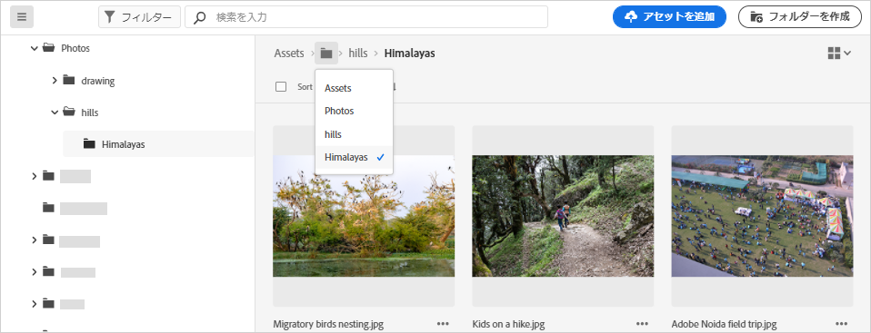
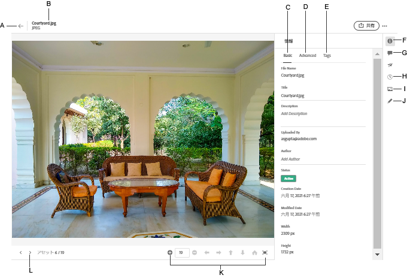

# ファイルおよびフォルダーへの移動とアセットの表示 {#view-assets-and-details}

<!-- TBD: Give screenshots of all views with many assets. Zoom out to showcase how the thumbnails/tiles flow on the UI in different views. -->

<!-- TBD: The options in left sidebar may change. Shared with me and Shared by me are missing for now. Update this section as UI is updated. -->

## [!DNL Assets Essentials] ユーザーインターフェイスについて  {#understand-interface-navigation}

[!DNL Assets Essentials] は、直観的で使いやすいユーザーインターフェイスを提供しています。すっきりしたインターフェイスのおかげで、アセットや関連情報を見つけやすく覚えやすくなります。

[!DNL Assets Essentials] にログインすると、次のインターフェイスが表示されます。

<!-- TBD: Update this screenshot. Remove top bar. Remove 2 labels from top bar. -->

![[!DNL Assets Essentials] ユーザーインターフェイス](assets/essentials-interface1.png)

*図：最初のログイン画面と目ぼしい機能の場所*
    *A：左側のサイドバー。リポジトリーを参照したり、他のオプションにアクセスしたりできます。*
    *B：左側のサイドバーを表示したり折りたたんだりして、アセット表示領域を広げます。*
    *C：検索結果をフィルタリングします。*
    *D：検索ボックス。*
    *E：アセットを並べ替えるオプション。*
    *F：製品に関するフィードバックを提供します。*
    *G：ユーザーの環境設定を編集したり、ログアウトしたります。*
    *H：ビューを切り替えます。*

<!-- TBD: Need an embedded video here with narration. It has to be hosted on MPC to be embeddable. -->

## アセットとフォルダーの参照と表示 {#browse-repository}

メインユーザーインターフェイスまたは左側のサイドバーから、必要なファイルまたはフォルダーを参照できます。参照時には、インターフェイスを使用してアセットのサムネールを表示し、リポジトリーを視覚的に参照したり、アセットの詳細を表示して目的のアセットをすばやく見つけたりできます。左側のサイドバーで使用できるオプションは次のとおりです。

* **アセット**：アクセス可能なすべてのフォルダーとアセットのリストがツリー表示されます。
* **最近表示された項目**：最近プレビューしたアセットのリスト。[!DNL Assets Essentials] は、プレビューしたアセットのみを表示します。リポジトリーファイルまたはフォルダーを参照する際にスクロールして通過したアセットは、ここには表示されません。
* **ライブラリ**：[!DNL Adobe Creative Cloud Team]（CCT）ライブラリビューにアクセスできます。このビューは、ユーザーが CCT ライブラリを使用する権限がある場合にのみ表示されます。

<!-- TBD: My Work Space shows task inbox and it is not visible on AEM Cloud Demos as of now. It is the source of truth server hence not documenting My Work Space option for now.
-->

左側のサイドバーを開いたり折りたたんだりして、使用可能なアセット表示領域を広げることができます。

[!DNL Assets Essentials] では、アセット、フォルダーおよび検索結果を 4 種類のレイアウトで表示できます。

*  [!UICONTROL リスト表示]
*  [!UICONTROL グリッド表示]
*  [!UICONTROL ギャラリー表示]
*  [!UICONTROL ウォーターフォール表示]

アセットを見つけるには、`Name`、`Relevancy`、`Size`、`Modified` および `Created` の昇順または降順にアセットを並べ替えます。

フォルダー内に移動するには、フォルダーのサムネールをダブルクリックするか、左側のサイドバーからフォルダーを選択します。フォルダーの詳細を表示するには、フォルダーを選択し、上部のツールバーで「詳細」をクリックします。階層を上下に移動するには、左側のサイドバーを使用するか、上部のパンくずリストを使用します。

*図：階層を参照するには上部のパンくずリストまたは左側のサイドバー使用*

## アセットのプレビュー {#preview-assets}

アセットを使用、共有またはダウンロードする前に、より詳細に表示できます。プレビュー機能を使用すると、画像だけでなく、サポートされているその他のアセットタイプも表示できます。

アセットをプレビューするには、目的のアセットを選択し、上部のツールバーで[!UICONTROL 詳細]アイコン（）をクリックします。アセットを表示できるだけでなく、詳細なメタデータを表示したり、その他のアクションを実行したりできます。

*A：リポジトリー内の現在のフォルダーまたは現在の検索結果に戻ります。*
*B：プレビューしているファイルの名前と形式。*
*C：基本メタデータ。*
*D：詳細メタデータ。*
*E：キーワードとスマートタグ。*
*F：アセットのプレビューとメタデータ情報の参照。*
*G：コメントと注釈。*
*H：バージョンの表示と管理。*
*I：画像のレンディションの表示。*
*J：画像の編集。*
*K：より詳細なプレビュー。ズーム、全画面表示、その他のオプション。*
*L：フォルダーレベルに戻らずに、現在のフォルダー内の前または次のアセットに進みます。*

<!-- TBD: Describe the options.

Explicitly previewed assets are displayed as recently viewed assets. Give screenshot of this.
Other use cases after previewing.

-->

>[!MORELIKETHIS]
>
>* [アセットのバージョンの表示](/help/manage-organize.md#view-versions)

