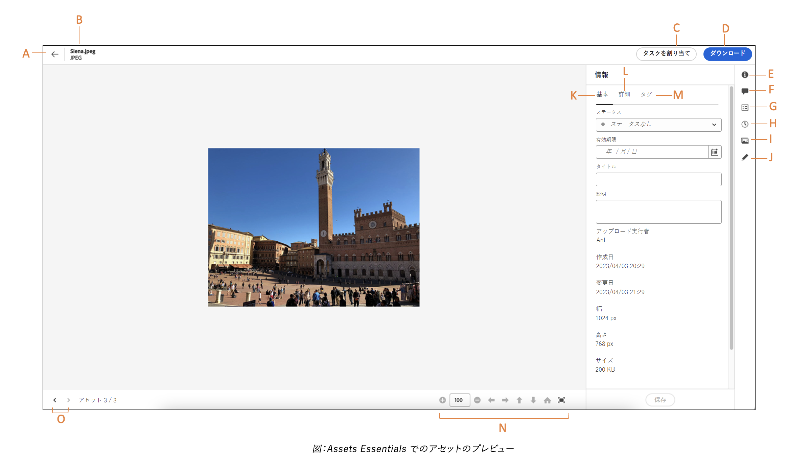

# ファイルおよびフォルダーへの移動とアセットの表示 {#view-assets-and-details}

<!-- TBD: Give screenshots of all views with many assets. Zoom out to showcase how the thumbnails/tiles flow on the UI in different views. -->

<!-- TBD: The options in left sidebar may change. Shared with me and Shared by me are missing for now. Update this section as UI is updated. -->

## [!DNL Assets Essentials] ユーザーインターフェイスについて  {#understand-interface-navigation}

[!DNL Assets Essentials] は、直観的で使いやすいユーザーインターフェイスを提供しています。すっきりしたインターフェイスのおかげで、アセットや関連情報を見つけやすく覚えやすくなります。

[!DNL Assets Essentials] にログインすると、次のインターフェイスが表示されます。

![[!DNL Assets Essentials] ユーザーインターフェイス](assets/essentials-interface.png)

    *回答：左側のサイドバーを使用してリポジトリを参照し、他のいくつかのオプションにアクセスできます。*
    *B:左側のサイドバーを表示または折りたたんで、アセット表示領域を拡大する*
    *C:検索結果のフィルタリング*
    *D:選択したフォルダーのすべてのコンテンツを選択*
    *E:アセットを並べ替えるオプション*
    *F:検索ボックス*
    *G:次を使用してファイルをアップロードまたはドラッグ&amp;ドロップ `Add Assets` ボタン*
    *H:新しいフォルダーを作成*
    *I:異なるビュー間の切り替え*

<!-- TBD: Need an embedded video here with narration. It has to be hosted on MPC to be embeddable. -->

## アセットとフォルダーの参照と表示 {#browse-repository}

メインユーザーインターフェイスまたは左側のサイドバーからフォルダーを参照できます。参照時には、このインターフェイスを使用してアセットのサムネールを表示し、リポジトリーを視覚的に参照したり、アセットの詳細を表示して目的のアセットをすばやく見つけたりできます。左側のサイドバーで使用できるオプションは次のとおりです。

* [マイワークスペース](https://experienceleague.adobe.com/docs/experience-manager-assets-essentials/help/my-workspace.html?lang=en):Assets には、Assets ユーザーインターフェイスの主要な領域に便利にアクセスできるウィジェットと、最も関連性の高い情報を提供する、カスタマイズ可能なワークスペースが含まれるようになりました。 このページは、作業項目の概要を示し、主要なワークフローにすばやくアクセスできるワンストップソリューションとして機能します。これらのオプションにより簡単にアクセスできるので、効率とコンテンツ速度が向上します。
* [タスク](https://experienceleague.adobe.com/docs/experience-manager-assets-essentials/help/my-workspace.html?lang=en):自分に割り当てられたタスクを以下で表示できます。 **自分のタスク** タブをクリックします。 一方、ユーザーが作成したタスクは、以下の場所に表示されます。 **割り当てられたタスク** タブをクリックします。 また、実行するタスクは、 **完了したタスク** タブをクリックします。
* [アセット](https://experienceleague.adobe.com/docs/experience-manager-assets-essentials/help/manage-organize.html?lang=en)：アクセス可能なすべてのフォルダーのリストがツリー表示されます。
* **最近表示された項目**：最近プレビューしたアセットのリスト。[!DNL Assets Essentials] は、プレビューしたアセットのみを表示します。リポジトリーファイルまたはフォルダーを参照する際にスクロールして通過したアセットは表示されません。
* [コレクション](https://experienceleague.adobe.com/docs/experience-manager-assets-essentials/help/manage-collections.html?lang=ja):コレクションとは、Adobe Experience Manager Assets Essentials内のアセット、フォルダーまたはその他のコレクションのセットです。 コレクションを使用して、ユーザー間でアセットを共有します。フォルダーとは異なり、1 つのコレクションに異なる複数の場所のアセットを含めることができます。1 人のユーザーと複数のコレクションを共有できます。各コレクションには、アセットへの参照が含まれます。アセットの参照整合性はコレクション間で維持されます。

* [インサイト](https://experienceleague.adobe.com/docs/experience-manager-assets-essentials/help/manage-reports.html?lang=en#view-live-statistics):In [!DNL Assets Essentials]を使用すると、ダッシュボードでリアルタイムのインサイトを表示できます。 Assets Essentials を使用すると、Assets Essentials 環境のリアルタイムデータをインサイトダッシュボードで表示できます。過去 30 日間または過去 12 か月間のリアルタイムイベント指標を表示できます。
* **ごみ箱**:ルートから削除されたアセットのリスト **[!UICONTROL Assets]** フォルダー。 ごみ箱フォルダー内のアセットを選択して、元の場所に復元したり、完全に削除したりできます。
* **設定**:Assets Essentialsの様々なオプションは、 **設定**（メタデータフォーム、レポート、分類管理など）。

<!-- TBD: Not sure if we want to publish these right now. CC Libs are beta as per Greg.
* **Libraries**: Access to [!DNL Adobe Creative Cloud Team] (CCT) Libraries view. This view is visible only if the user is entitled to CCT Libraries.
-->

<!-- TBD: My Work Space shows task inbox and it is not visible on AEM Cloud Demos as of now. It is the source of truth server hence not documenting My Work Space option for now.
-->

左側のサイドバーを開いたり折りたたんだりして、使用可能なアセット表示領域を広げることができます。

[!DNL Assets Essentials] では、アセット、フォルダーおよび検索結果を 4 種類のレイアウトで表示できます。

*  [!UICONTROL リスト表示]
*  [!UICONTROL グリッド表示]
*  [!UICONTROL ギャラリー表示]
*  [!UICONTROL ウォーターフォール表示]

アセットを見つけるには、`Name`、`Relevancy`、`Size`、`Modified` および `Created` の昇順または降順にアセットを並べ替えます。

フォルダー内に移動するには、フォルダーのサムネールをダブルクリックするか、左側のサイドバーからフォルダーを選択します。フォルダーの詳細を表示するには、フォルダーを選択し、上部のツールバーで「詳細」をクリックします。階層を上下に移動するには、左側のサイドバーを使用するか、上部のパンくずリストを使用します。

*図：階層を参照するには上部のパンくずリストまたは左側のサイドバー使用*

## アセットのプレビュー {#preview-assets}

アセットを使用、共有またはダウンロードする前に、より詳細に表示できます。プレビュー機能を使用すると、画像だけでなく、サポートされているその他のアセットタイプも表示できます。

アセットをプレビューするには、目的のアセットを選択し、上部のツールバーで[!UICONTROL 詳細]アイコン（）をクリックします。アセットを表示できるだけでなく、詳細なメタデータを表示したり、その他のアクションを実行したりできます。

*回答：現在のフォルダーまたはリポジトリ内の現在の検索結果に戻る*
*B:プレビューしているファイルの名前と形式*
*C:タスクを割り当て*
*D:アセットをダウンロード*
*E:アセットのプレビューとメタデータ情報の確認*
*D:詳細メタデータ*
*E:キーワードとスマートタグ*
*F:コメントと注釈*
*G:選択したアセットに関連するタスクを表示*
*H:バージョンの表示と管理*
*I:画像のレンディションの表示*
*J:画像を編集*
*K:基本メタデータ*
*L:詳細メタデータ*
*M:キーワードとスマートタグ*
*N:より詳細にプレビューします。 ズーム、フルスクリーン、その他のオプション*
*O:現在のフォルダー内の前または次のアセットに進み、フォルダーに戻りません。*

また、ビデオをプレビューすることもできます。

アセットを明示的にプレビューすると、[!DNL Assets Essentials] には最近表示したアセットとして表示されます。

<!-- TBD: Describe the options.

Explicitly previewed assets are displayed as recently viewed assets. Give screenshot of this.
Other use cases after previewing.
-->

## 次の手順 {#next-steps}

* Assets Essentials ユーザーインターフェイスの「[!UICONTROL フィードバック]」オプションを使用して製品に関するフィードバックを提供する

* 右側のサイドバーにある「[!UICONTROL このページを編集]」（）または「[!UICONTROL 問題を記録] 」（）を使用してドキュメントに関するフィードバックを提供する

* [カスタマーケア](https://experienceleague.adobe.com/?support-solution=General&amp;lang=ja#support)に問い合わせる

>[!MORELIKETHIS]
>
>* [アセットのバージョンの表示](/help/manage-organize.md#view-versions)

