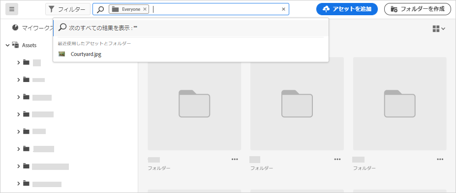
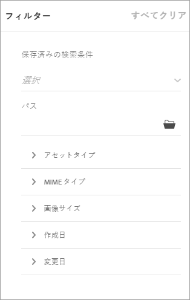
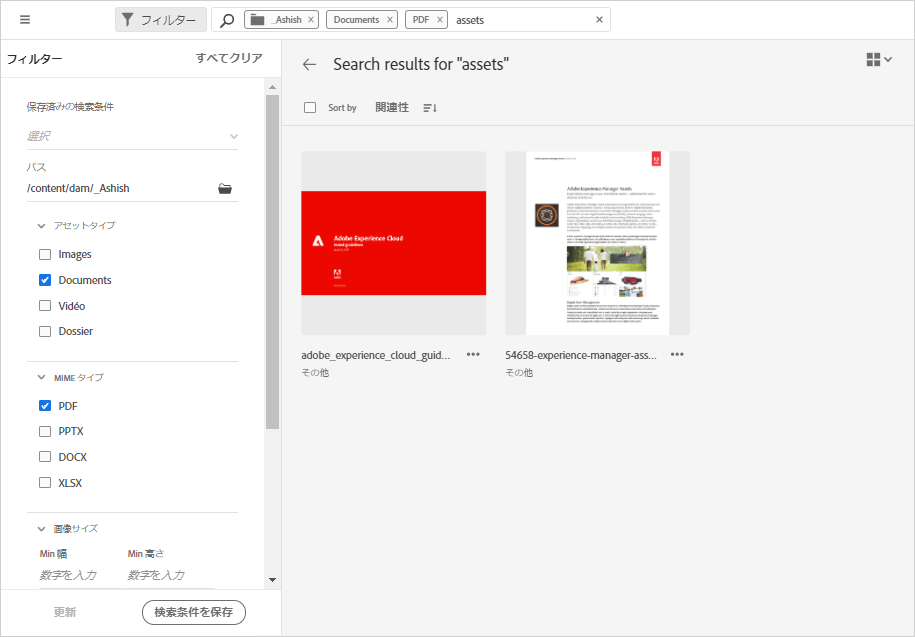

# [!DNL Assets Essentials] でのアセットの検索  {#search-assets}

[!DNL Assets Essentials] では効果的な検索が可能です。この検索はデフォルトで機能します。フルテキスト検索なので、網羅的に検索できます。この強力な検索機能を使用すると、適切なアセットをすばやく発見できるので、コンテンツベロシティ（コンテンツ創出の速度）の向上に役立ちます。[!DNL Assets Essentials] では、フルテキスト検索を行えるほか、スマートタグ、タイトル、作成日、著作権などのメタデータを検索することもできます。

アセットを検索するには、

* ページ上部の検索ボックスをクリックします。デフォルトでは、現在参照しているフォルダー内を検索します。次のいずれかの操作を行います。

   

   * キーワードを使用して検索します。オプションで、フォルダーを変更することもできます。Return キーを押します。

   * 最近表示されたアセットを直接検索して、操作を開始します。検索ボックス内をクリックし、最近表示されたアセットを候補から選択します。

## 検索結果のフィルタリング {#refine-search-results}

以下のパラメーターに基づいて検索結果をフィルタリングできます。

*図：検索したアセットを様々なパラメーターに基づいてフィルタリング*

* ファイルタイプ：サポートされているファイルタイプ（`Images`、`Documents`、`Videos`）で検索結果をフィルタリングします。
* MIME タイプ：サポートされている 1 つ以上のファイル形式でフィルタリングします。<!-- TBD:  [supported file formats](/help/supported-file-formats.md). -->
* 画像サイズ：画像をフィルタリングするための最小サイズと最大サイズのどちらか一方または両方を指定します。サイズはピクセル単位で指定され、画像のファイルサイズではありません。
* 作成日：アセットの作成日（メタデータで指定されたもの）。標準の日付形式は `yyyy-mm-dd` です。
* 変更日：アセットの最終変更日。標準の日付形式は `yyyy-mm-dd` です。

検索したアセットを、`Name`、`Relevancy`、`Size`、`Modified`、`Created` の昇順または降順に並べ替えることができます。

## 保存済みの検索 {#saved-search}

[!DNL Assets Essentials] の検索機能は非常に使いやすくなっています。検索ボックス内に、キーワードを入力し、Return キーを押せば結果を表示できるだけでなく、最近検索したキーワードを 1 回クリックするだけですばやく再検索することもできます。

また、アセットのメタデータやタイプに関する特定の条件に基づいて検索結果をフィルタリングすることもできます。特定のフィルターを頻繁に使用する場合、[!DNL Assets Essentials] では、検索性を向上させるために、検索パラメーターを保存できます。その場合、保存済みの検索を選択し、1 回クリックするだけで検索してフィルターを適用することができます。

保存済みの検索を作成するには、アセットを検索し、1 つ以上のフィルターを適用して、[!UICONTROL フィルター]パネルの「[!UICONTROL 検索結果を保存]」をクリックします。

<!-- TBD: Search behavior. Full-text search. Ranking and rank boosts. Hidden assets.
Report poor UX that users can only save a filtered search and not a simple search.
.
Are other supported files fully indexed and support full-text search? Eg. audio/videos files can at best have metadata indexed.
Anything about ranking of assets displayed in search results?

What about temporarily hiding an asset (suspending search on it) from the search results? If an asset is undergoing review collaboration, should it be used by others? Should it be hidden in search?

When userA is searching and userB add an asset that matches search results, will the asset display in search as soon as userA refreshes the page? Assuming indexing is near real-time. May not be so for bulk uploads.
-->
