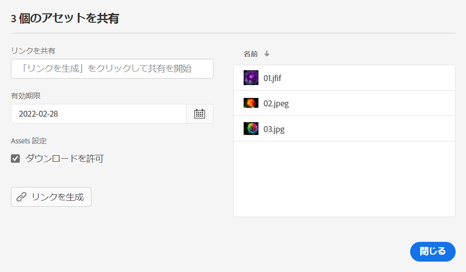
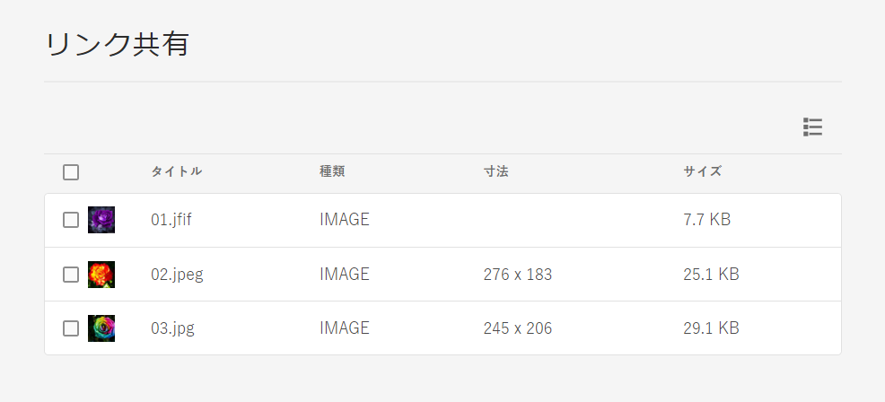

# アセットのリンクを共有 {#share-links-assets}

[!DNL Assets Essentials] を使用すると、にアクセスできない外部の関係者と、リンクを生成してアセットを共有できます。 [!DNL Assets Essentials] アプリケーション。 次を定義できます。

* リンクの有効期限

* 受信者がリンクにアクセスした後でアセット（元のバイナリ）をダウンロードできる場合。

リンクの受信者は、これらの設定に基づいて、アセットのプレビューまたはダウンロードを選択できます。

## アセットのリンクを生成 {#generate-link-for-assets}

アセットまたはアセットを含むフォルダーのリンクを生成するには：

1. アセットまたはアセットを含むフォルダーを選択し、 **[!UICONTROL リンクを共有]**.

1. 設定を調整する場合は、カレンダーアイコンをクリックし、 **[!UICONTROL 有効期限]** フィールドに入力します。 また、 `yyyy-mm-dd` 形式 デフォルトでは、リンクの有効期限は共有日から 2 週間に設定されています。

1. 選択 **[!UICONTROL ダウンロードを許可]** ：リンクの受信者に対し、アセットのダウンロードを許可する場合。

1. クリック **[!UICONTROL リンクを生成]**.

1. クリック **[!UICONTROL リンクをコピー]** をクリックして、リンクをコピーします。 リンクを **[!UICONTROL リンクを共有]** フィールドに入力します。

   

1. クリック **[!UICONTROL 閉じる]** 電子メールや他のコラボレーションツールを使用してリンクを共有できます。

## 共有アセットへのアクセス {#access-shared-assets}

受信者は、アセットの公開リンクを共有した後、にログインしなくても、そのリンクをクリックして、Web ブラウザーで共有アセットをプレビューまたはダウンロードできます。 [!DNL Assets Essentials].

リンクをクリックし、フォルダーをクリックして目的のアセットに移動した後、アセットをクリックしてプレビューします。 共有アセットをリスト表示またはカード表示で表示するよう選択できます。

共有アセットまたは共有アセットフォルダーにマウスポインターを置いて、そのアセットを選択するか、ダウンロードすることができます。

複数のアセットを選択し、 **[!UICONTROL ダウンロード]**. [!DNL Assets Essentials] 選択したアセットを zip ファイルとしてダウンロードします。 [!DNL Assets Essentials] を選択してダウンロードした各アセットに対し、親 zip ファイルに、アセットと同じ名前のサブフォルダーが作成されます。

すべてのアセットを一度にダウンロードするには、 **[!UICONTROL リスト表示]**&#x200B;をクリックし、 **[!UICONTROL すべて選択]** 次に、 **[!UICONTROL ダウンロード]**.

>[!NOTE]
>
>ダウンロードオプションを有効にしない場合、 [リンクの生成](#share-links-assets) アセットの場合と、リンクの受信者がアセットのダウンロードを選択した場合、 [!DNL Assets Essentials] は空の zip ファイルをダウンロードします。

