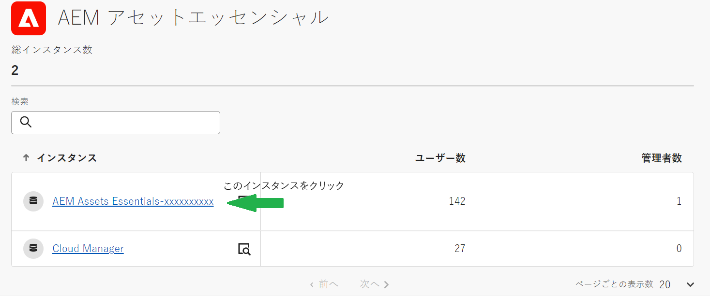
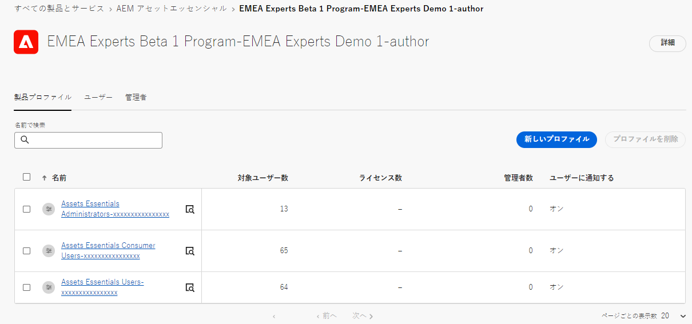
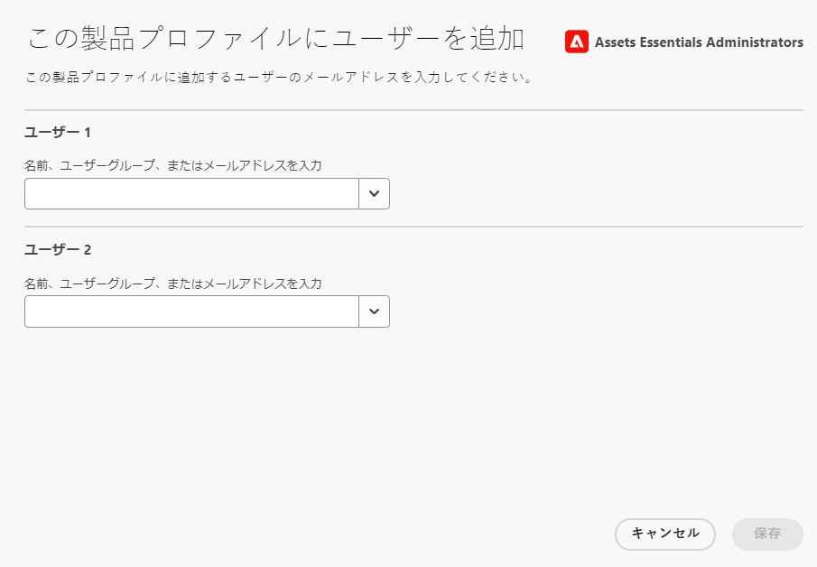

# Experience Manager Assets Essentials の管理 {#administer-assets-essentials}

## 目的

* **オーディエンス**：Assets Essentials 管理者

* **目的**：Admin Console を使用して Assets Essentials アプリケーションへのアクセスを設定し、Assets Essentials アプリケーションへのログイン後に実行できるタスクを管理します。

## 概要 {#overview}

[!DNL Adobe Experience Manager Assets Essentials] は、アドビのお客様向けにアドビによってプロビジョニングされます。プロビジョニングの一環として、[!DNL Adobe Admin Console] でお客様の組織に [!DNL Assets Essentials] が追加されます。管理者は [!DNL Admin Console] を使用して [!DNL Assets Essentials] ソリューションに対するユーザーの使用権限を管理し、[!DNL Assets Essentials] に権限とメタデータフォームをセットアップするアプリケーション管理者を割り当てます。

次のデータフロー図は、Assets Essentials の設定と管理を行うために管理者が実行する必要があるタスクのシーケンスを示しています。

## Admin Console へのアクセス {#access-admin-console}

Assets Essentials ソリューションがプロビジョニングされると、管理者にアドビからメールが届きます。このメールには、歓迎メッセージと使用を開始するためのリンクが含まれています。さらに、アドビは、Assets Essentials を自動的にデプロイするプロセスを開始します。デプロイメントプロセスが完了するまでに 1 時間ほどかかります。

メールに記載されたリンクから、[Admin Console](https://adminconsole.adobe.com) にアクセスしてログインします。複数の組織アカウントに管理者としてアクセスできる場合は、該当する組織を選択するか、[組織セレクター](https://helpx.adobe.com/jp/enterprise/using/admin-console.html)を使用してその組織に切り替えます。自動デプロイメントプロセスが完了すると、[!DNL AEM Assets Essentials] の製品カードが [!DNL Admin Console] に表示されます。

## Admin Console タスクの管理 {#manage-admin-console-tasks}

Admin Console で次のタスクを実行します。

* [製品プロファイルへのユーザーの追加](#add-users-to-product-profiles)

* [ユーザーグループの追加](#add-user-groups)

* [グループへのユーザーの追加](#add-users-to-user-groups)

### 製品プロファイルへのユーザーの追加 {#add-users-to-product-profiles}

Assets Essentials アプリケーションにアクセスできるように、製品プロファイルにユーザーを追加します。

製品プロファイルにユーザーを追加するには：

1. 組織の [Admin Console](https://adminconsole.adobe.com) にアクセスし、上部のバーで「**[!UICONTROL 製品]**」をクリックしたあと、「**[!UICONTROL AEM Assets Essentials]**」をクリックし、次に [!DNL Assets Essentials] のインスタンスをクリックします。インスタンスの名前は、以下のスクリーンショットに示す名前とは異なる可能性があります。
   >[!NOTE]
   >
   >[!DNL Cloud Manager] インスタンスは、サービスステータスの確認やサービスログへのアクセスなど、特別な管理にのみ使用するもので、製品へのユーザーの追加には使用できません。詳しくは、[管理者ガイド](deploy-administer.md#view-service-status-and-access-logs-view-logs)を参照してください。

   

   [!DNL Assets Essentials] には、管理者、通常のユーザーおよび消費者ユーザー用のアクセスを表す 3 つの製品プロファイルがあります。

   

1. 製品にユーザーを追加するには、3 つの Assets Essentials 製品プロファイルのいずれか 1 つをクリックし、「**[!UICONTROL ユーザーを追加]**」を選択して、ユーザーの詳細を入力し、「**[!UICONTROL 保存]**」をクリックします。

   

   ユーザーを追加すると、使用を開始するための招待メールがそのユーザーに届きます。招待メールは、[!DNL Admin Console] の製品プロファイル設定で無効にすることができます。

1. ユーザーをグループから削除するには、該当するグループをクリックし、既存のユーザーを選択して、「**[!UICONTROL ユーザーを削除]**」を選択します。

   >[!NOTE]
   >
   >ユーザーが Assets Essentials アプリケーションで管理タスクを実行するには、Admin Console で管理者の Assets Essentials 製品プロファイルにユーザーを追加する必要があります。これらのタスクには、[フォルダー構造の作成](#create-folder-structure)、[フォルダーの権限の管理](#manage-permissions-for-folders)、[メタデータフォームの設定](#metadata-forms)などがあります。　　

### ユーザーグループの追加 {#add-user-groups}

ユーザーグループを作成し、そのユーザーグループにユーザーを割り当てます。これらのユーザーグループは、Assets Essentials アプリケーションで、フォルダーに対する権限を設定するために使用できます。

ユーザーをユーザーグループ（1）に追加し、[ユーザーを Assets Essentials 製品プロファイル（2）に](#add-admin-users)追加することはできます。ただし、ユーザーグループを Assets Essentials 製品プロファイル（3）に直接追加することはできません。

ユーザーグループの管理方法については、[ユーザーグループの管理](https://helpx.adobe.com/jp/enterprise/using/user-groups.html)の `Create user groups` および `Edit user groups` を参照してください。 

>[!NOTE]
>
>Admin Console が、Azure や Google コネクタ、ユーザー同期ツール、User Management Rest API など、ユーザー／グループの割り当てを管理する外部システムを活用するように設定されている場合、グループとユーザーの割り当ては自動的に設定されます。詳しくは、[Adobe Admin Consoleユーザー](https://helpx.adobe.com/jp/enterprise/using/users.html)を参照してください。

### グループにユーザーを追加 {#add-users-to-user-groups}

ユーザーグループを作成した後、ユーザーグループへのユーザーの追加を開始できます。

ユーザーグループへのユーザーの追加を管理する方法については、[ユーザーグループの管理](https://helpx.adobe.com/jp/enterprise/using/user-groups.html#add-users-to-groups)の `Add users to groups` を参照してください。

## Assets Essentials 管理タスクの管理 {#manage-assets-essentials-tasks}

Admin Console タスクを実行したら、Assets Essentials アプリケーションで次の管理タスクを実行できるようになります。

* [フォルダー構造の作成](#create-folder-structure)

* [フォルダーの権限の管理](#manage-permissions-for-folders)

* [メタデータフォームの設定](#metadata-forms)

>[!NOTE]
>
>これらのタスクを管理する（特に権限の管理）には、ユーザーにアプリケーション管理権限が必要です。[管理者の Assets Essentials 製品プロファイル](#add-users-to-product-profiles)に、この権限を追加する必要があります。

### フォルダー構造を作成 {#create-folder-structure}

次の方法を使用して、Assets Essentials リポジトリにフォルダー構造を作成できます。

* ツールバーにある「**[!UICONTROL フォルダーを作成]**」オプションをクリックし、空のフォルダーを作成します。

* ツールバーにある「**[!UICONTROL アセットを追加]**」オプションをクリックし、[ローカルマシンで使用可能なフォルダー構造をアップロード](add-delete.md)します。

組織のビジネス目標に適したフォルダー構造を作成します。既存のフォルダー構造を Assets Essentials リポジトリにアップロードする場合は、構造を確認する必要があります。詳しくは、[効果的な権限管理のベストプラクティス](permission-management-best-practices.md)を参照してください。

Assets Essentials リポジトリでフォルダー構造を作成する計画を開始する際は、次の点を考慮してください。

* 今後のガバナンス：管理者が管理するフォルダーと、[所有者として他のユーザーに権限をデリゲート](manage-permissions.md##manage-permissions-folders)するフォルダー。

* スケーラブル：フォルダー構造は、組織の今後のニーズに準拠し、容易に拡張可能にする必要があります。

* サイズ：1 つのフォルダーに含めるアセットの数が多くなりすぎないようにします。ファイルの数が多すぎると、操作性の問題を引き起こし、管理が困難になる可能性があります。

* 直感的：フォルダー構造は、参照が容易で、エンドユーザーにとって直感的なものにする必要があります。 フォルダー構造内の新しいアセットをアップロードする場所を容易に識別できるようにする必要があります。

組織で使用できるフォルダー構造タイプには様々なものがあります。一般的なフォルダー構造の例を以下に示します。

### フォルダーの権限の管理 {#manage-permissions-for-folders}

Assets Essentials では、管理者は、リポジトリで使用可能なフォルダーのアクセスレベルを管理できます。管理者は、ユーザーグループを作成し、それらのグループに権限を割り当てて、アクセスレベルを管理できます。また、権限管理の権限をフォルダーレベルでユーザーグループにデリゲートすることもできます。

>[!VIDEO](https://video.tv.adobe.com/v/341104)

詳しくは、[フォルダーの権限の管理](manage-permissions.md)を参照してください。

### メタデータフォームの設定 {#metadata-forms}

Assets Essentials には、多数の標準メタデータフィールドがデフォルトで用意されています。 組織には、追加のメタデータニーズがあり、ビジネス固有のメタデータを追加するために、さらに多くのメタデータフィールドが必要です。 メタデータフォームを使用すると、ビジネスごとにアセットの[!UICONTROL 詳細]ページにカスタムメタデータフィールドを追加できます。 ビジネス固有のメタデータにより、アセットのガバナンスと検出が向上します。フォームは、ゼロから作成することも、既存のフォームを再利用することもできます。

各種アセット（様々な MIME タイプ）のメタデータフォームを設定できます。ファイルの MIME タイプと同じフォーム名を使用します。Essentials は、アップロードされたアセットの MIME タイプをフォームの名前と自動的に照合し、フォームフィールドに基づいて、アップロードされたアセットのメタデータを更新します。

例えば、`PDF` または `pdf` という名前のメタデータフォームが存在する場合、アップロードされた PDF ドキュメントには、そのフォームで定義されたメタデータフィールドが含まれています。

Assets Essentials では、次のシーケンスを使用して、既存のメタデータフォーム名を検索し、特定タイプのアップロード済みアセットにメタデータフィールドを適用します。

MIME サブタイプ／MIME タイプ／`default` フォーム／標準フォーム

例えば、`PDF` または `pdf` という名前のメタデータフォームが存在する場合、アップロードされた PDF ドキュメントには、そのフォームで定義されたメタデータフィールドが含まれています。`PDF` または `pdf` という名前のメタデータフォームが存在しない場合、`application` という名前のメタデータフォームがあれば Assets Essentials は照合します。`application` という名前のメタデータフォームがある場合、アップロードされた PDF ドキュメントには、そのフォームで定義されたメタデータフィールドが含まれています。それでも、一致するメタデータフォームが見つからない場合、Assets Essentials は `default` メタデータフォームを検索して、そのフォームで定義されたメタデータフィールドを、アップロードされた PDF ドキュメントに適用します。これらの手順がいずれも機能しない場合、Assets Essentials は、標準フォームで定義されたメタデータフィールドを、アップロードされたすべての PDF ドキュメントに適用します。

>[!IMPORTANT]
>
>特定のファイルタイプの新しいメタデータフォームは、[!DNL Assets Essentials] に用意されているデフォルトのメタデータフォームを完全に置き換えます。メタデータフォームを削除または名前変更すると、新しいアセットに対して、デフォルトのメタデータフィールドが再び使用可能になります。

>[!VIDEO](https://video.tv.adobe.com/v/341275)

メタデータフォームについて詳しくは、[Assets Essentials のメタデータフォーム](metadata.md#metadata-forms)を参照してください。

## 次のステップ

Assets Essentials アプリケーションを設定および管理したので、[Creative Cloud アプリケーションを Experience Manager Assets Essentials アプリケーションと統合します](integrate-assets-essentials-creative-cloud.md)。
