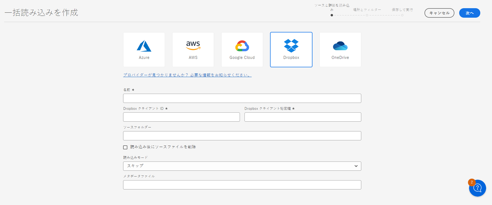
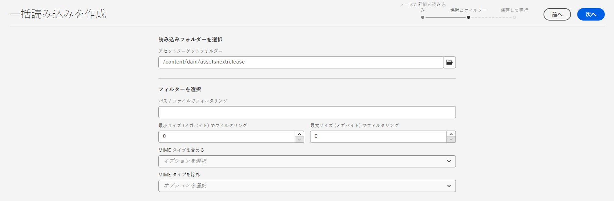
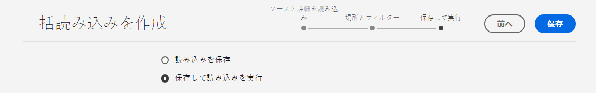
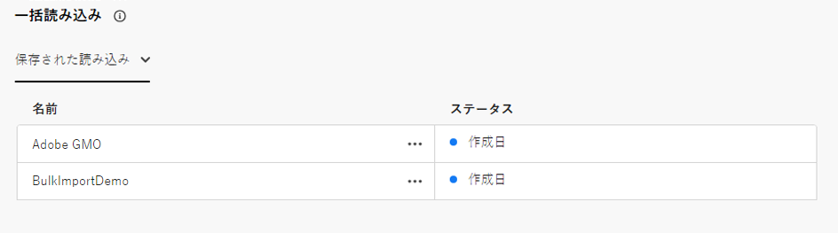
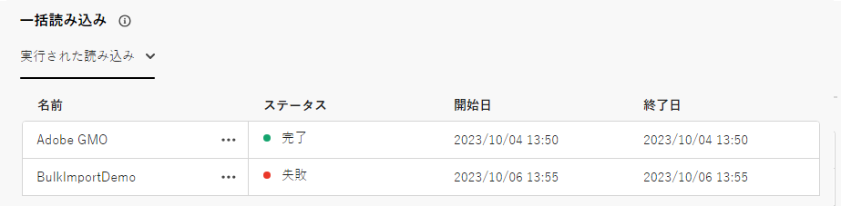
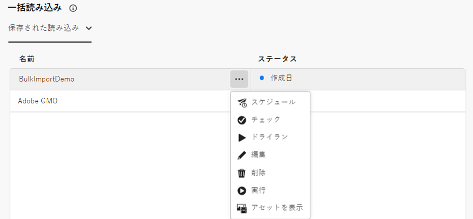
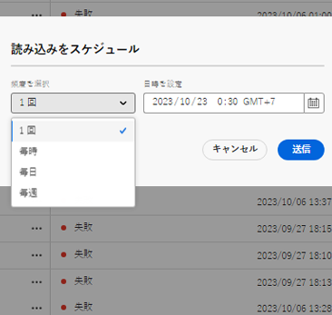
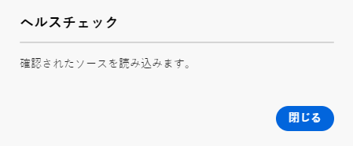
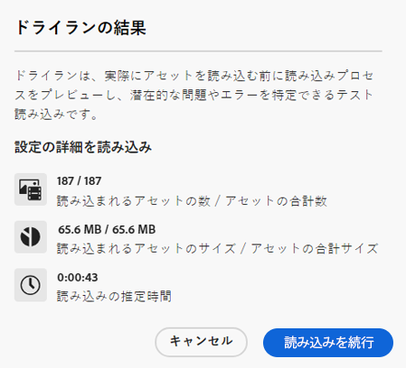
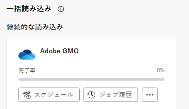

# Assets Essentialsを使用したアセットの一括読み込み  {#bulk-import-essentials}

>[!CONTEXTUALHELP]
>id="assets_bulk_import"
>title="アセットの一括読み込み"
>abstract="管理者は、Assets Essentials を使用して、データソースから Experience Manager Assets に大量のアセットを読み込めるようになりました。管理者は、個々のアセットやフォルダーを Experience Manager Assets にアップロードする必要がなくなりました。一括読み込みでサポートされるクラウドストレージプロバイダーには、Azure、AWS、Google Cloud、Dropbox が含まれます。"

AEM Assets Essentials での一括読み込みを使用すると、管理者は、データソースからAEM Assetsに大量のアセットを読み込むことができます。 管理者は、個々のアセットやフォルダーを AEM Assets にアップロードする必要がなくなりました。

>[!NOTE]
>
>Assets Essentialsの一括インポーターは、Assetsas a Cloud Serviceの一括インポーターと同じバックエンドを使用します。 ただし、Assets Essentialsでは、から読み込むデータソースが増え、ユーザーエクスペリエンスがより効率的になります。

次のデータソースからアセットを読み込むことができます。

* Azure
* AWS
* Google Cloud
* Dropbox

## 前提条件 {#prerequisites}

| データソース | 前提条件 |
|-----|------|
| Azure | <ul> <li>Azure ストレージアカウント </li> <li> Azure ブロブコンテナ <li> 認証モードに基づく Azure アクセスキーまたは SAS トークン </li></ul> |
| AWS | <ul> <li>AWS 地域 </li> <li> AWS バケット <li> AWS アクセスキー </li><li> AWS アクセスシークレット </li></ul> |
| Google Cloud | <ul> <li>GCP バケット </li> <li> GCP サービスアカウントメール <li> GCP サービスアカウントの秘密キー</li></ul> |
| Dropbox | <ul> <li>Dropbox クライアント ID </li> <li> Dropbox クライアント秘密鍵</li></ul> |

データソースに基づくこれらの前提条件に加えて、AEM Assets に読み込む必要があるすべてのアセットが含まれるデータソースで使用可能なソースフォルダー名を認識しておく必要があります。

## 一括読み込み設定の作成 {#create-bulk-import-configuration}

一括読み込み設定を作成するには、次の手順を実行します。

1. **[!UICONTROL 設定]**／**[!UICONTROL 一括読み込み]**&#x200B;に移動して、「**[!UICONTROL 読み込みを作成]**」をクリックします。
1. データソースを選択します。使用可能なオプションには、Azure、AWS、Google Cloud、Dropbox が含まれます。
1. 「**[!UICONTROL 名前]**」フィールドで一括読み込み設定の名前を指定します。
1. [前提条件](#prerequisites)で説明しているように、データソース固有の資格情報を指定します。
1. 「**[!UICONTROL ソースフォルダー]**」フィールドでデータソースのアセットを含むルートフォルダーの名前を指定します。
1. （オプション）ファイルが Experience Manager Assets に読み込まれた後、ソースデータストアから元のファイルを削除するには、「**[!UICONTROL 読み込み後にソースファイルを削除]**」オプションを選択します。
1. 「**[!UICONTROL 読み込みモード]**」を選択します。「**[!UICONTROL スキップ]**」、「**[!UICONTROL 置換]**」または「**[!UICONTROL バージョンを作成]**」を選択します。スキップモードがデフォルトです。このモードでは、アセットが既に存在する場合は、取得をスキップします。
   

1. （オプション）CSV 形式で提供される、読み込むメタデータファイルを「メタデータファイル」フィールドに指定し、「**[!UICONTROL 次へ]**」をクリックして&#x200B;**[!UICONTROL 場所とフィルター]**&#x200B;に移動します。
1. 「 **[!UICONTROL アセットのターゲットフォルダー]**」フィールドを使用して、アセットの読み込み先となる DAM 内の場所を定義するパスを指定します。例：`/content/dam/imported_assets`
1. （オプション）「**[!UICONTROL フィルターを選択]**」セクションで、アセットの最小ファイルサイズを MB 単位で指定して、「**[!UICONTROL 最小サイズでフィルター]**」フィールドの取り込みプロセスにアセットを含めます。
1. （オプション）アセットの最大ファイルサイズを MB 単位で指定して、「**[!UICONTROL 最大サイズでフィルター]**」フィールドの取り込みプロセスにアセットを含めます。
1. （オプション）「**[!UICONTROL MIME タイプを含める]**」フィールドを使用して、取り込みプロセスに含める MIME タイプを選択します。このフィールド内で複数の MIME タイプを選択できます。値を定義しない場合、すべての MIME タイプが取り込みプロセスに含まれます。

1. （オプション）「**[!UICONTROL MIME タイプを除外]**」フィールドを使用して、取り込みプロセスで除外する MIME タイプを選択します。このフィールド内で複数の MIME タイプを選択できます。値を定義しない場合、すべての MIME タイプが取り込みプロセスに含まれます。

   

1. 「**[!UICONTROL 次へ]**」をクリックします。「**[!UICONTROL 保存して読み込みを実行]**」を選択して設定を保存し、一括読み込みを実行します。「**[!UICONTROL 読み込みを保存]**」を選択して、後で実行できるように現在の設定を保存します。

   

1. 「**[!UICONTROL 保存]**」をクリックして、選択したオプションを実行します。

### 一括読み込み時のファイル名の処理 {#filename-handling-bulkimport-assets-view}

アセットやフォルダーを一括で読み込む場合、[!DNL Experience Manager Assets] は、インポートソースに存在する情報の構造全体を読み込みます。[!DNL Experience Manager] は、アセット名とフォルダー名に含まれる特殊文字に対する組み込みルールに従うので、これらのファイル名のサニタイズが必要になります。フォルダー名とアセット名の両方について、ユーザーが定義したタイトルは変更されず、`jcr:title` に保存されます。

一括読み込み時に、[!DNL Experience Manager] は、既存のフォルダーを探してアセットやフォルダーの再読み込みを避けると共に、読み込みが行われる親フォルダーに適用されるサニタイズルールを検証します。親フォルダーにサニタイズルールが適用される場合、インポートソースにも同じルールが適用されます。新規読み込みの場合、アセットやフォルダーのファイル名を管理するために、次のサニタイズルールが適用されます。

一括読み込み時の禁止名、アセット名の処理、フォルダー名の処理について詳しくは、 [一括インポート中のファイル名の処理](https://experienceleague.adobe.com/docs/experience-manager-cloud-service/content/assets/manage/add-assets.html?lang=en#filename-handling-bulkimport).

## 既存の一括読み込み設定を表示 {#view-import-configuration}

設定を作成した後に保存することを選択した場合、その設定は「**[!UICONTROL 保存された読み込み]**」タブに表示されます。

読み込みを保存して実行することを選択した場合、読み込み設定が「**[!UICONTROL 実行された読み込み]**」タブに表示されます。

読み込みをスケジュールすると、「**[!UICONTROL スケジュールされた読み込み]**」タブに表示されます。

## 一括読み込み設定を編集 {#edit-import-configuration}

設定の詳細を編集するには、設定名に対応する「...」、「**[!UICONTROL 編集]**」の順にクリックします。編集操作の実行中は、設定のタイトルとデータソースの読み込みを編集することはできません。「実行された読み込み」タブ、「スケジュールされた読み込み」タブまたは「保存された読み込み」タブを使用して、設定を編集できます。

## 1 回限りの読み込みまたは繰り返しの読み込みのスケジュール設定 {#schedule-imports}

1 回限りの一括読み込みまたは繰り返しの一括読み込みをスケジュール設定するには、次の手順に従います。

1. 「**[!UICONTROL 実行された読み込み]**」タブまたは「**[!UICONTROL 保存された読み込み]**」タブで設定名に対応する「...」、「**[!UICONTROL スケジュール]**」の順にクリックします。また、「**[!UICONTROL スケジュールされた読み込み]**」タブに移動し、「**[!UICONTROL スケジュール]**」をクリックして、既存のスケジュールされた読み込みを再スケジュールすることもできます。

1. 1 回限りの取得を設定するか、1 時間ごと、1 日ごと、または 1 週間ごとのスケジュールを設定します。「**[!UICONTROL 送信]**」をクリックします。

   

## 読み込みのヘルスチェックを実行 {#import-health-check}

データソースへの接続を検証するには、設定名に対応する「...」、「**[!UICONTROL 確認]**」の順にクリックします。接続に成功すると、Experience Manager Assets に次のメッセージが表示されます。

## 読み込みを実行する前にドライランを実行 {#dry-run-bulk-import}

設定名に対応する「...」、「**[!UICONTROL ドライラン]**」の順にクリックして、一括読み込みジョブのテスト実行を呼び出します。Experience Manager Assets には、一括読み込みジョブに関する次の詳細が表示されます。

## 一括読み込みを実行 {#run-bulk-import}

設定の作成中に読み込みを保存した場合は、「保存された読み込み」タブに移動して、設定に対応する「...」、「**[!UICONTROL 実行]**」の順にクリックします。

同様に、既に実行された読み込みを実行する必要がある場合は、「実行された読み込み」タブに移動して、設定名に対応する「...」、「**[!UICONTROL 実行]**」の順にクリックします。

## 進行中の読み込みの停止またはスケジュール {#schedule-stop-ongoing-report}

読み込み中に一括読み込みホームページに表示される一括読み込みステータスダイアログを使用して、進行中の一括読み込みをスケジュールまたは停止できます。

また、「**[!UICONTROL アセットを表示]**」をクリックして、ターゲットフォルダーに読み込まれたアセットを表示することもできます。

## 一括読み込み設定を削除 {#delete-bulk-import-configuration}

「**[!UICONTROL 実行された読み込み]**」タブ、「**[!UICONTROL スケジュールされた読み込み]**」タブまたは&#x200B;**[!UICONTROL 保存された読み込み]**」タブに存在する設定名に対応する「...」をクリックして、「**[!UICONTROL 削除]**」をクリックし、一括読み込み設定を削除します。

## 一括読み込みの実行後のアセットへの移動 {#view-assets-after-bulk-import}

一括読み込みジョブの実行後にアセットが読み込まれる Assets のターゲット場所を表示するには、設定名に対応する「...」をクリックして、「**[!UICONTROL アセットを表示]**」をクリックします。
