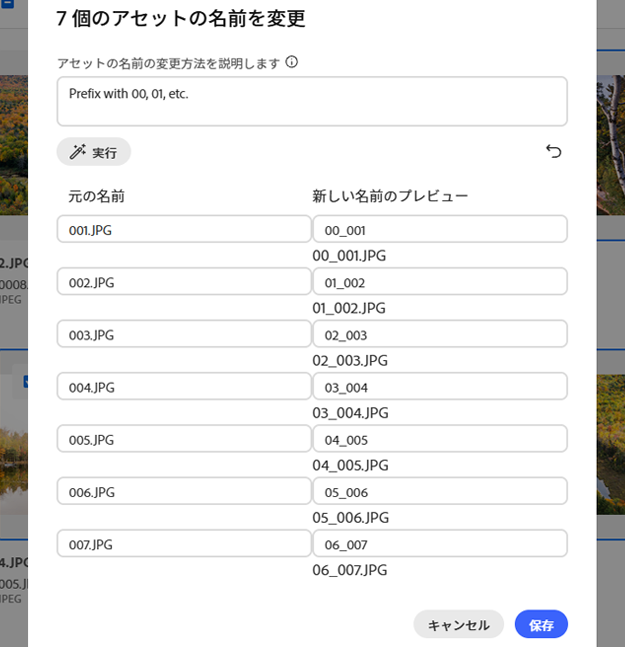

# [!DNL Assets Essentials] でのアセットまたはフォルダーの名前変更 {#rename-single-asset-or-folder}

名前を変更すると、コンテンツや場所を変更せずにアセットを整理、分類および識別しやすくなります。 [!DNL Assets Essentials] では、選択したアセットまたはフォルダーの名前を変更できます。

アセットまたはフォルダーの名前を変更するには、次の手順を実行します。

1. 名前を変更するアセットまたはフォルダーを見つけます。

1. アセットまたはフォルダーの名前を変更するには、次のいずれかの方法を使用します。

   * アセットまたはフォルダーを選択し、上部のメニューから **[!UICONTROL 名前を変更]**&#x200B;をクリックします。
   * アセットまたはフォルダーの「その他」オプション `...` をクリックし、「**[!UICONTROL 名前を変更]**」を選択します。
   * アセットまたはフォルダーのタイトルをクリックして名前を変更します。 「**アセット名を変更**」テキストボックスに新しいテキストを入力し、「**保存**」をクリックします。 この機能は、グリッド、ギャラリー、ウォーターフォール、リストの各表示で利用できます。

## AI を活用したアセット名の一括変更 {#rename-bulk-assets-using-ai}

[!DNL Assets Essentials] では、AI を使用して複数のアセット名を一度に変更できます。 AI 一括名前変更機能は、フォルダーではなく、ファイルにのみ適用できます。 複数のファイルを一度に選択し、まとめて名前を変更できます。

AI で生成されたプロンプトを使用して一度にアセット名の一括変更を行うには、次の手順に従います。

1. 複数のアセットを選択し、上部のメニューから「**[!UICONTROL 一括名前変更]**」をクリックします。

1. 選択したアセットの名前の変更方法を説明するプロンプトを追加します。 [AI 一括名前変更の例](#examples-ai-bulk-rename)を参照してください。

1. 「**[!UICONTROL 実行]**」をクリックして、プロンプトに示すように、AI がアセットの名前を変更できるようにします。

1. [オプション]：をクリックして、最後に実行したアクションを元に戻す、またはキャンセルします。

1. [!UICONTROL 新しい名前のプレビュー]列で変更を確認し、「**[!UICONTROL 保存]**」をクリックします。

   

## AI 一括名前変更の例 {#examples-ai-bulk-rename}

AI を使用して、AI プロンプトに基づいてアセット名を一括変更する例を以下に示します。

* 接頭辞として 00、01 などを付け、接尾辞として今日の日付を付けます。
* すべてのファイルを「my-file」に変更し、増分番号を追加します。
* 接頭辞と接尾辞を削除し、名前の中央部分のみを残します。
* ファイルの前に 001、002 などを付けて、英語に翻訳します。

>[!VIDEO](https://video.tv.adobe.com/v/3440975)

>[!NOTE]
>
> * 絵文字をテキストに変換することはできません。
> * アセット名の変更時に警告メッセージが表示されないように、一意の名前を使用します。 ただし、新しい名前でもう一度やり直すことができます。
> * また、Unicode 文字や英数字以外の文字をテキストに変換することもできます。

## 次の手順 {#next-steps}

* [ビデオを視聴して Assets Essentials でのメタデータフォームの管理を学ぶ](https://experienceleague.adobe.com/docs/experience-manager-learn/assets-essentials/configuring/metadata-forms.html?lang=ja)

* Assets Essentials ユーザーインターフェイスの「[!UICONTROL フィードバック]」オプションを使用して製品に関するフィードバックを提供する

* 右側のサイドバーにある「[!UICONTROL このページを編集]」（）または「[!UICONTROL 問題を記録] 」（）を使用してドキュメントに関するフィードバックを提供する

* [カスタマーケア](https://experienceleague.adobe.com/ja?support-solution=General#support)に問い合わせる

