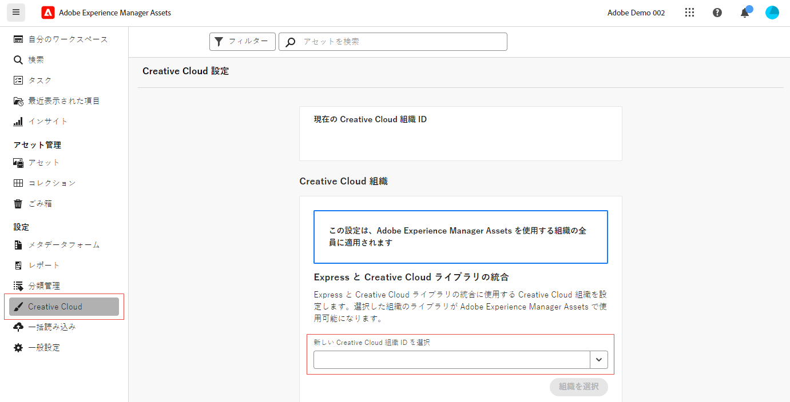

# AEM Assets を Creative Cloud に接続  {#cross-org-entitlements}

Experience Manager Assets には、Express ライブラリや Creative Cloud ライブラリなど、AEM Assets での最新の Creative Cloud 統合を簡単に使用するために、別の IMS 組織にプロビジョニングされた Creative Cloud 権限に接続する機能があります。

Creative Cloud 製品と AEM Assets が別の IMS 組織にプロビジョニングされている場合は、異なる Creative Cloud 組織に接続して、2 つのソリューション間で統合されたワークフローを実行できます。

## 前提条件 {#prerequisites}

* Experience Manager Assets に対する管理者権限

* Creative Cloud と Experience Manager 間で使用される同じユーザー ID に対する Creative Cloud へのアクティブな権限です。 同じメールアドレスを持つ個人用 ID と Federated ID に対する権限は、異なるユーザー ID として処理されます。

## 新しい Creative Cloud 組織に対する接続 {#connect-to-creative-cloud-org}

新しい Creative Cloud 組織に接続するには、次の手順を実行します。

1. **[!UICONTROL 設定]**／**[!UICONTROL Creative Cloud]** に移動します。

1. **[!UICONTROL 新しい Creative Cloud 組織 ID を選択]**&#x200B;ドロップダウンリストを使用して、新しい Creative Cloud 組織を選択します。 リストには、アクセス権のあるすべての組織が表示されます。 アクティブな Creative Cloud 権限を持つ組織を選択します。

1. 「**[!UICONTROL 組織を切り替え]**」をクリックして、新しい組織に切り替えます。

   

## 制限事項 {#limitations}

* AEM Assets は、一度に 1 つの Creative Cloud 組織に接続できます。 一度に複数の Creative Cloud 組織への接続はサポートされていません。

* AEM Assets 内で接続する Creative Cloud 組織は、組織内のすべてのユーザーに適用できます。
