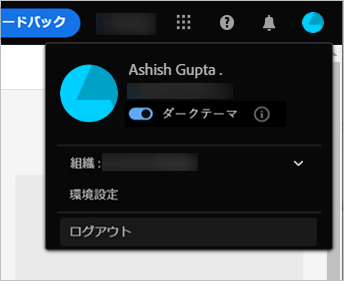
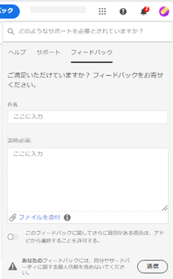

# [!DNL Adobe Experience Manager Assets Essentials] の基本 {#assets-essentials-get-started}

<!-- TBD: Make links for these steps. -->

[!DNL Assets Essentials] を使用したデジタルアセットの管理に必要なのは、次の 3 つの簡単な手順だけです。

* **手順 1**：アセットを[アップロード](/help/using/add-delete.md)し[表示](/help/using/navigate-view.md)する。
* **手順 2**：アセットを[検索](/help/using/search.md)し[ダウンロード](/help/using/manage-organize.md#download)する。
* **手順 3**：アセットを[管理および整理](/help/using/manage-organize.md)する。

[!DNL Assets Essentials] を使用するには、[https://experience.adobe.com/#/assets](https://experience.adobe.com/#/assets) でログインします。ログイン時に、`Company or School Account` を選択します。アクセス権を受け取るには、組織の管理者に問い合わせてください。

さらに、[ユーザーインターフェイスについて](/help/using/navigate-view.md)、[ユースケース一覧](#use-cases)、<!-- TBD: [supported file types](/help/using/supported-file-formats.md), -->[既知の問題](/help/using/release-notes.md#known-issues)も参考になります。

## [!DNL Assets Essentials] へのアクセス権の取得 {#get-access}

アドビは、ソリューションをプロビジョニングし、組織が指名した人物を管理者として追加します。管理者は、[[!DNL Admin Console]](https://helpx.adobe.com/jp/enterprise/using/admin-console.html) を使用して、組織の様々なユーザーにアクセス権を付与できます。アクセスに関するリクエストについては、組織の管理者に問い合わせてください。

ログイン時、資格情報を入力すると、[!DNL Assets Essentials] からアカウントを選択するように求められます。 この場合、`Company or School Account` をクリックして続行します。

## [!DNL Assets Essentials] の設定 {#configuration}

環境設定を開くには、ユーザーインターフェイスの右上隅にあるアバターをクリックします。ソリューションの環境設定で、明るいテーマと暗いテーマを切り替えることができます。

複数の異なる組織に属している場合は、組織を変更し、様々な組織のアカウントにアクセスすることもできます。

[!UICONTROL Experience Cloud の環境設定]を変更するには、「[!UICONTROL 環境設定]」をクリックします。

## [!DNL Assets Essentials] のユースケース {#use-cases}

[!DNL Assets Essentials] を使用すると、次のような様々なデジタルアセット管理（DAM）タスクを実行できます。

| ユーザータスク | 機能とハウツー情報 |
|-----|------|
| アセットの参照と表示 | <ul> <li>[リポジトリーの参照](/help/using/navigate-view.md#view-assets-and-details) </li> <li> [アセットのプレビュー](/help/using/navigate-view.md#preview-assets) <li> [アセットのレンディションの表示](/help/using/add-delete.md#renditions) </li> <li>[アセットのバージョンの表示](/help/using/manage-organize.md#view-versions)</li></ul> |
| 新しいアセットの追加 | <ul> <li>[新しいアセットやフォルダーのアップロード](/help/using/add-delete.md#add-assets)</li> <li>[アップロードの進行状況の監視とアップロードの管理](/help/using/add-delete.md#upload-progress)</li> <li>[重複の解決](/help/using/add-delete.md#resolve-upload-fails)</li> </ul> |
| アセットまたは関連情報の更新 | <ul> <li>[画像の編集](/help/using/edit-images.md)</li> <li>[バージョンの作成](/help/using/manage-organize.md#create-versions)と[バージョンの表示](/help/using/manage-organize.md#view-versions)</li> <li>[画像の編集](/help/using/edit-images.md)</li> </ul> |
| アセットの編集 | <ul> <li>[Adobe Photoshop Express を使用したブラウザー内編集](/help/using/edit-images.md)</li> <li>[ソーシャルメディアプロファイルの切り抜き](/help/using/edit-images.md#crop-straighten-images)</li> <li>[バージョンの表示と管理](/help/using/manage-organize.md#view-versions)</li> <li>[使用方法 [!DNL Adobe Asset Link]](/help/using/integration.md#integrations)</ul></ul> |
| リポジトリー内のアセットの検索 | <ul> <li>[特定のフォルダー内での検索](/help/using/search.md#refine-search-results)</li> <li>[保存済みの検索](/help/using/search.md#saved-search)</li> <li>[最近表示されたアセットの検索](/help/using/search.md)</li> <li>[フルテキスト検索](/help/using/search.md) |
| アセットのダウンロード | <ul> <li> [アセットのプレビュー](/help/using/navigate-view.md#preview-assets) </li> <li> [アセットのダウンロード](/help/using/manage-organize.md#download) <li> [レンディションのダウンロード](/help/using/add-delete.md#renditions) </li></ul> |
| メタデータ操作 | <ul> <li>[詳細なメタデータの表示](/help/using/metadata.md) </li> <li> [メタデータを更新](/help/using/metadata.md#update-metadata)</li> <li> [新しいメタデータフォームの作成](/help/using/metadata.md#metadata-forms) </li> </ul> |
| 他のソリューションとの統合 | <ul> <li>[アセットセレクターの使用： [!DNL Adobe Journey Optimizer]](/help/using/integration.md)</li> <li>[[!DNL Adobe Asset Link] （ [!DNL Creative Cloud]](/help/using/integration.md) 用）</li> <li>[他のソリューションとの統合： [!DNL Adobe Workfront]](/help/using/integration.md)</li> </ul> |

## 次の手順 {#next-steps}

* [ビデオを視聴して Assets Essentials の基本を学ぶ](https://experienceleague.adobe.com/docs/experience-manager-learn/assets-essentials/getting-started.html?lang=ja)

* Assets Essentials ユーザーインターフェイスの「[!UICONTROL フィードバック]」オプションを使用して関する関するフィードバックを提供する

* 右側のサイドバーにある「[!UICONTROL このページを編集]」（）または「[!UICONTROL 問題を記録] 」（）を使用してドキュメントに関するフィードバックを提供する

* [カスタマーケア](https://experienceleague.adobe.com/?support-solution=General&amp;lang=ja#support)に問い合わせる

<!--TBD: Merge the below rows in the table when the use cases are documented/available.

| How do I delete assets? | <ul> <li>[Delete assets](/help/using/manage-organize.md)</li> <li>Recover deleted assets</li> <li>Permanently delete assets</li> </ul> |
| How do I share assets or find shared assets? | <ul> <li>Shared by me</li> <li>Shared with me</li> <li>Share for comments and review</li> <li>Unshare assets</li> </ul> |
| How do I collaborate with others and get my assets reviewed | <ul> <li>Share for review</li> <li>Provide comments. Resolve and filter comments</li> <li>Annotations on images</li> <li>Assign tasks to specific users and prioritize</li> </ul> |

-->

<!-- 

##  Provide product feedback {#provide-feedback}

Adobe welcomes feedback about the solution. To provide feedback without even switching your working application, use the [!UICONTROL Feedback] option in the user interface. It also lets you attach files such as screenshots or video recording of an issue.

  

To provide feedback for documentation, click [!UICONTROL Edit this page]  or [!UICONTROL Log an issue]  from the right sidebar. You can do one of the following: 

* Make the content updates and submit a GitHub pull request.
* Create an issue or ticket in GitHub. Retain the automatically populated article name when creating an issue.

-->

>[!MORELIKETHIS]
>
>* [ユーザーインターフェイスについて](/help/using/navigate-view.md)
>* [リリースノートと既知の問題](/help/using/release-notes.md)

<!-- TBD: 
>* [Supported file types](/help/using/supported-file-formats.md).
-->
