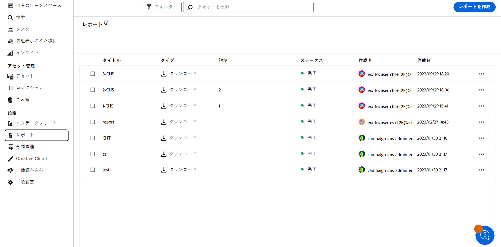
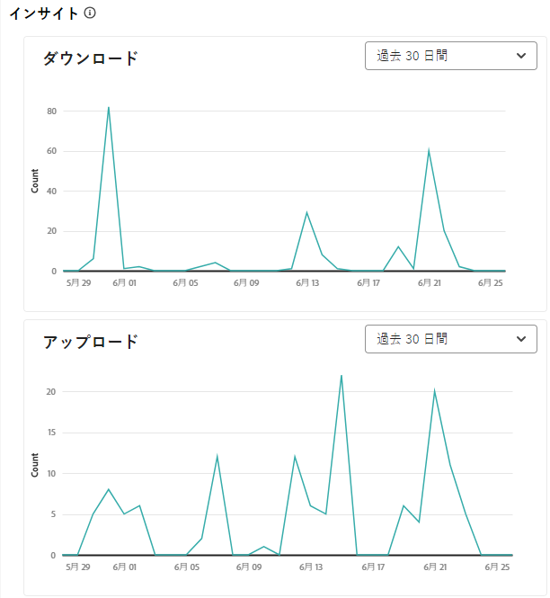
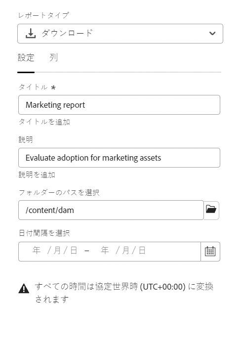
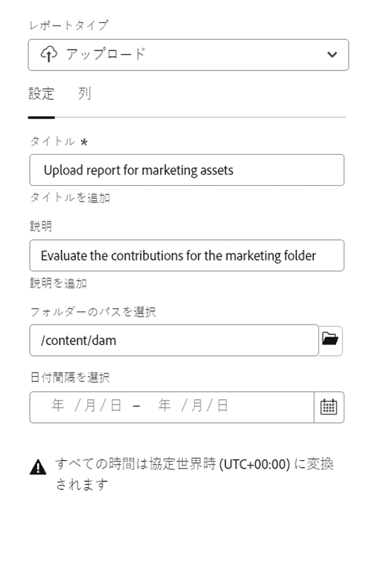
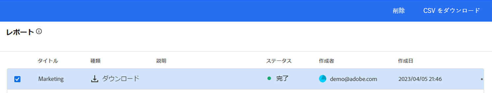

# レポートの管理 {#manage-reports}

アセットレポートを使用すると、管理者は Adobe Experience Manager Assets Essentials 環境のアクティビティを視覚的に確認できます。このデータは、ユーザーがコンテンツや製品とどのようにやり取りするかについての有用な情報を提供します。すべてのユーザーが Insights ダッシュボードにアクセスでき、管理者の製品プロファイルに割り当てられたユーザーはユーザー定義レポートを作成できます。

## レポートへのアクセス {#access-reports}

[Assets Essentials 管理者製品プロファイル](deploy-administer.md)に割り当てられているユーザーはすべて、Assets Essentials でインサイトダッシュボードにアクセスしたり、ユーザー定義のレポートを作成したりできます。

レポートにアクセスするには、 **[!UICONTROL レポート]** under **[!UICONTROL 設定]**.

<!--
In the **[!UICONTROL Reports]** screen, various components are shown in the tabular format which includes the following:

* **Title**: Title of the report
* **Type**: Determines whether the report is uploaded or downloaded to the repository
* **Description**: Provide details of the report that was given during uploading/downloading the report
* **Status**: Determines whether the report is completed, under progress, or deleted.
* **Author**: Provides email of the author who has uploaded/downloaded the report.
* **Created**: Gives information of the date when the report was generated.
-->

## インサイトの表示 {#view-live-statistics}

>[!CONTEXTUALHELP]
>id="assets_reports"
>title="レポート"
>abstract="インサイトダッシュボードを使用すると、過去 30 日間または過去 12 か月間の Experience Manager Assets 環境のリアルタイムのイベント指標を表示できます。イベントのリストには、ダウンロード数、アップロード数、上位の検索数などが含まれます。"

Assets Essentials を使用すると、Assets Essentials 環境のリアルタイムデータをインサイトダッシュボードで表示できます。過去 30 日間または過去 12 か月間のリアルタイムイベント指標を表示できます。

左側のナビゲーションパネルにある「**[!UICONTROL インサイト]**」をクリックすると、自動生成された以下のグラフを表示できます。

* **ダウンロード**：過去 30 日間または 12 か月間に Assets Essentials 環境からダウンロードされたアセットの数は、折れ線グラフで表されます。

* **アップロード**：過去 30 日間または 12 か月間に Assets Essentials 環境にアップロードされたアセットの数は、折れ線グラフで表されます。

* **サイズ別のアセット数**:0 MB ～ 100 GB の様々なサイズの範囲に基づくアセット数の割合です。

* **ストレージ使用量**：ユーザービリティに応じて、棒グラフで表されるAssets Essentials環境のストレージ使用量（バイト単位）。

  

* **配信**：グラフは、配信日としてのアセット数を示します。

* **アセットタイプ別のアセット数**：使用可能なアセットの様々な MIME タイプの数を表します。 例えば、application/zip、image/png、video/mp4、application/postscripte などです。

* **上位の検索**：過去 30 日間または 12 か月間に Assets Essentials 環境内で検索された上位の検索キーワードと回数は、表形式で表されます。

## ダウンロードレポートの作成 {#create-download-report}

ダウンロードレポートを作成するには：

1. **[!UICONTROL 設定]**／**[!UICONTROL レポート]**&#x200B;に移動して、「**[!UICONTROL レポートを作成]**」をクリックします。

1. 「[!UICONTROL 設定]」タブで、レポートタイプを&#x200B;**[!UICONTROL ダウンロード]**&#x200B;に指定します。

1. レポートのタイトルとオプションの説明を指定します。

1. 「**[!UICONTROL フォルダーパスを選択]**」フィールドを使用して、レポートを実行するアセットを含むフォルダーパスを選択します。

1. レポートの日付間隔を選択します。

   >[!NOTE]
   >
   > Assets Essentials は、すべてのローカルタイムゾーンを協定世界時（UTC）に変換します。

1. 「[!UICONTROL 列]」タブで、レポートに表示する列名を選択します。

1. 「**[!UICONTROL 作成]**」をクリックします。

   

次の表に、レポートに追加できるすべての列の使用方法を示します。

<table>
    <tbody>
     <tr>
      <th><strong>列名</strong></th>
      <th><strong>説明</strong></th>
     </tr>
     <tr>
      <td>タイトル</td>
      <td>アセットのタイトル。</td>
     </tr>
     <tr>
      <td>パス </td>
      <td>Assets Essentials でアセットを使用できるフォルダーパス。</td>
     </tr>
     <tr>
      <td>MIME タイプ</td>
      <td>アセットの MIME タイプ。</td>
     </tr>
     <tr>
      <td>サイズ</td>
      <td>アセットのサイズ（バイト単位）。</td>
     </tr>
     <tr>
      <td>ダウンロードしたユーザー</td>
      <td>アセットをダウンロードしたユーザーのメール ID。</td>
     </tr>
     <tr>
      <td>ダウンロード日</td>
      <td>アセットのダウンロードアクションが実行された日付。</td>
     </tr>
     <tr>
      <td>作成者</td>
      <td>アセットの作成者。</td>
     </tr>
     <tr>
      <td>作成日時</td>
      <td>アセットが Assets Essentials にアップロードされた日付。</td>
     </tr>
     <tr>
      <td>変更日</td>
      <td>アセットの最終変更日付。</td>
     </tr>
     <tr>
      <td>期限切れ</td>
      <td>アセットの有効期限切れステータス。</td>
     </tr>
     <tr>
      <td>ユーザー名によりダウンロード</td>
      <td>アセットをダウンロードしたユーザーの名前。</td>
     </tr>           
    </tbody>
   </table>

## アップロードレポートの作成 {#create-upload-report}

アップロードレポートを作成するには：

1. **[!UICONTROL 設定]**／**[!UICONTROL レポート]**&#x200B;に移動して、「**[!UICONTROL レポートを作成]**」をクリックします。

1. 「[!UICONTROL 設定]」タブで、レポートタイプを&#x200B;**[!UICONTROL アップロード]**&#x200B;として指定します。

1. レポートのタイトルとオプションの説明を指定します。

1. 「**[!UICONTROL フォルダーパスを選択]**」フィールドを使用して、レポートを実行するアセットを含むフォルダーパスを選択します。

1. レポートの日付間隔を選択します。

1. 「[!UICONTROL 列]」タブで、レポートに表示する列名を選択します。

1. 「**[!UICONTROL 作成]**」をクリックします。

   

次の表に、レポートに追加できるすべての列の使用方法を示します。

<table>
    <tbody>
     <tr>
      <th><strong>列名</strong></th>
      <th><strong>説明</strong></th>
     </tr>
     <tr>
      <td>タイトル</td>
      <td>アセットのタイトル。</td>
     </tr>
     <tr>
      <td>パス </td>
      <td>Assets Essentials でアセットを使用できるフォルダーパス。</td>
     </tr>
     <tr>
      <td>MIME タイプ</td>
      <td>アセットの MIME タイプ。</td>
     </tr>
     <tr>
      <td>サイズ</td>
      <td>アセットのサイズ。</td>
     </tr>
     <tr>
      <td>作成者</td>
      <td>アセットの作成者。</td>
     </tr>
     <tr>
      <td>作成日時</td>
      <td>アセットが Assets Essentials にアップロードされた日付。</td>
     </tr>
     <tr>
      <td>変更日</td>
      <td>アセットの最終変更日付。</td>
     </tr>
     <tr>
      <td>期限切れ</td>
      <td>アセットの有効期限切れステータス。</td>
     </tr>              
    </tbody>
   </table>

## 既存のレポートの表示 {#view-report-list}

[レポートを作成](#create-download-report)した後、既存のレポートのリストを表示して、CSV 形式でダウンロードしたり削除したりできます。

レポートのリストを表示するには、**[!UICONTROL 設定]**／**[!UICONTROL レポート]**&#x200B;に移動します。

各レポートには、レポートのタイトル、レポートのタイプ、レポートの作成時に指定した説明、レポートのステータス、レポートの作成者のメール ID、レポートの作成日が表示されます。

レポートの `Completed ` ステータスは、レポートのダウンロード準備ができたことを表します。

## CSV レポートのダウンロード {#download-csv-report}

レポートを CSV 形式でダウンロードするには：

1. **[!UICONTROL 設定]**／**[!UICONTROL レポート]**&#x200B;に移動します。

1. レポートを選択し、「**[!UICONTROL CSV をダウンロード]**」をクリックします。

選択したレポートが CSV 形式でダウンロードされます。CSV レポートに表示される列は、[レポートの作成](#create-download-report)時に選択する列に依存します。

## レポートの削除 {#delete-report}

レポートを削除するには：

1. **[!UICONTROL 設定]**／**[!UICONTROL レポート]**&#x200B;に移動します。

1. レポートを選択し、「**[!UICONTROL 削除]**」をクリックします。

1. もう一度「**[!UICONTROL 削除]**」をクリックして確認します。
