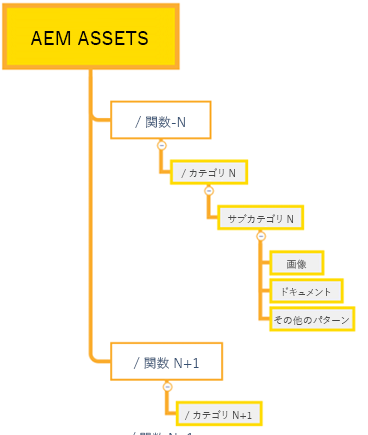
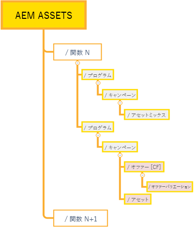
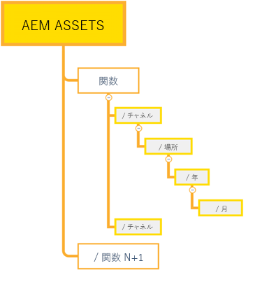

# 効果的な権限管理のベストプラクティス {#best-practices-permissions-management}

管理者として、Assets Essentials リポジトリのフォルダー権限の管理を開始する前に、運用を管理しながら、後で管理者とエンドユーザーにとってインフラストラクチャを直感的なものにするために実装できるベストプラクティスには様々なものがあります。

これらのベストプラクティスは、次の場合に組み込むことができます。

* [Admin Console でのユーザーグループの作成](#admin-console-best-practices)

* [Assets Essentials リポジトリでのフォルダー構造の作成](#folder-structure-assets-essentials)

* [Assets Essentials リポジトリでの権限の管理](#folder-permissions)

## Admin Console {#admin-console-best-practices}

組織内のユーザーグループに基づいて、アクセスのニーズを特定します。組織のユーザーグループを計画および作成し、それらのユーザーグループにユーザーを追加します。個々のユーザーではなく、ユーザーグループに基づいてフォルダー権限を管理するほうが簡単です。

## Assets Essentials リポジトリのフォルダー構造 {#folder-structure-assets-essentials}

Assets Essentials リポジトリでフォルダー構造を作成する計画を開始する際は、次の点を考慮してください。

* 今後のガバナンス：管理者が管理するフォルダーと、[所有者として他のユーザーに権限をデリゲート](manage-permissions.md##manage-permissions-folders)するフォルダー。

* スケーラブル：フォルダー構造は、組織の今後のニーズに準拠し、容易に拡張可能にする必要があります。

* サイズ：1 つのフォルダーに含めるアセットの数が多くなりすぎないようにします。ファイルの数が多すぎると、操作性の問題を引き起こし、管理が困難になる可能性があります。

* 直感的：フォルダー構造は、参照が容易で、エンドユーザーにとって直感的なものにする必要があります。 フォルダー構造内の新しいアセットをアップロードする場所を容易に識別できるようにする必要があります。

組織で使用できるフォルダー構造タイプには様々なものがあります。一般的なフォルダー構造の例を以下に示します。

* 関数と分類ベース

  

* キャンペーンベース

  

* オファーの場所（またはチャネル）ベース

  

## フォルダー権限 {#folder-permissions}

組織のユーザーグループを作成し、それらのユーザーグループにユーザーを追加し、Assets Essentials リポジトリで組織のニーズに合ったフォルダー構造を選択して作成したら、組織のフォルダー権限の管理を開始できます。フォルダー権限の管理を開始する際は、次の点を考慮してください。

* 個々のユーザーではなく、ユーザーグループに権限を適用します。これにより、よりシンプルで効率的な権限構造が得られます。

* 運用効率を高めるために、権限構造をできるだけシンプルにします。

* 「アクセスを拒否」権限の使用は慎重に行ってください。フォルダー構造に正の権限（編集可能、表示可能、所有者）を適用することをお勧めします。

効率的でシンプルなフォルダー構造を実現する方法の例については、[フォルダーに対する権限の管理](manage-permissions.md##manage-permissions-folders)を参照してください。

## 次の手順 {#next-steps}

* Assets Essentials ユーザーインターフェイスの「[!UICONTROL フィードバック]」オプションを使用して製品に関するフィードバックを提供する

* 右側のサイドバーにある「[!UICONTROL このページを編集]」（）または「[!UICONTROL 問題を記録] 」（）を使用してドキュメントに関するフィードバックを提供する

* [カスタマーケア](https://experienceleague.adobe.com/?support-solution=General&amp;lang=ja#support)に問い合わせる
