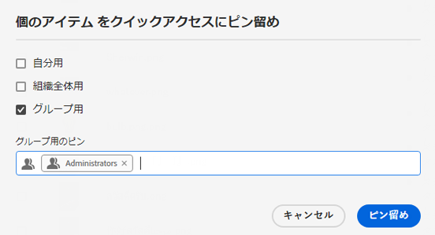
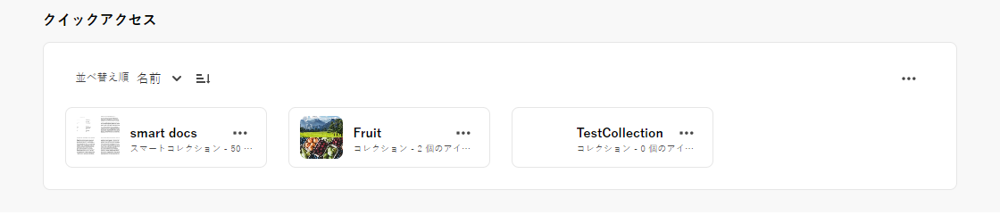
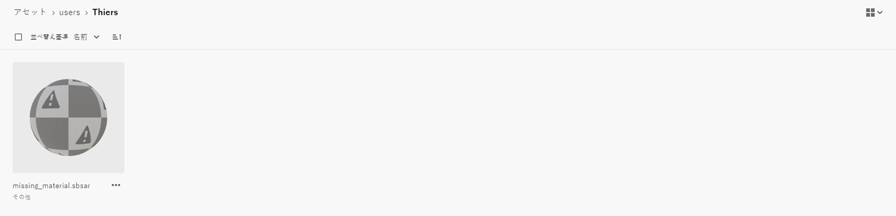
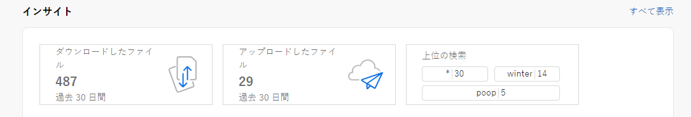
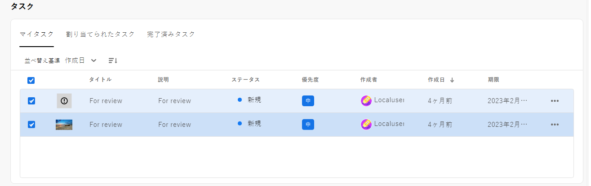
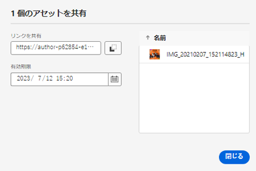

# [!DNL Assets Essentials] のリリースノート {#release-notes}

Assets Essentials の最新リリースは 2024年4月18日（PT）にリリースされました。

最近追加された機能には次のようなものがあります。

**コンテキスト検索**

また、テキストプロンプトを定義して、リポジトリで使用可能なアセットを検索することもできるようになりました。Experience Manager Assets は、これらのテキストプロンプトを検索フィルターに自動変換し、検索結果を表示します。フィルターペインを使用して自動フィルターを表示および変更すると、検索結果をさらに絞り込むことができます。

<!--

**Dynamic renditions**

You can now view and download dynamic renditions (including smart crops) in Experience Manager Assets. Dynamic renditions are customized versions of image assets created in real-time to meet specific needs, such as resizing images based on device resolution or cropping to fit different aspect ratios. These renditions enable organizations to deliver personalized and optimized experiences to diverse audience needs.

-->

**アセットおよびフォルダーのインプレース名前変更**

Experience Manager Assets では、シングルクリックでアセットまたはフォルダーを名前変更できる機能を提供して、簡素化されたユーザーエクスペリエンスを提供するようになりました。

**ビデオのクイックアクションの高速化**

Experience Manager Assets には、Adobe Express を活用した簡単で直感的なビデオ編集ツールが含まれており、コンテンツの再利用を増やし、コンテンツの速度を高速化します。編集オプションには、ビデオのトリミング、切り抜き、サイズ変更、MP4 から GIF ファイルへの変換などが含まれます。

>[!NOTE]
> [!DNL Adobe Express] にアクセスする権限と、AEM Assets 内の 1 つ以上の環境が必要です。環境には、[!DNL Assets as a Cloud Service] または [!DNL Assets Essentials] 内の任意のリポジトリを指定できます。

**複数のフォルダーへのメタデータフォームの割り当てまたは削除**

メタデータフォームを複数のフォルダーに割り当てたり、複数のフォルダーから削除したりできるようになりました。

**プライベートコレクションの権限の管理**

管理者または非管理者（他のユーザー）に、リポジトリで使用可能なプライベートコレクションのアクセスレベルの管理を許可できます。`Can View` や `Can Edit` などの権限をユーザーグループまたはユーザーに割り当てることができます。また、ユーザーグループに権限管理の権限をデリゲートすることもできます。

**お客様からのフィードバックに基づく改善**

お客様からのフィードバックに基づく機能強化およびバグ修正。

## 既知の問題 {#known-issues}

[!DNL Assets Essentials] の機能に関する既知の問題のリストは、継続的に改訂および更新されます。

<!--

* Assets Essentials does not support creating Private collections.

-->

<!--* Private collections are available to creator and the users with administrator privileges. As an administrator, you cannot delegate the permissions to access the collection to other users.-->

問題が発生した場合や機能強化のご要望については、サポートチームに[フィードバックを送付](#provide-feedback)してください。

## 過去のリリース {#past-releases}

### 2024年1月リリース {#january-2024-release}

**スマートタグのブロックリスト**

Assets Essentials では、ブロックリストを定義できるようになりました。このリストは、リポジトリにアップロードする際に、アセットにスマートタグとして追加する必要がない単語で構成されます。この機能は、ブランドのコンプライアンスを保持し、スマートタグのモデレートにかかる作業を軽減するのに役立ちます。

**Adobe Firefly を使用した生成 AI 画像の作成**

Adobe Firefly のテキストから画像生成機能を統合して、検索クエリに基づいて新しい画像を作成します（Adobe Firefly ライセンスが必要です）。

**類似検索画像**

画像を選択し、Experience Manager Assets リポジトリで類似の画像を表示することで、コンテンツを簡単に検索できるようになりました。

**AEM Assets の Adobe Express 埋め込みエディター**

Express へのアクセス権を持つユーザーは、Adobe Express と Adobe Firefly の統合された画像編集および作成ツールを AEM Assets 内で直接利用できるようになり、コンテンツの再利用を改善し、コンテンツの速度を向上させることができます。

**インサイトのストレージ使用状況レポート**：

管理者は、インサイトの一部として使用できるストレージ使用状況レポートを表示できるようになりました。

**検索ファーストホームページの設定**

Assets Essentials では、組織のホームページエクスペリエンスを設定できるようになりました。ホームページとして検索ファーストを選択した場合は、組織の検索バーの位置、背景画像、ロゴを設定できます。「[!UICONTROL 一般設定]」を選択すると、デフォルトのランディングページが上書きされます。例えば、デフォルトのランディングは、管理者には[!UICONTROL マイワークスペース]、管理者以外のユーザーには[!UICONTROL 検索ファースト]となり、一般設定でいずれかのオプションを選択すると、その設定がすべてのユーザーに適用されます。

### 2023年10月リリース {#october2023-release}

**OneDrive データソースからのアセットの一括読み込み**

管理者は、[OneDrive から AEM Assets に大量のアセットを読み込める](/help/using/bulk-import-assets-view.md)ようになりました。一括読み込みでサポートされるデータソースの更新リストには、Azure、AWS、Google Cloud、Dropbox、および OneDrive が含まれます。

**ライブラリに対する組織をまたいだ資格のサポート**

Experience Manager Assets では、別の IMS 組織の Creative Cloud ライブラリへのアクセスを設定できるようになりました。これにより、Creative Cloud と Experience Manager の間で、製品をまたいだ最新ワークフローに容易にアクセスできるようになり、クリエイティブの時間と労力を削減できます。

### 2023年9月リリース {#september2023-release}

**フォルダーにメタデータフォームの割り当て**

Assets Essentials デプロイメント内の特定のフォルダーにメタデータフォームを割り当てることができるようになりました。サブフォルダー内のアセットを含むフォルダー内のすべてのアセットには、割り当てられたメタデータフォームで定義されたプロパティが表示されます。

**データソースからのアセットの一括読み込み**

管理者は、データソースから AEM Assets に大量のアセットを読み込めるようになりました。管理者は、個々のアセットやフォルダーを AEM Assets にアップロードする必要がなくなりました。一括読み込みでサポートされるデータソースには、Azure、AWS、Google Cloud、Dropbox が含まれます。

**Adobe Express を活用した画像編集ツール**

AEM Assets 内で直接使用できる Adobe Express を活用した、簡単で直感的な画像編集ツールにより、コンテンツの再利用性を高め、コンテンツの速度を向上させます。

**マイワークスペースのクイックアクセス用に項目をピン留めする際の柔軟性**

自分用、組織全体用またはグループのリスト用の項目を選択してピン留めし、選択に基づいてマイワークスペースの「クイックアクセス」セクションに項目が表示されるようにする機能です。

### 2023年7月リリース {#july2023-release}

**画像スマートタグ用の人工知能フレームワークの改善**

Experience Manager Assets は、画像スマートタグ用に改善された人工知能フレームワークを使用するようになりました。このコンテンツインテリジェンスにより、取り込み時にすべての画像アセットで使用できるスマートタグの関連性と精度が向上します。

**アセットのリスト表示の列表示の設定**

Assets Essentials では、ステータス、形式、ディメンション、サイズなど、アセット のリスト表示に表示する列を選択できるようになりました。

**関連性に基づいた検索結果の並べ替え**

Assets Essentials では、デフォルトで、関連性に基づいて検索結果を並べ替えるようになりました。検索したアセットを、`Name`、`Relevance`、`Size`、`Modified` および `Created` の昇順または降順に並べ替えることができます。

### 2023年6月リリース {#june2023-release}

**アセットの階層タグ付けにより、検索エクスペリエンスを高速化**

語彙を制御するフラットなリストは、時間の経過と共に管理できなくなります。Assets Essentials では、階層的なタグ付け構造をサポートするようになりました。これにより、関連するメタデータの適用、アセットの分類、検索のサポート、タグの再利用、検出性の向上などを簡単に行えます。

**ファイル、フォルダー、コレクションをピン留めして、すばやくアクセスできるようにする**

ファイル、フォルダー、コレクションをピン留めして、後で必要になった際に、すばやくアクセスできるようになりました。ピン留めした項目は、マイワークスペースの「**クイックアクセス**」セクションに表示されます。リポジトリ内の保存場所に移動する代わりに、マイワークスペースを使用してこれらにアクセスできます。

**ごみ箱フォルダー内のアセットのフィルタリング**

Assets Essentials では、ごみ箱フォルダー内の使用可能なアセットをフィルタリングできるようになりました。ごみ箱フォルダー内の適切なアセットを検索するために、標準フィルターまたはカスタムフィルターを適用して、アセットを復元するか完全に削除することができます。

**3D アセットのサムネールプレビュー**

Assets Essentials では、gLB、USDz、FBX、3DS、OBJ、SBSAR など、一般的な 3D ファイル形式のサムネールプレビューを生成するようになりました。これらのファイルを Assets Essentials にアップロードすると、デフォルトでは、システムによってサムネールが自動的に生成されます。

**上位の検索した用語の表示**

Assets Essentials では、マイワークスペースの「**インサイト**」セクションを使用して、Assets Essentials デプロイメント内で上位に検索した用語の表示がサポートされるようになりました。また、詳細なインサイトに移動して、過去 30 日間または 12 か月間で上位の検索結果を表示することもできます。

**メタデータフォームの機能強化**

Assets Essentials では、複数値テキストおよびドロップダウンリストのプロパティコンポーネントをメタデータフォームに追加できるようになりました。

### 2023年の複数のリリース {#multiple-releases-2023}

最近追加された機能のリストは次のとおりです。

**上位のダウンロードされたアセット**

マイワークスペースの「[!UICONTROL コンテンツ]」セクションに、Assets Essentials 環境で最もダウンロードされたアセットの上位 10 件が表示されるようになりました。また、リストされた各アセットの形式タイプとダウンロード数を表示することもできます。

**アセットメタデータの一括アップデート**

メタデータの一括アップデートを使用すると、複数のアセットに対して、共通のメタデータアップデートを同時に実行できます。 レコードを個別に更新する必要はなく、検索を通じてアクセスするアセットやフォルダーにプロパティをすばやく適用できます。また、メタデータの一括アップデートにより、既存の値が上書きされます。つまり、既存のキーワードがメタデータの一括アップデートにより上書きされます。

**設定可能なウィジェットを使用したマイワークスペース**

Assets には、カスタマイズされたワークスペースが用意されました。このワークスペースは、Assets ユーザーインターフェイスの主要な領域と、最も関連性の高い情報に簡単にアクセスできるワンストップソリューションとして機能します。これらのオプションにすばやくアクセスできるので、プロジェクトのコンテンツ速度と効率が向上します。

マイワークスペースには、インサイト、タスクおよびコンテンツ用のウィジェットが含まれています。環境設定に基づいて、ワークスペースでのこれらのウィジェットの表示方法を設定できます。

**専用タスク管理 UI**

Assets Essentials では、左側のナビゲーションパネルで使用できる新しい「**[!UICONTROL タスク]**」オプションを使用して、現在自分に割り当てられているタスク、自分が作成したタスクおよび既に完了したタスクのリストを一元管理できるようになりました。また、タスクを選択して承認または却下するか、タスクの詳細を開いて承認、却下、編集または削除することで、適切なアクションを実行することもできます。

**アセットを共有するための自動生成リンク**

Assets Essentials では、Assets Essentials ユーザーインターフェイスを使用してアセットを共有することを選択するとすぐに、自動的にリンクを生成するようになりました。有効期限を変更した場合でも、生成されたリンクは引き続き有効です。

**お客様からのフィードバックに基づく改善**

お客様からのフィードバックに基づく機能強化およびバグ修正。

### 2022.11.0 {#november-2022}

 [!DNL Assets Essentials] の 11 月リリースは 2022年11月17日（PT）にリリースされました。

このリリースの特長は次のとおりです。

**Document Cloud ビューアを使用したドキュメントのプレビュー**

Assets Essentials では、サポートされている他の形式タイプのドキュメントをアップロードして、組み込まれている Document Cloud ビューアを使用してプレビューできるようになりました。サポートされている形式タイプには、TXT、RTF、DOC、DOCX、PPT、PPTX、XLS および XLSX が含まれます。

<!--

**View Smart Tags moderation reports**

Asset reporting now provides administrators with visibility into the Smart Tags promoted or deleted for an asset. You can specify a folder path and the report lists the Smart Tags promoted or deleted for all assets available at the folder path.

-->

<!--
**Read-only access to large number of users**

Assets Essentials allows administrators to provide read-only access to a large number of users for selected assets or folders in the repository. 
You can easily synchronize the user groups available on the external identity management of an organization with Adobe Admin Console and then manage permissions in Admin Console and Assets Essentials to provide the users with read-only access for selected assets or folders.

-->

**新しい「メタデータを保存」オプション**

Assets Essentials ユーザーインターフェイスで新しい「メタデータを保存」オプションが 使用できるようになり、メタデータのガバナンスが強化されました。

**お客様からのフィードバックに基づく改善**

お客様からのフィードバックに基づく機能強化およびバグ修正。

**Adobe Asset Link バージョン 3.3**

[Adobe Asset Link](https://helpx.adobe.com/jp/enterprise/using/adobe-asset-link.html) バージョン 3.3 は、2022年12月13日（PT）にリリースされ、次の機能が含まれます。

* 従来の [Creative Cloud エンタープライズ版](https://www.adobe.com/jp/creativecloud/business/enterprise.html)のサポートに加え、[Creative Cloud グループ版](https://www.adobe.com/jp/creativecloud/business/teams.html)をサポート。

* 最新の Adobe InDesign、Photoshop、Illustrator 2023 アプリケーションのサポート。

* プロキシサーバー環境での Adobe Asset Link CEP プラグインの使用に対するサポート。

### 2022.8.0 {#august-2022}

[!DNL Assets Essentials] の 8月リリースは 2022年8月22日（PT）にリリースされました。

このリリースの特長は次のとおりです。

**コレクションの通知**

Assets Essentials 通知を使用すると、リポジトリで使用可能なコレクションで実行した操作を監視できます。通知を送信するコレクションを選択し、購読する必要があります。また、コレクションに対して実行される削除、リンクの共有、移動、名前の変更、更新など、通知の送信する操作を設定できます。

**スマートコレクションを編集**

Assets Essentials では、スマートコレクションの作成時に使用する検索条件を編集する機能も提供するようになりました。新しい検索条件を保存して、コレクションのコンテンツを動的に更新します。

**ストレージアカウントのライブ統計の表示**

Assets Essentials を使用すると、Assets Essentials 環境のリアルタイムのストレージアカウントデータをライブ統計ダッシュボードでも表示できるようになりました。過去 30 日間または過去 12 か月間のリアルタイムイベント指標を表示できます。

**アップロードレポートの表示**

アセットレポートで、管理者が Adobe Experience Manager Assets Essentials デプロイメントにアップロードされたアセットを表示できるようになりました。管理者は、既に Assets Essentials デプロイメントからダウンロードしたアセットのレポートを生成できます。このデータは、ユーザーがコンテンツや製品とどのようにやり取りするかについての有用な情報を提供します。

**お客様からのフィードバックに基づく改善**

お客様からのフィードバックに基づく機能強化およびバグ修正。

### 2022.6.0 {#june-2022}

[!DNL Assets Essentials] の 6月リリースは 2022年7月14日（PT）にリリースされました。

このリリースの特長は次のとおりです。

**スマートコレクション**

検索結果をスマートコレクションとして保存して、コレクションのコンテンツを動的に更新します。[スマートコレクションの作成](manage-collections.md#create-smart-collection)時に定義した検索条件に適合するアセットが Assets Essentials リポジトリに追加されている場合、スマートコレクションのコンテンツは自動的に更新されます。

**通知**

Assets Essentials 通知を使用すると、[リポジトリで使用可能なアセットやフォルダーで実行した操作を監視できます](manage-notifications.md)。通知を送信するコンテンツを選択し、購読する必要があります。また、通知を受け取るカテゴリを設定することもできます。

**レポート**

アセットレポートを使用すると、管理者は Adobe Experience Manager Assets Essentials 内のユーザーアクティビティを評価できます。レポートとライブ統計ダッシュボードでは、ユーザーがデプロイメントで利用可能なアセットをどのように操作するかについての有用な情報を提供します。[レポートの情報を使用して](manage-reports.md)重要な成功指標を導き出し、自社やお客様の Assets の採用状況を測定することができます。

アセットダウンロードレポートとライブ統計ダッシュボードモジュールを表示して、ダウンロードされているアセットとダウンロードの頻度を確認します。

### 2022.5.0 {#may-2022}

[!DNL Assets Essentials] の5月リリースは 2022年6月16日（PT）にリリースされました。

このリリースの特長は次のとおりです。

**アセットステータスの機能強化**

* Assets Essentials で[アセットの有効期限の設定](manage-organize.md#set-asset-status)が可能になりました。さらに、アセットの `Expired` ステータスと有効期限の日付範囲を基に、[アセットをフィルタリング](search.md#refine-search-results)できます。

* ごみ箱に入っているすべてのアセットのアセットステータスインジケーターを表示できるようになりました。 これにより、アセットのステータスに基づいてアセットを復元するかどうかを決定できます。

**検索フィルターの機能強化**

* Assets Essentials では、アセットの `No Status` ステータスを使用して[アセットをフィルタリング](search.md#refine-search-results)できるようになりました。

<!--

* Assets Essentials now supports [using a wildcard operator (*) while using custom filters](search.md#custom-filters) to enable Assets Essentials to display assets in the results that partially match the search criteria.

-->

**コレクションの機能強化**

<!--

* Assets Essentials now enables you to [create Private collections](manage-collections.md#create-collection).

-->

* Assets Essentials では、[コレクションのダウンロード](manage-collections.md)をサポートするようになりました。

* コレクションの「説明」メタデータフィールドを編集できるようになりました。

**ドキュメントの改善**

* [Assets Essentials 概要ドキュメント](introduction.md)の新しいバージョンが利用できるようになりました。

**お客様からのフィードバックに基づく改善**

* お客様からのフィードバックに基づく機能強化およびバグ修正。

### 2022.4.0 {#april-2022}

[!DNL Assets Essentials] の最新リリースは 2022年5月12日（PT）にリリースされました。このリリースでは、次の機能が提供されます。

* [!DNL Assets Essentials] で、[コレクションの作成](manage-collections.md)がサポートされるようになりました。コレクションとは、Experience Manager Assets Essentials 内の一連のアセットのことです。コレクションを使用して、ユーザー間でアセットを共有します。フォルダーとは異なり、1 つのコレクションに異なる複数の場所のアセットを含めることができます。

* また、Assets Essentials で、ユーザーインターフェイスに[カスタムフィルターを追加](search.md#custom-filters)できるようになりました。標準フィルターに加えて、カスタムフィルターを適用し、検索結果を絞り込むことができます。

* Assets Essentials で、リポジトリで使用可能なアセットの[ステータスを設定](manage-organize.md#set-asset-status)できるようになりました。デジタルアセットのダウンストリーム使用をより適切に制御および管理するためのアセットステータスを設定します。

* お客様からのフィードバックに基づく機能強化およびバグ修正。

#### Chrome のシークレットモード {#incognito-mode}

このリリースでは、UI 配信と Assets Essentials の特定の機能（アセットと画像編集に関するコメント）のパフォーマンスを最適化しています。これは、ブラウザーのローカルストレージとサードパーティ cookie が有効かどうかに依存します。Chrome web ブラウザーのシークレットモードは、デフォルトでサードパーティ cookie をブロックします。ユーザーは、すべての機能に引き続きアクセスするための多くのオプションを利用できます。

* ブラウザーセッションを分離する必要がある場合、シークレットモードではなく Chrome プロファイルを使用する

* Chrome のシークレットモード画面で `Block third-party cookies` をオフにする

### 2022.2.0 {#march-2022}

[!DNL Assets Essentials] は 2022年3月9日（PT）にリリースされ、次の更新が行われました。

* [!DNL Assets Essentials] では、[!DNL Assets Essentials] アプリケーションへのアクセス権を持たない[外部の関係者とリンクを生成し、アセットを共有](share-links-for-assets.md)できるようになりました。リンクの有効期限を定義し、メールやメッセージングサービスなどの好みの通信方法を使用して、他のユーザーとリンクを共有できます。リンクの受信者は、アセットをプレビューし、ダウンロードできます。

* [!DNL Assets Essentials] では、既存の通常および消費者ユーザー製品プロファイルに加えて、Admin Console の[管理者製品プロファイル](deploy-administer.md#add-users-to-essentials)を構成できるようになりました。管理者は、他のユーザーを管理者製品プロファイルに割り当てることができるようになりました。

* Assets Essentials では、管理者が[リポジトリで使用可能なフォルダーのアクセスレベルを管理](manage-permissions.md)できるようになりました。管理者は、ユーザーグループを作成し、それらのグループに権限を割り当てて、アクセスレベルを管理できます。また、フォルダーレベルでユーザーグループに権限管理の権限をデリゲートすることもできます。

* お客様からのフィードバックに基づく機能強化およびバグ修正。

さらに、Creative Cloud 用の [!DNL Adobe Asset Link] 拡張機能（Photoshop、Illustrator および InDesign）では、パネルの起動時間とダウンロード速度のパフォーマンスが向上した[新しいバージョン 3.2](https://exchange.adobe.com/creativecloud.details.106875.adobe-asset-link-cep.html) をリリースしました。

### 2022.1.0 リリース {#january-2022}

[!DNL Assets Essentials] は 2022年2月3日（PT）にリリースされ、次の更新が行われました。

* 「[!UICONTROL フォルダーを作成]」操作のパフォーマンスの向上。<!-- CQ-4338818 -->

### 2021.11.0 リリース {#november-2021}

[!DNL Assets Essentials] は 2021年12月16日（PT）にリリースされ、次の更新が行われました。

* Adobe は、プロビジョニングプロセスの完了後、自動的に Assets Essentials をデプロイします。管理者は、[!DNL Cloud Manager] ユーザーインターフェイスを使用して Assets Essentials をデプロイするために、追加の手順を実行する必要はありません。この自動デプロイメントは、2022年1月6日（PT）以降にプロビジョニングされた環境で使用できるようになります。
* Assets Essentials で動作する Creative Cloud プラグインの新しいバージョンを Adobe Exchange で利用できます。「[Adobe XD v 2.1.0 用の Adobe Asset Link](https://exchange.adobe.com/creativecloud/plugindetails.html/app/cc/61d229b9)」および「[Photoshop / InDesign / Illustrator v 3.1.65 用の Adobe Asset Link](https://exchange.adobe.com/creativecloud.details.106875.adobe-asset-link-cep.html)」を参照してください。
* バグ修正および製品の機能強化。以前の既知の問題への対応含んでいます（アップロード後、左側のナビゲーションツリーにフォルダーが正しく表示されるようになり<!-- CQ-4337638 -->、ドラッグ＆ドロップでアップロードする際、現在のフォルダーまたは任意のサブフォルダーを選択できるようになりました<!-- CQ-4327753 -->）。

### 2021.8.0 リリース {#august2021}

[!DNL Assets Essentials] 2021.8.0 は 2021年8月30日（PT）にリリースされ、次の更新が行われました。

* [!DNL Adobe Workfront] との統合により、[!DNL Workfront] ユーザーは、自分の作業を管理する中で、自分のデジタルアセットを管理することができます。

### 2021.7.0 リリース {#july2021}

[!DNL Assets Essentials] 2021.7.0 は 2021年7月29日（PT）にリリースされ、次の更新が行われました。

* カスタマイズされたメタデータフォームを作成および管理して、アセットの詳細画面の [!DNL Settings]／[!UICONTROL メタデータフォーム]でユーザーにメタデータプロパティを表示するために使用できます。[メタデータフォーム](metadata.md#metadata-forms)を参照してください。
* 多数のサブフォルダーを含むネストされたフォルダーをアップロードする際のパフォーマンスの向上など、様々なバグ修正と製品の改善が行われました。

### 2021.6.0 リリース {#june2021}

[!DNL Assets Essentials] の最初のリリースは 2021年6月21日（PT）に公開され、軽量のアセット管理機能を提供しています。次の主要機能と CRUD（作成、読み取り、更新、削除）操作をサポートしています。

* アセット（ネストしたフォルダーを含む）のアップロードと追加。アセットとバージョンのプレビュー。
* フルテキスト検索、詳細検索フィルター、迅速にアセットを検出できる保存済みの検索。
* 基本的なアセット管理操作（更新、削除、ダウンロード、メタデータ管理など）。
* [!DNL Assets Essentials] は、[!DNL Adobe Journey Optimizer] ユーザーがメッセージの作成時にアセットを管理するために利用できます。
